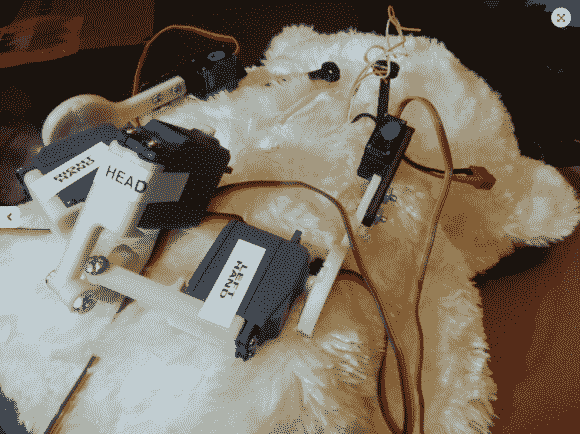

# 机器人终结者泰迪会在你睡觉的时候保护你

> 原文：<https://hackaday.com/2014/10/16/robotic-terminator-teddy-will-protect-you-while-you-sleep/>

这个电子泰迪熊是噩梦的素材……如果你喜欢变异的机器人玩具，那就是梦了。无论是哪种情况,[欧文·里德]的这个项目既迷人又令人毛骨悚然，因为他通过给一个谦逊的填充动物植入机动部件，赋予了它生命。

[Erwin]通过用一系列 3D 打印的骨骼填充皮肤，实现了熊全身几个角度的运动，这些骨骼通过伺服电机连接在它的肩膀、肘部和颈部。电机通过 Arduino 运行从机控制，从机是用 C#编写的自定义应用程序。该应用程序使用 Xbox Kinect 的运动跟踪和面部识别功能，将木偶的运动输入映射到玩偶骨架的电机。此外，两只红色发光二极管会根据控制它的人的面部表情照亮熊的脸颊，作为额外的提醒，泰迪感受到了你的感受。

在[欧文的]视频中，他展示了他的应用程序通过 Kinect 的摄像头与控制它的机械骨骼并排看到的东西。成品不是我晚上很快就能抱在怀里的东西，但看起来很棒，而且看起来很有趣:

[https://www.youtube.com/embed/GezSMfDPlTw?version=3&rel=1&showsearch=0&showinfo=1&iv_load_policy=1&fs=1&hl=en-US&autohide=2&wmode=transparent](https://www.youtube.com/embed/GezSMfDPlTw?version=3&rel=1&showsearch=0&showinfo=1&iv_load_policy=1&fs=1&hl=en-US&autohide=2&wmode=transparent)