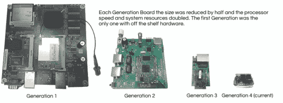
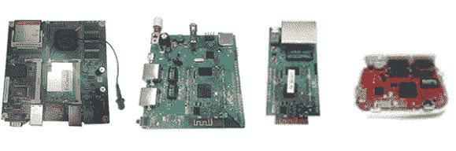
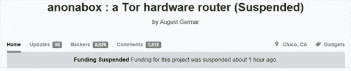

# Anonabox:如何在 Kickstarter 上惨败

> 原文：<https://hackaday.com/2014/10/17/anonabox-how-to-fail-horribly-at-kickstarter/>

上周晚些时候， [Anonabox](https://www.kickstarter.com/projects/augustgermar/anonabox-a-tor-hardware-router) 登陆 Kickstarter，引发了人们对安全、隐私和审查的担忧。这个项目出现在常见的科技博客上，称赞这个项目是开源、开放硬件运动的巅峰，是后斯诺登时代注重隐私的技术官僚的一笔巨大投资。

然后，Anonabox [的创造者在 reddit](http://www.reddit.com/r/anonabox/comments/2ja22g/hi_im_august_germar_a_developer_for_the_anonabox/) 上做了一个 AMA。很快发现，整个项目是一个现成的路由器[发现全球速卖通](http://ru.aliexpress.com/item/New-2014-300Mbps-WT3020A-Multiprotocol-Portable-Mini-WIFI-Router-with-USB-data-line-Wireless-Router-wi/1691403728.html)与刷新固件。这款路由器的第一批售价为 20 美元，Anonabox Kickstarter 以最低 51 美元的承诺赠送它们。新固件基本上是一个标准的 OpenWrt 安装，对配置文件做了一些修改。该项目声称解决了硬件后门的问题，但附带了后门根密码(密码是' developer！')，开启 WiFi，默认开启 ssh。Anonabox 还声称是互联网安全和隐私的即插即用解决方案，这意味着*如果*这个项目上市，将有*很多人不会改变默认配置。这是相当滑稽的暗示。*

根据 Kickstarter 的活动，Anonabox 已经经历了四年的发展和四代硬件。[August]甚至有一个很棒的图形，展示了每一代产品的尺寸都减少了一半，系统资源增加了一倍:

Image taken from Kickstarter campaign

任何稍微注意细节的人都会很快意识到，像以太网插孔、SD 卡和 CF 卡这样的组件总是一样大。我想知道如果所有的板子都按比例缩放，那么这个图形会是什么样子？

Image rescaled so all boards are proportional to each other

哦。这一点都不可疑。

与大多数受到如此负面关注的 Kickstarters 一样，[该项目仅在几小时前](https://www.kickstarter.com/projects/augustgermar/anonabox-a-tor-hardware-router)被暂停，但在此之前，该项目在高峰期筹集了超过 60 万美元的认捐。

尽管 Anonabox 失败了，但启用 Tor 的路由器还是有市场的，幸运的是[我们在 hackaday.io](http://hackaday.io/project/2040-web-security-everywhere) 上就有一个。这太棒了，Kickstarter 活动的一些内容直接来自这个项目。有了大量的市场调查，我们只能希望[CaptainStouf]为 UnJailPi 经营他自己的活动。