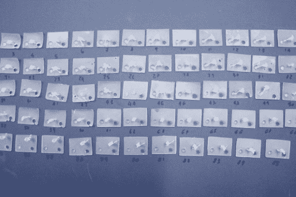

# 用 3D 打印画面制作 2D 电影

> 原文：<https://hackaday.com/2014/10/18/creating-a-2d-film-with-3d-printed-frames/>

在电影早期，有一段时间，法国的 3D 电影被称为“浮雕电影”。然而，当我们听到这个词时， *Relief，*会让我们想到一些有形的东西，这就是为什么这个名字后来被调整为包括更无形的术语， *3D* 。利用这一事实，法国艺术家[Julien Maire]为他名为“[浮雕](http://www.imal.org/en/relief)”的装置设计并建造了一个超大尺寸的投影仪，通过让光线穿过一系列独立的 3D 短片来创建动画。

[朱利安]错综复杂的投影卷轴本身就是一个令人印象深刻的机械壮举，可以说是超越了它在画廊空间的墙上产生的图像。85 个单独的帧构成了一个人在地上挖洞的短片，由用立体平版印刷机制作的小雕像组成。SLA 打印机使用的树脂的半透明性质使投影仪投射的阴影具有一系列模糊值，从而产生三维外观，而不仅仅是投射形状的轮廓。这个装置将新旧技术融合在一起，产生了我们熟悉的东西，但让我们欣赏的是我们从未见过的东西。

[朱利安的]“救济”目前正在 iMAL(布鲁塞尔互动媒体艺术实验室)展出，将持续整个 10 月。如果你碰巧在慕尼黑的[硬件研讨会之前在欧洲逗留了很长时间，你可以停下来看看！](http://hackaday.com/2014/10/16/hackaday-munich-get-your-ticket-now/)