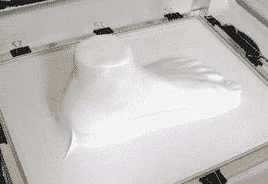

# 廉价的 DIY 真空成型机

> 原文：<https://hackaday.com/2014/10/19/diy-vacuum-former-on-the-cheap/>

真空成型是一种将塑料成型为所需形状的工艺。一片塑料薄片被加热到软的状态，然后用气压将塑料压到模具周围或模具中。真空成型可用于制造各种物品，从产品包装到浴缸。

也就是说，真空成型器可能是一种很好的东西，但可能不会有很多用处。因此，在一个上面花费大量的金钱会导致一个低价值的情况。对于一些人来说，从头开始建立一个可能是正确的做法。[Amalgamized]建造了自己的[低成本真空成型机](http://lettucebranch.blogspot.com/2011/06/diy-vacuum-former-for-thermoformed.html)，并在记录建造过程中做得很好。

有一个双管齐下的方法来降低这个项目的成本。首先，框架是由现成的材料制成的，你可能会把它们放在你的废木料仓里。框架的侧面是 3/4 英寸的胶合板，填孔的顶部是由 1/4 英寸的 MDF 制成的。一根 PVC 管将中密度纤维板顶部下方的腔室连接到一台车间真空吸尘器。商店吸尘器通过顶部的孔把空气吸下来；*想反转空气曲棍球台*。

攻击点 2 是没有专用的加热器。装订夹将塑料板固定在铝窗框上，然后将其放入 250 至 300 华氏度的烤箱中几分钟。当塑料开始下垂时，将其迅速从烤箱中取出，放在模具上。shopvac 在塑料下产生一个低压区，大气压力将塑料向下推到模具周围。

