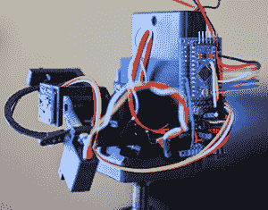

# 单像素彩色数码相机

> 原文：<https://hackaday.com/2014/10/20/a-single-pixel-color-digital-camera/>

[Ben]已经编写了各种代码和算法来过滤、分类和卷绕图像，还编写了一些用于拍照的小工具。一个没有给他的烙铁增加缺口的项目是照相机。解决这个问题最简单的方法是找一些纸板和胶带，然后制作一个针孔摄像机。[本]想要一台数码相机。不是什么数码相机，[而是一款*彩色*数码相机](http://www.gperco.com/2014/10/single-pixel-camera.html)，不想处理像素阵列或者镜头。你说不可能？当你的工具箱里有一堆积分变换时就不会了。

[Ben]只用一个光传感器为他的相机输出 RGB 值——到处都找不到镜头。然而，如果你用这种传感器多次扫描一个场景，每次都阻挡传感器的一部分视野，你可以仅从单个光传感器重建一个基本的低分辨率图像。如果你在传感器的视野范围内扫描并旋转这个“阻挡臂”，重建图像被称为[拉冬变换](http://en.wikipedia.org/wiki/Radon_transform)，这是【Ben】在他的研究中使用过几次的东西。

【Ben】的相机由 [Adafruit RGB 光传感器](http://www.adafruit.com/product/1334)，一个 Arduino，一个 microSD 卡，几个伺服系统和一堆打印部件组成。伺服系统用于扫描和旋转每幅图像传感器上的“阻挡臂”。传感器的输出保存到 SD 卡，并转移到计算机进行后处理。

在把所有的像素数据拿到他的笔记本电脑后，[Ben]绘制了原始数据。最初的几张照片是一个点光源——他工作空间里的一盏灯。这正是他所期待的结果，一条波浪状的线出现在原本空白的田野上。最终的转换看起来有点像参考图片，但为了获得更好的效果，[Ben]将他的相机转向了更自然的场景。将他的单像素相机指向窗外，通过一块涂有凡士林的玻璃，得到了一张看起来像是在水下拍摄的图像。尽管如此，对于单像素相机来说，它的效果非常好。把他的相机带到户外，提供了一个更好的重建场景，这在很大程度上归功于[本]可以接触到的美丽风景。