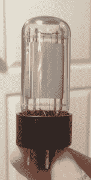
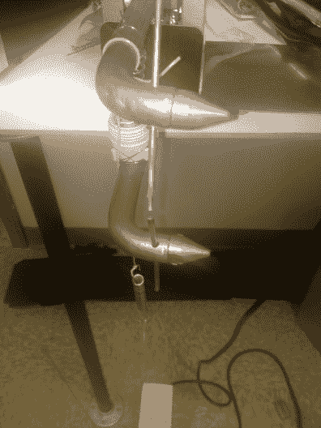
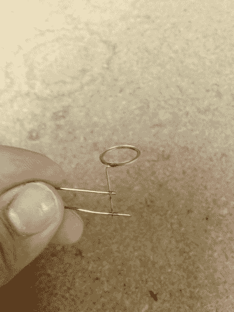
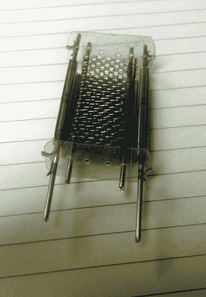
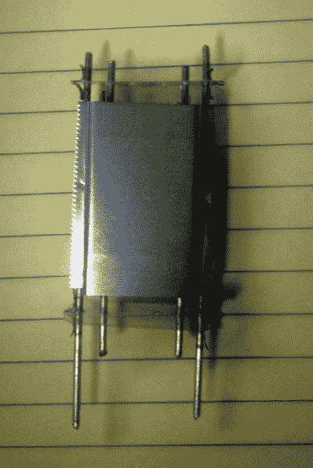
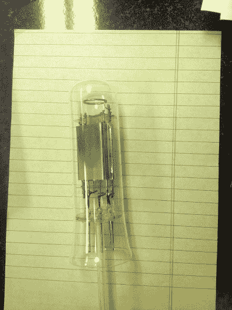
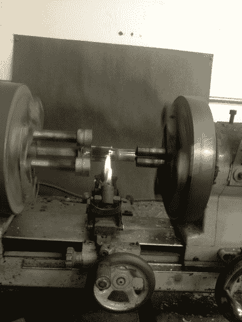
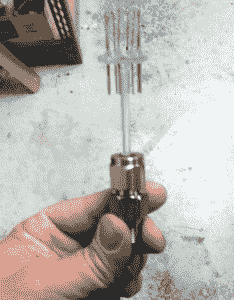
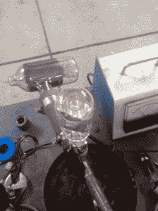

# 手工真空管:Hackaday 向您展示如何

> 原文：<https://hackaday.com/2014/11/21/artisanal-vacuum-tubes-hackaday-shows-you-how/>

Homemade Vacuum Tube

大约十年前，我在空闲时间开始了一段奇怪的小旅程，穿越了上个世纪以来的电子制造业。一天早上，我决定弄清楚我们有时称之为电子管的发光小玻璃瓶是如何工作的。不知道更好，我只是拿起一本旧的托马斯登记。对于那些 40 岁以下的人来说，这是我们的谷歌版本，类似于一套 10 页的黄页。

我开始给列在“电子管制造商”下面的公司打电话，直到电话那头传来声音。大多数电话号码都会响起熟悉的“该号码不再使用”的信息，但在一个幸运的案例中，我发现我正在与 M.U. Inc .的 Roni Elsbury，nee Ulmer 女士交谈。她的公司是美国仅存的几家仍在生产传统风格真空管的公司之一。从那时起，我喜欢偶尔去她的工厂，帮助她维护设备，加工工具，并帮助解决一些工程上的小挑战，使这一非常手工的过程保持活力。这并不需要太多的旅行就能意识到，这可以归结为一些非常基本的工具和过程，这些工具和过程可以在你的普通车库中复制，而且积极的，所有这些基本的结果都可以通过互联网上广泛可用的信息得到。

## 很容易在你的车库里制作

这是我在车库里使用的一个典型的建造过程。我想指出的是，这些过程包括玻璃、薄金属、云母和锋利的工具，它们都有割伤的危险。此外，还利用了手持火炬形式的极端温度和射频感应轰击。对于所有的工业过程，在任何努力中都必须非常小心。我还想指出的是，在这些过程中没有使用汞或其他有害物质。主要材料是玻璃、镍、云母片和钨丝。异丙醇和丙酮被用作清洁剂，极少量的钡被用于 T2 吸气剂。

  Spot welder  Typical weld

几乎所有管道内的连接都是焊接的，而点焊是最快最经济的。我简单地修改了一个便宜的商店买的点焊机，以接受小直径焊条，并使用 10 安培自耦变压器来控制焊接温度。我连接了一个弹簧加载板，作为一个开关爪关闭踏板。

上面右边是一个典型的焊缝。我使用镍，因为它有利于真空应用和电子管电子特性。只要焊接时间保持最短，它还易于焊接，并且在空气中的焊接条件下不容易氧化。这里还显示了一个放热的可蒸发的吸气剂环。这包含钡/铝合金，其通过施加感应射频加热场而蒸发，并在管被密封以保持合理的真空水平后吸附气体。

  View of the internal components  Completed “cage” assembly

左边是所谓的笼子，一半的阳极还没有连接上。整个结构由镍板、金属线和金属网组成。. 015 用标准办公室剪刀剪切成形的透明云母，用手扳压机、木块和小钢针冲压。阳极是一片 0.010”的镍，围绕一小块木头形成。格栅由软回火镍网制成，镍网围绕一个块体形成，并焊接到两根镍棒上作为支撑。传统上，钼或镀镍钢将用于网格线，但这两种材料在没有特殊工具的情况下很难加工和焊接。右边是完整的组件，阳极的第二部分被焊接以完成笼子。

## 把所有的放在一起

在这里，笼子被焊接到所谓的阀杆上，而这一圈被称为支架。阀杆是包含玻璃到金属铅的密封和用于将管道连接到真空系统的排气管的部分。这种特殊的管子使用市售的阀杆。它们可以手工制作，但是很难得到经得起使用的好结果。这是电子管中要求最高和最关键的部分，美国有许多电子玻璃制造商可以提供这些零件进行绘图，那些希望自己手工制作的人可以观看 Ron Soyland 关于该主题的 YouTube 视频。钨丝也穿过保持架，在这一点上点焊到阀杆引线上。这管使用 0.0085 直径 1.5%的钍钨。

  Mount and stem fitment check  

此处检查安装件与玻璃灯泡的配合。云母垫片应与玻璃灯泡接触，以尽量减少笼中的振动。下一步是修剪多余的灯泡材料，并将灯泡和支架密封在一起。这是通过将这些零件放在一个特制的车床上来完成的，车床上有两个同步转动的主轴箱。许多商店会像我一样制造他们自己的机器。然而，在这张照片中，我使用的是市售车床。

## 避免因热冲击而破损

在大规模生产中，旋转式封口机是典型的。一般来说，密封后需要对管子进行退火。有时你可以不使用烤箱对玻璃进行火焰退火，但这只能通过实践和经验来实现。更好的解决方案是使用硼硅酸盐玻璃。这些类型具有更强的抗热震性，并且更容易使用。不幸的是，它们要贵得多，因为它们通常只在极端情况下使用。大型发射管和蒸汽灯通常包含这种玻璃，以应对极端的温度变化，并且不会损坏密封中的密封金属铅。

## 管的排空

将试管放入真空系统中。该图显示了包含可压缩压盖的典型压缩端口。高真空泵系统包含机械旋转叶片泵，其支持油蒸汽扩散泵或涡轮分子泵，其后是冷冻阱，然后是管道连接到的歧管。这通常还包括一个电离真空计，如图上部所示。模拟仪表指示扩散泵上的前压力。典型的扩散泵需要 100 毫托或微米的前压力来开始泵送作用。一微米相当于 1.32 X 10-6 个大气压。没有泄漏和冷冻阱的构造良好的单级扩散泵的极限压力远低于 1×10-7 托。

然而，在真空管实践中，这很难再现，并且只能在非常小的批量中实现，需要长的烘烤时间和极度小心。在大批量生产中，如果终止时(排气管熔化并从泵中移出)管内的实际压力在 10-4 范围内，则认为是良好的真空。然后，钡吸气剂负责达到最终的操作真空水平。更高水平的真空需要更多的泵和更好的实践，这里无法涵盖。

Pumped tube waiting to have a base installed

有经验的人自己动手，不用担心。对于仅使用带制冷捕集器的双级机械旋转叶片泵的实验管，有可能获得可接受的结果。但是，必须小心谨慎，尽一切努力使用射频轰击对管子进行除气，并在泵上放置的烘箱中以超过预期工作温度两倍的温度烘烤管子约一小时。密封时最终压力应保持在 20 微米以下，且应使用大量吸气剂材料。此外，该管应充满氮气或氩气，并在抽空前加热，以减少管中的平均氧量。许多最早的放大管就是这种类型的。得到的电子管会发射，但是当阳极电压增加时会产生电离电流。通常这种“软”管的电压上限为 60 到 90 伏。一旦真空系统打开，并且已知被抽吸的管无泄漏，灯丝就被点亮，并在排气过程的剩余时间内保持点亮。这可以防止从其他金属部件释放的气体分子凝结在灯丝上，并增加额外的热量以从其他表面去除气体。管的左侧显示了一个线圈，用于在泵运行时对管的内部金属部件进行射频感应加热。这也可以作为加热吸气剂的热源，产生镜面并保持适当的真空压力。通常，在吸气剂有机会吸附商业生产的管中的剩余气体之后，接收管将在 1×10-6 范围内工作。

## 结论

你必须记住，在电子学的早期，许多这些过程是通过观察经验证据发展起来的。几年后，人们才开始认真地对热离子发射进行严肃的科学研究，在生产这些装置的过程中，许多重要的发现都是由个人用基本的工具完成的。有些发现纯属偶然。没有什么特别的理由，人们不能简单地从十多岁和二十多岁的创新者在电子管成为大生意之前停下来的地方捡起来。别忘了，门洛帕克只不过是一座摇摇欲坠的建筑，而[[德·福里斯特](http://en.wikipedia.org/wiki/Lee_de_Forest)在《联邦电讯报》的一个黑暗角落里辛勤工作时，他开发了三极管。我建造的特殊类型的管道非常粗糙。它的最大板极电流只有几毫安，有气，增益少得可怜，但很管用。这提醒我们，曾经有人尝试过一些事情，他们并不确定如何去做，也没有具体的计划，但是他们成功了。他们找到了前进的道路，并最终开创了一个全新的科学领域——一个产业。我想我现在会去我的车库里多玩一会儿。

#### 资源

网上有一些视频和网站非常详细地展示了电子管生产的一些优点。

*   花点时间看看罗恩·索伊兰在他的网站和 T2 的 YouTube 频道上的作品。
*   下面是一些电子管生产全盛时期的教育片，展示了详细的过程。
*   这里分两部分是 RCA 的电影，电子在游行:[第一部分](https://www.youtube.com/watch?v=QCksgN7kiv4)，[第二部分](https://www.youtube.com/watch?v=J61hHMjxzC4)

#### 关于查尔斯·亚历山大

Charles 是 Alex-Tronix 公司的生产经理，也负责新产品开发，但是他很容易感到无聊，所以他在 T2 的 M.U. Incorporated 公司兼职修理真空泵和试管测试装置。他也是地球上下载量最大的播客和几个录音室的技术人员，因为他讨厌空闲时间…我的意思是他真的讨厌空闲时间。如果他真的有空闲时间，他肯定会花在他众多爱好中的一项上，比如:更多的电子项目、勘探或业余无线电。