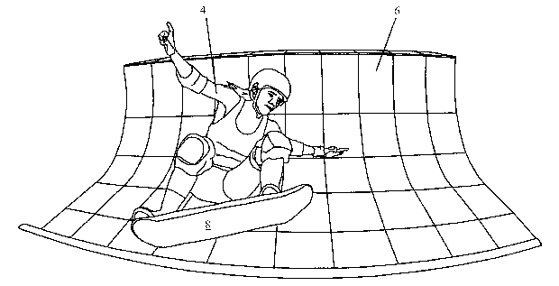

# 你可以在家里制作悬浮滑板

> 原文：<https://hackaday.com/2014/10/21/the-hoverboard-you-can-build-at-home/>

今天新闻禁令解除，宣告了世界上第一个悬浮滑板的诞生。是的，悬浮滑板从*回到了未来。*它被称为 Hendo 悬浮滑板，显然是真的，[你可以花 1 万美元买一个](https://www.kickstarter.com/projects/142464853/hendo-hoverboards-worlds-first-real-hoverboard)。如果对你来说太贵了，你可以花 900 美元买一个“技术演示器”——一个由相同技术驱动的遥控悬停盒。

*当然*世界上第一个悬浮滑板作为一个众筹活动向世界宣布，所以在我们开始了解这个东西应该如何工作之前，我们必须做我们的尽职调查。这场运动背后的公司 Arx Pax Labs，Inc .存在，创始人也存在。Arx Pax 创始人和员工的所有相关商业登记、履历信息和经历均符合我的要求。事实上，至少有一名员工有电动马达内部零件的工作经验。乍一看，该公司本身实际上是合法的。

该活动是为了一款 *BttF-* 风格的悬浮滑板，但这实际上只是 Arx Pax 的一种营销策略；悬浮滑板本身是公认的亏损领导者，即使价格为 10，000 美元——这个 Kickstarter 的主要目标只是让媒体关注悬浮滑板中的磁悬浮技术。所有这一切都是精心策划的，一年后将举行一场“大型活动”,展示一个真正的工作悬浮滑板。2015 年 10 月 21 日演示悬浮滑板有什么特别的？

我敢说没有人能想出比这更好的营销活动。

这个故事的精髓来自于迄今为止的科学好奇心。每个阅读这篇文章的人毫无疑问都见过超导体从磁铁床上悬浮起来，涡流演示真的只是你可以用稀土磁铁和铜管做的很酷的事情。格雷格·亨德森和 Arx Pax 所做的就是利用这些现象，把它们变成磁悬浮的平台。

[根据专利](https://www.google.com/patents/US20140265690?dq=ininventor:%22D.+Gregory+Henderson%22&hl=en&sa=X&ei=0WVGVNPWN8PlsASi_4LYCg&ved=0CB8Q6AEwAA)，Hendo 悬浮滑板中发现的磁悬浮系统是这样工作的:

*   一台或多台电动机带动一系列由强永磁体构成的转子旋转。
*   磁铁排列成[哈尔巴赫阵列](http://en.wikipedia.org/wiki/Halbach_array)，阵列一侧的磁场增强，另一侧的磁场抵消。
*   将转子放在导电的非铁表面上——例如铜片或铝片——[在导电表面上感应出涡流](http://en.wikipedia.org/wiki/Eddy_current)。
*   这些涡流产生的磁场与产生它的磁场相反，导致整个装置悬浮起来。

就是这样。这就是你如何创建一个真正的，工作的悬浮滑板。Arx Pax 还开发了一种方法来控制装有一些这种悬浮圆盘的飞行器；价值 900 美元的“白盒”技术演示器包括一个智能手机应用程序作为遥控器。

如果你仍然对这项发明充满怀疑，那你就有伴了。被才华蒙蔽双眼和被废话迷惑之间只有一线之隔，所以我们把这个问题留给你:制造一个这样的设备，放到 hackaday . io 上，我们会让你觉得值得。我们将向 [Hackaday 商店](http://store.hackaday.com/)发放一些礼品卡，奖励第一个制作这种悬浮滑板的人，最好是带有酷酷的身体套件。《星球大战》的陆地飞车已经完成了，但是雪地飞车还没有。给我们惊喜。