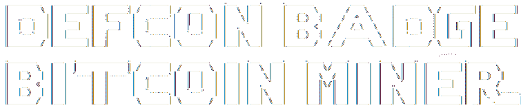

# 把 DEFCON 徽章变成比特币矿工

> 原文：<https://hackaday.com/2014/10/23/turning-the-defcon-badge-into-a-bitcoin-miner/>

今年的 DEFCON 徽章是一件令人印象深刻的硬件，包括令人难以置信的谜题，瓶盖感应按钮，led，当然还有视差推进器。[mike]认为像 Propeller 这样酷的芯片应该得到更好的利用，而不是坐以待毙，直到明年，所以他把它变成了一个比特币矿工，每秒钟为他带来惊人的 40 次哈希运算。

在一开始就没有太多处理能力的硬件上挖掘比特币(至少与普遍使用的 FPGAs 和 ASIC 矿工相比)意味着[mike]必须找到一些有趣的方法来计算挖掘所需的 SHA256 哈希。他求助于 RetroMiner，这是为最初的任天堂制作的比特币挖矿机。像 NES 矿工一样，[迈克]正在将与比特币网络的通信卸载到主机上，但所有实际的数学运算都由推进器上的单个内核处理。

DEFCON 徽章节省了一个用于与主机通信的核心，可以想象每秒可以管理 280 个哈希，这意味着为 DEFCON 制作的所有徽章的处理能力大约相当于一个七年前的显卡。