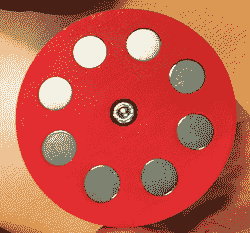
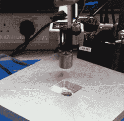

# 建造磁悬浮四轴飞行器

> 原文：<https://hackaday.com/2014/10/24/building-a-magnetic-levitating-quadcopter/>

三天前，2014 年 10 月 21 日，向全世界宣布*回到未来*悬浮滑板是真的。这是一个 Kickstarter，当然，它的趋势是对创作者的 500 万美元的发薪日。令人惊讶的是，对于一个拥有如此多营销天才的项目来说，这是一个真实存在的设备[，甚至还有专利](https://www.google.com/patents/US20140265690?dq=ininventor:%22D.+Gregory+Henderson%22&hl=en&sa=X&ei=0WVGVNPWN8PlsASi_4LYCg&ved=0CB8Q6AEwAA)。从专利中，我们能够收集到这种悬浮板/磁悬浮设备如何工作的一些细节，在我们关于最初报道的帖子中，我们说我们将向第一个能够克隆这种磁悬浮设备并将其放到 hackaday.io 上的人赠送一些好东西。

[【杰尔梅斯特】刚刚中奖](http://hackaday.io/project/3222-hoverbot)。这有点欺骗，因为他在 7 月份已经让他的原型悬浮滑板工作了，并在 9 月份的布莱顿迷你制造商博览会上演示了一个更先进的“倒置四轴飞行器”设备。好样的[果冻]。你将得到一张 hackaday 商店的[礼品卡。](http://store.hackaday.com/)

和 Kickstarter 悬浮滑板一样，[jelly]使用的是在有色金属上方的框架中旋转的磁铁阵列。在最初的测试中，八个钕磁铁被安排在一个框架中，悬挂在 3/4″的铝板上，用一个钻头旋转。仅仅通过这个简单的测试，[jelly]就能够在 1 厘米处实现 2 千克的升力，在 1 英寸的间隔处实现 1 千克的升力。该测试还提供了一些关于磁铁对铝或铜的影响的有价值的见解；3 公斤的铝板几乎是旋转的，这意味着如果这个设备用于小板，需要使用反向旋转的磁性升降机对。

试验台然后推进到两对转子与标准的爱好无刷电机，但稳定性是一个问题；磁性转子提供了足够的升力，但它会很快倒下。为了解决这个问题，[jellmeister]采用了标准的四轴飞行器配置，用磁性旋翼取代了道具，并在布莱顿制造商博览会上成功地将它悬停在一块铝板上方。

由于[jellmeister]实际上已经*建造了*一个磁悬浮悬浮滑板，他有更多关于它们如何工作的数据，而不是一份被禁止的新闻稿。磁性转子悬浮滑板*将*在铝和铜上工作，但【杰尔】怀疑 Kickstarter 悬浮滑板可能正在其性能的边缘运行，需要更有效的铜半管。有色金属板的厚度也有所不同，使用更厚的板可以获得更好的性能。不，你这个 bojo，悬浮滑板不能在盐水上工作，*即使你有 pow-ah。*

所以你走吧。这就是你怎么做悬浮滑板的。[jellmeister]的设计有点粗糙，使用 [Halbach 阵列](http://en.wikipedia.org/wiki/Halbach_array)用于磁转子应该可以提高效率。使用 3D 打印的转子设计是一个天才之举，我们期待更多的四磁悬浮东西在短时间内达到尖端。

下面是[jellmeister]的作品演示。

哦。这些东西需要一个名字。我谦卑地提交术语“Bojo”来指代任何通过旋转磁铁和涡流悬浮的装置。

[https://www.youtube.com/embed/0g1NV10_m84?version=3&rel=1&showsearch=0&showinfo=1&iv_load_policy=1&fs=1&hl=en-US&autohide=2&wmode=transparent](https://www.youtube.com/embed/0g1NV10_m84?version=3&rel=1&showsearch=0&showinfo=1&iv_load_policy=1&fs=1&hl=en-US&autohide=2&wmode=transparent)

[https://www.youtube.com/embed/pUxm9LifGG8?version=3&rel=1&showsearch=0&showinfo=1&iv_load_policy=1&fs=1&hl=en-US&autohide=2&wmode=transparent](https://www.youtube.com/embed/pUxm9LifGG8?version=3&rel=1&showsearch=0&showinfo=1&iv_load_policy=1&fs=1&hl=en-US&autohide=2&wmode=transparent)