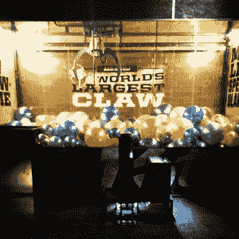

# 原型构建条就像它听起来的那样，听起来很棒

> 原文：<https://hackaday.com/2014/10/27/the-proto-buildbar-is-exactly-what-it-sounds-like-and-it-sounds-awesome/>

俄亥俄州代顿市的人们有了一个新的理由为世界上第一个酒吧/创客空间的开业而兴奋。

它被称为 Proto BuildBar，有点像 3D 打印实验室、创客空间和咖啡馆的混合体。闲逛、喝酒、吃饭、3D 打印——听起来像我们去过的大多数黑客空间，但这可能只是第一个以咖啡馆为主要商业模式的空间！

它甚至是世界上最大的抓爪游戏的所在地，至少他们是这么宣称的。

它刚刚开张，周四举行了一场新闻发布会，当地新闻博客对此进行了报道。虽然代顿长期以来一直被称为技术中心(波音和其他高科技公司在该地区)，但开放 Proto Buildbar 有望为周边地区带来新的生机！

想了解更多关于 Proto BuildBar 的信息(包括运行时间)，你可以在脸书上查看。

【感谢加载。尼康！]