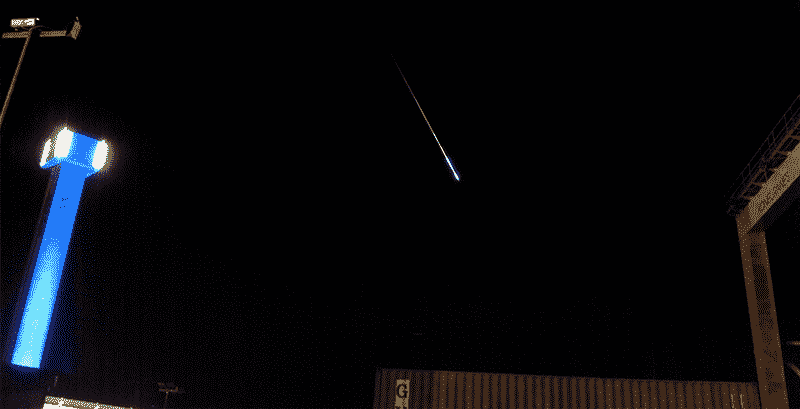

# 用树莓派寻找流星、卫星和星迹

> 原文：<https://hackaday.com/2014/11/01/finding-meteors-satellites-and-star-trails-with-a-raspberry-pi/>

Raspberry Pi 是一款非常受欢迎、廉价、低功耗的电脑，它还有一个漂亮的完全可编程的摄像头附件。这开启了长曝光摄影的可能性，迄今为止[Jippo]已经找到了最好的用途:[长曝光天体摄影](https://sites.google.com/site/meteotuxpi/home)用于捕捉流星、卫星和星迹。

[Jippo]正在使用一个普通的 Raspi 和相机模块，以及他的朋友[Jani Lappalainen]编写的一点定制软件，该软件从相机中抓取图像数据，并将其保存为延时拍摄，或者仅在发生重大变化时保存。这将包括流星和[铱耀斑](http://en.wikipedia.org/wiki/Satellite_flare)，以及经过的飞机、卫星的反射，当然还有长时间曝光的恒星轨迹。

到目前为止，[吉波]已经拍摄了足够多的图像，足以构成一个伟大的星空之夜。有一张很棒的流星照片，几张卫星反射太阳的照片，还有一些很棒的星迹。[吉波]正在使用的软件可以在他的网站上找到，还有他的精彩片段库[。](https://sites.google.com/site/meteotuxpi/gallery-1)