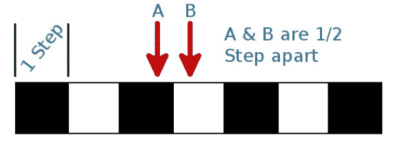

# 我们往哪边走？旋转编码器背后的概念

> 原文：<https://hackaday.com/2014/11/01/which-way-are-we-going-concepts-behind-rotary-encoders/>

[Pete]的一个项目需要一个旋转编码器，所以[他开始建造自己的](http://rasterweb.net/raster/2014/10/15/rotary-encoding/)。顾名思义，旋转编码器通过将“步数”编码成电信号来测量旋转，该电信号可由微控制器测量(或用于许多其他方面)。了解每一步的移动程度将允许你在像机器人轮子这样的应用中计算精确的移动距离[。或者您可以简单地使用旋转轴作为输入设备来导航菜单或设置。](http://hackaday.com/2012/01/02/easy-rotary-encoding-for-your-projects/)

这个概念很好理解。我们原本计划在 [Hackaday 十周年纪念日](http://hackaday.com/2014/10/11/hackaday-10th-anniversary-wrap-up/)为多人猎鸭制作旋转编码器，但制作团队很难让系统工作。在[Pete 的]案例中，他使用了光遮断器(显然，红外光束很容易透过白纸被检测到，但通常这些部分会从光盘上切掉)。我们使用反射传感器。无论哪种方式，都有一个检测旋转编码器转动方向的技巧。休息之后我们会为你解释的。

为了便于理解，我们将编码器轮与这一行白盒和黑盒联系起来。每一个都是编码器的一个单独的步骤。为了测量方向，你需要两个传感器；无论转向哪个方向，单个传感器都能检测到相同模式的白盒和黑盒。

两个传感器“异相”安装。他们正好相隔 1/2 步。如果你现在看这个图像，传感器 A 检测到一个黑盒，传感器 B 会记录一个白盒。因为它们相距 1/2 步，所以它们永远不会同时改变状态。无论模式朝哪个方向移动，它总是一个接一个。

只要当前状态已知，下一个要改变的传感器将表示编码器图案移动的方向。如果您将图案本身向右移动(传感器是固定的)，接下来发生的事情将是传感器 B 从白色变为黑色。但是如果你把图案移到左边，接下来会发生的是传感器 A 从黑变白。输出模式被称为格雷码[，可以使用查找表或简单的逻辑进行解析。](http://en.wikipedia.org/wiki/Gray_code)

这个概念非常简单，如果你花时间把它归结为核心概念，并研究我们这里到底发生了什么。这是大多数硬件概念的情况，它非常值得寻找和挖掘你不完全理解的领域。它让磁性旋转编码器等神奇神秘的传感器[变得简单易懂。](http://hackaday.com/2012/03/08/building-a-magnetic-rotary-encoder/)