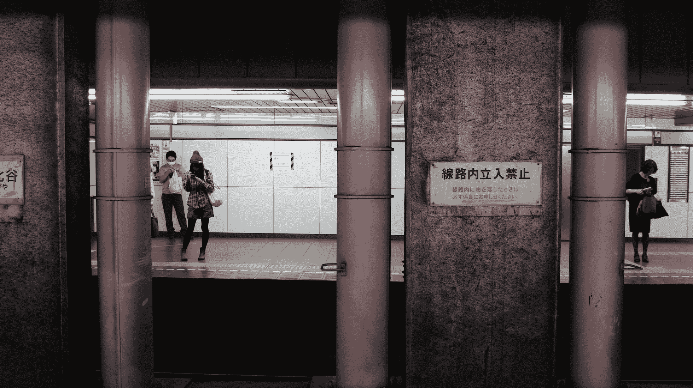
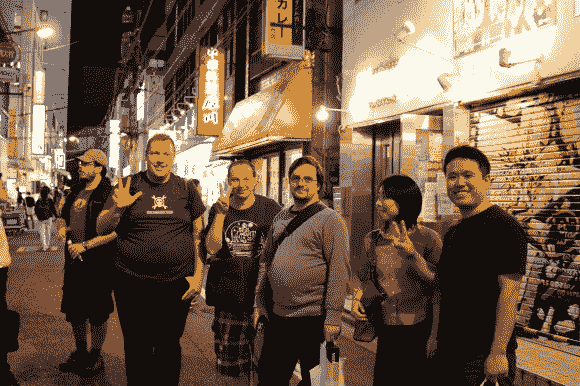
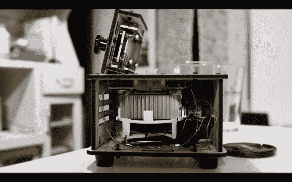
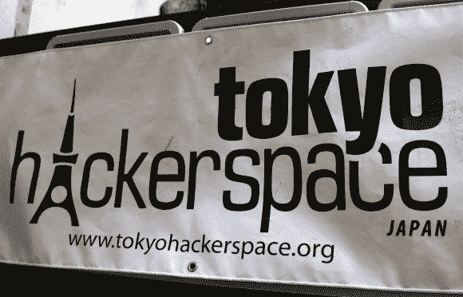
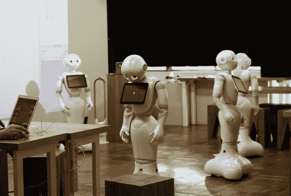
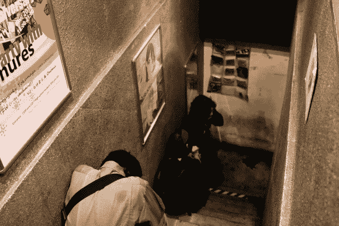

# Hackaday 的 48 小时东京极速跑

> 原文：<https://hackaday.com/2014/11/03/hackadays-48-hour-tokyo-speedrun/>

“未来已经在这里了——只是分布不均匀，”[威廉·吉布森]引用了一句老话。我是在所有的赛博朋克文学中长大的，花了大量的时间痴迷于[弗雷德·加拉格尔的]系列，我总是想象日本在这个分布的最尾部。未来生活的地方。尽管泡沫破裂已经过去了几十年，而且这种情况不可能还会发生，但相信这种情况可能会发生还是有点浪漫的。因此，我选择保持梦想的活力，从未真正去过那个地方。

直到几周前— [Bilke]，一个让 Hackaday.io 存活下来的疯狂的系统管理员，让我这么做了。他从洛杉矶找到了这些便宜的机票，接下来你知道的就是——我们飞去东京度 48 小时的周末。由于没有时间准备，我们联系了来自 Freaklabs 的[Akiba]和来自 Tokyo Hackerspace 的[Emery],寻求一些建议。当我们着陆的时候，电子邮件已经在等着我们了，我们完整的日程已经安排好了。很高兴知道无论你在哪里，总有一个友好的本地黑客愿意帮助你。

过了移民局，我们在那个星期五晚上乘坐 JR 成田快线进入城市。从那里我们坐了一辆出租车，因为我们听不懂片假名中的一个词，但是当我们弄明白事情后，我们跳上了 JR 山手地铁线。我们检查了所有我们听说过的主要地方(新宿，涩谷，六本木，银座…)，因为时差让我们无论如何也睡不着。

午夜过后的某个时候，我突然想到——未来的冲击。但这是我从未想过的那种…

这就好像你希望在《神经漫游者》第一页的某个地方着陆，但却在吉卜力工作室的电影中结束。虽然所有的霓虹和技术噱头似乎都在那里，但他们描绘的未来感觉奇怪地不合时宜——就像一个来自遥远过去的梦。一些直接来自任天堂或世嘉公司 80 年代中期和几十年后的草图，仍然没有衰退的迹象。一切都非常紧密，干净，保存完好，微笑着与一个独特的卡哇伊触摸。复古的未来乌托邦。

这当然不是我所希望的，但整个事情很快就让我喜欢上了。我开始有了家的感觉…

## 秋叶原

第二天，我们坐上地铁，直奔一个我们前一天晚上故意跳过的地方——秋叶原电器城。在那里，我们遇到了来自东京黑客空间的[埃默里]、[泰兰]、[詹姆斯]、[辛戈]和[真理子]，他们带我们参观了整个旅程。太壮观了。

这个地方有点像极客仙境，每个角落都藏着一个你从未去过却又忍不住想进去的地方。你可能会来到秋叶原为你的最新项目寻找电子元件，但离开时却成了火车御宅族，1998 年世嘉 Dreamcast 的所有者，带着满满一袋游戏，或者爱上了另一部默默无闻的漫画，这将消耗你生命中更好的一部分。

Cosplay 角色在街上游荡，女孩们在各种女仆咖啡馆做广告。电子产品无处不在，遍布大量的小地方，每个地方的侧重点略有不同。我们走进的其中一家商店专营电子元件和神秘学书籍！？克苏鲁喜欢硅燃烧的味道。

希望我们与令人惊叹的东京黑客空间工作人员的视频能让你更好地感受住在这样一个地方的黑客是什么样的。

## 新吾&真理子的家庭工作室

花了一整天的时间在秋叶原迷宫中穿行，感觉被所有超负荷的感官消耗殆尽，当[Shingo]和[真理子]邀请我们去他们的家庭工作室休息一会儿并喝点啤酒时，我们非常兴奋。它位于秋叶原，步行即可到达所有主要景点，是黑客的梦想。这套公寓兼作迷你制造实验室，夫妻科学极客团队坚持不懈地研究新项目和新想法。

我们已经知道了[Shingo]的[Levi stone](http://hackaday.com/2011/06/11/satellite-tracking-by-shining-a-laser-into-space/)box，但这个地方充斥着黑客攻击的历史……从他早期的航空航天工作，到更传统的项目，如 random Arduino shields，一直到他最新的基于[open PCR](http://openpcr.org/)的 DNA 放大器硬件项目。他们非常友好，他们的地方总是对需要一些 fab 设备的本地黑客开放。

## 东京黑客空间

当天的最后一站是东京黑客空间。已经是周六深夜了，这个地方已经关门了，但我们还是想看一眼。所以我们和泰兰(Taylan)和詹姆斯(James)一起跳上了开往野崎站的 JR 线，他们为我们打开了车门。它位于东京市中心的一个住宅区的中间，考虑到租金和相对较小的黑客社区，这样的东西首先存在简直是个奇迹。

我们很快认出了著名的[会费/捐款机](http://hackaday.com/2014/03/13/automatically-accept-membership-fees-or-donations/)，并从中得到了一些乐趣。我们最喜欢的装备是一个很酷的激光切割机，作为他们 [Indiegogo 活动](https://www.indiegogo.com/projects/tokyo-hackerspace-lease-renewal)的延伸目标。我们最喜欢的项目是一个[套件自动售货机](http://quake.tokyohackerspace.org/index.php/Kit_Vending_Machine)——一个旧的香烟机被改造成一个套件和项目分配器。

每周定期的“开放日”会议在周二晚上举行，所以如果你打算去参观，那是时候来这里了。

## 3331 艺术千代田

星期天很快就到了，但我们还有一点时间，所以我们从[Akiba]的清单中选了另一个项目——3331 Arts chiyo da，然后乘坐 JR 到 Yushima 站。这趟旅行完全值得。

3331 是一所废弃的学校，它被改造成了一个“创意”空间，“将尖端艺术与日常生活结合在一起。”你很少会在一个地方发现如此多样的有趣事物。在一楼，我们参加了一场儿童戏剧表演(当然是日语的)，类似于现实生活中的龙珠 z。紧挨着它的是一个大型的当代艺术展览，展出了一件有趣的装置艺术作品，由视觉模块触发的继电器控制，处理一张上面有 Enso 风格绘画的旋转纸。在同一层，一个巨大的梦幻屋风格的声音艺术装置叫做“DJ 约翰·凯奇”

第三层隐藏着一个很酷的小地方，叫做“[焊接咖啡馆](http://handazukecafe.com/ "Soldering Café")，”，一个开放的空间，对电子产品感兴趣的人可以在这里分享工具，进行他们的项目。对于黑客来说，这也是一个与所有在 3331 大厅漫游的疯狂艺术家会面和合作的好地方。旁边是软银机器人公司(SoftBank Robotics Corp .)的车间，开发人员可以在这里享受无尽的乐趣，为软银的人形机器人编写控制代码。

在地下室，一长串动漫宅男，耐心等待进入 [Sakka Zakka](http://animesakkazakka.web.fc2.com/asz3_index.html) 新晋艺人展柜。

## 莫格拉俱乐部

时间不多了，差不多是我们离开的时候了，但是我很遗憾我们没有机会去体验著名的秋叶原夜生活。[Akiba]推荐去逛逛 [Club Mogra](http://club-mogra.jp/ "Club Mogra") ，这应该是一个电子乐/chiptunes 宅男/书呆子文化中心，但我们应该在那天晚上离开小镇，我们不可能做到这一点。尽管如此，我还是查了俱乐部的网站，结果是下午 3 点开始有一场演出。我不知道什么样的派对会这么早就开始，但我们还是决定去看看。

大约下午 4 点左右，我们到达了事发地点。一个不起眼的小入口，只有一扇贴着“Mogra”标签的门和一名保安。我们没抱太大期望，钻进车里，下楼去了地下室。楼梯的尽头是一个穿着漫画角色扮演服装的女孩。她微笑着为我们打开了门。

我被吹走了。

这个地方挤满了人。DJ 正在播放某种 chiptune/jungle，上面放着层层叠叠的动漫主题曲，每个人都在疯狂地跳舞和聚会。墙上贴满了 8 位简介和随机动画片段的投影。我看到弹夹里有个鬼嗖的一声飞过，完全被体验超越了。最后，这就是我所希望的那种反乌托邦式的未来——周日下午，在地下深处，人们跳舞着被遗忘，哀叹着遥远的 8 位世界从未存在过。

下午 6 点，我们已经没有时间了，不得不出发，搭乘成田机场的快车返回机场。随着这座城市逐渐消失在背景中，我意识到，尽管东京看起来不再像过去那样未来派，但它更为独特——一个未来提前到来的地方。以一种独特的日本方式，他们找到了与它和谐相处的方法。

对于一个构建硬件的极客来说，几乎没有比这更好的地方了。

[https://www.youtube.com/embed/f7EGe-7EdAk?version=3&rel=1&showsearch=0&showinfo=1&iv_load_policy=1&fs=1&hl=en-US&autohide=2&wmode=transparent](https://www.youtube.com/embed/f7EGe-7EdAk?version=3&rel=1&showsearch=0&showinfo=1&iv_load_policy=1&fs=1&hl=en-US&autohide=2&wmode=transparent)