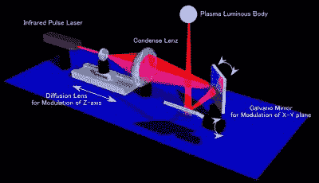

# 真正的 3D 显示器是如何工作的

> 原文：<https://hackaday.com/2014/11/06/how-a-real-3d-display-works/>

有一种新的展示技术正在博客上流传，就像任何看起来像是从(乔治·卢卡斯)裁剪室地板上撕下来的东西一样，它得到了很多关注。它是[一种可以在半空中显示体素](http://burton-jp.com/en/product.htm)的设备，在没有任何屏幕，没有任何雾机，没有任何反光介质的情况下，形成低分辨率的三维图案。这真的是我们见过的全息甲板中最接近投影仪的东西，导致一些人问它是如何做到的。

这不是我们第一次看到这样的事情了。几年前。[展示了类似的 3D 显示技术](http://hackaday.com/2011/11/20/a-real-laser-based-3d-display/)，该技术使用绿色激光在显示介质中显示数万个体素。同一家公司使用这项技术在空气中绘制白色体素，没有烟雾机或其他任何激光束反射的东西。我们当时无法理解这是如何工作的，但是通过一点点研究，我们可以找到相关的文档。

像这样的系统[于 2006 年](http://www.aist.go.jp/aist_e/latest_research/2006/20060210/20060210.html)首次发布，建立在早期工作的基础上，只在 2D 平面上显示像素。该设备的工作原理是采用红外 Nd:YAG 激光器，将光束聚焦到一个极小的点上。在这一点上，大气加热到足以变成等离子体，并变成一个明亮的，如果是暂时的，光点。当激光每秒钟发出几百次脉冲时，这些小的等离子体爆发就可以构成一幅图像。

在 2D 空间中移动一团等离子体相当容易；你只需要几面镜子。为了获得三维投影图像，安装在线性轨道上的透镜来回移动，改变光学系统的焦距。这是一个非常令人印象深刻的光学装置，但简单到足以让人记住。

拥有一个用等离子球投射图像的设备引发了另一个问题:这个东西有多安全？没有提到这个设备中使用的激光有多强大，但是在这个投影仪的每张图片中，人们都戴着护目镜。在视频中——下面有一个——一旦你注意到它，就会发现它明显缺少了什么:声音。这台投影仪每秒钟制造数百次膨胀空气的小球。我们不知道它听起来像什么——或者你是否能听到它——但持续的嗡嗡声会限制它作为广告媒体的应用。

就像任何我们知道它如何工作的最先进的项目一样，有光学经验的人很有可能把这样的东西放在一起。一个普通的绿色激光指示器在水介质中会比红外激光安全得多，但除此之外，复制这个项目的大门是敞开的。

感谢[Sean]发送此邮件。

[https://www.youtube.com/embed/GNoOiXkXmYQ?version=3&rel=1&showsearch=0&showinfo=1&iv_load_policy=1&fs=1&hl=en-US&autohide=2&wmode=transparent](https://www.youtube.com/embed/GNoOiXkXmYQ?version=3&rel=1&showsearch=0&showinfo=1&iv_load_policy=1&fs=1&hl=en-US&autohide=2&wmode=transparent)