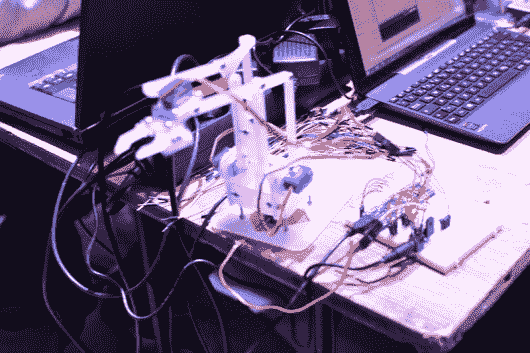
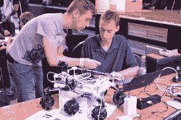
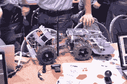
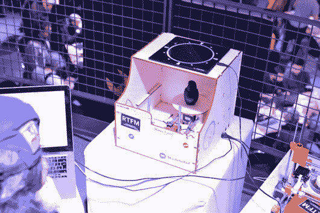
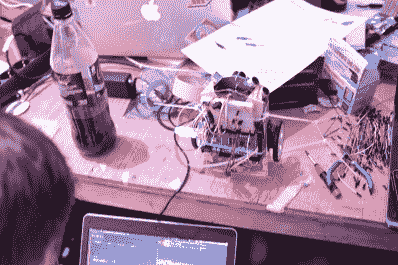

# 黑客 werkstatt 和其他车间

> 原文：<https://hackaday.com/2014/11/13/hacking-werkstatts-and-other-workshops/>

今天在慕尼黑的聚会上，我们举办了一些非常酷的研讨会，Moog 合成器、机械臂、Linksys 路由器在桌子上张开，Club Mate 像水一样流动。我们马上就要结束研讨会了，酒桶正在被打开。不过，在此之前，展示一下今天出现的所有*其他* Hackaday 奖项目可能是个好主意。

大约中午时分，3D 打印的摇臂转向架机器人 M.A.R.S. Rover 出现了。我没有看到它四处行驶，但那里*将*可能是视频了。

还展示了自动切割机器人割草机。今天没有流血。

[Mario]很酷，飞过来炫耀了一下 [OpenExposer](http://hackaday.io/project/1129-openexposer) ，这是一台受 RepRap 项目启发很大的激光树脂打印机。

下图。

  MeArm  Moog hacking  M.A.R.S. Rover  Not-deadly lawnmower  OP-1 synth with a Moog  3D Scanner and OpenExposer  If you’re wondering why we couldn’t get Internet at the workshops…  Solarbotics