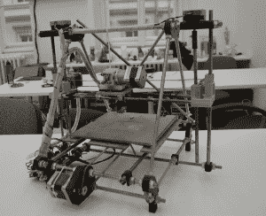
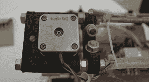

# 采访一位印刷商

> 原文：<https://hackaday.com/2014/11/19/interview-with-a-printer/>

黑客日欧洲之旅仍在继续，这一次是在布拉格，与 reprap 项目的核心开发人员约瑟夫 prusa 一起参加了所有 maker fairs and consens，他也是以他的名字命名的 Prusa Mendel 和 i3 打印机的创造者。

[Prusa]参与 re rap 项目始于一个[re rap Mendel](http://reprap.org/wiki/Mendel)，这是 re rap 硬件的第二次迭代，但却是第一个流行且易于构建的版本。[Jo]发现 Mendel 很难制造，所以他加载了 OpenSCAD 并开始设计他自己版本的硬件。这个版本在几年内成为事实上的标准 RepRap，许多受其启发的衍生打印机进入了世界各地的黑客空间和工作室。

The first Prusa printer, derived from the RepRap Mendel.

几年前，【Prusa】率先推出了 [Prusa i3](http://reprap.org/wiki/Prusa_i3) ，彻底打破了 RepRaps 的传统“螺杆和螺母”结构。这是第一个用金属板作为框架的模型，这是在其他几十个模型中可以看到的另一个特征。这也不是没有争议的事情。使用金属板作为框架不允许太多的自我复制，这是 RepRap 项目的核心价值。这对社区来说无关紧要。Prusa i3 或类似的设计是[在 3Dhubs 上第三受欢迎的打印机](http://www.3dhubs.com/trends)。

The first Prusa printer showing off its Makerbot heritage

普鲁萨这个名字的未来会怎样？有一个 i4 在工作中，我很确定这就是我能告诉你的。有人已经购买了域名，所以,*可能会改名。*

在下面的采访中，[Prusa]回顾了他参与 RepRap 项目的情况，他的业务，他认为过去一年 3D 打印的最新进展，3D 打印领域最糟糕的事情是什么(这是 Kickstarter)，RepRap 项目的状态，以及对 SLS，DLP 和 SLA 打印技术的想法。下面视频。

[https://www.youtube.com/embed/sPelFkVNTtQ?version=3&rel=1&showsearch=0&showinfo=1&iv_load_policy=1&fs=1&hl=en-US&autohide=2&wmode=transparent](https://www.youtube.com/embed/sPelFkVNTtQ?version=3&rel=1&showsearch=0&showinfo=1&iv_load_policy=1&fs=1&hl=en-US&autohide=2&wmode=transparent)