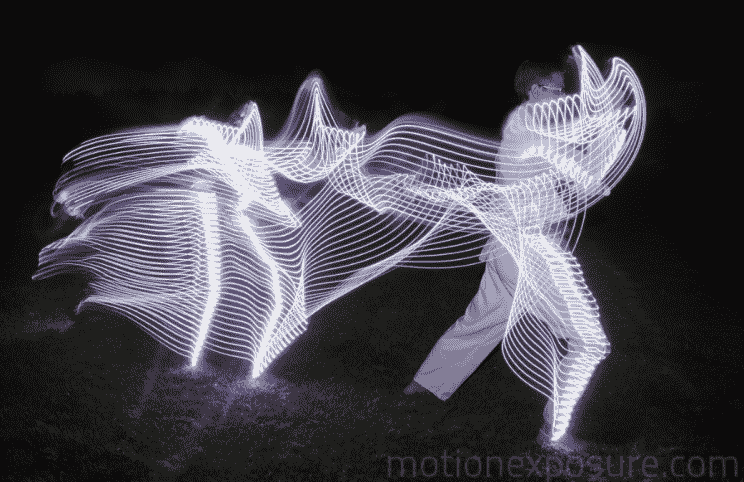

# 画在灯光下的时间运动

> 原文：<https://hackaday.com/2014/12/04/motion-through-time-painted-in-light/>

摄影师[斯蒂芬·奥兰多]有一组令人敬畏的作品，聚焦于人体运动。他用彩色光和设置在任意环境中的相机捕捉的图像以一种视觉上令人震惊的方式讲述了一个时间的故事。

[斯蒂芬]已经尝试了各种类型的行动。他将发光二极管带附着在桨等道具上，以捕捉划船的节奏运动，或者直接附着在身体的某些部位，以可视化更混乱的手势，就像武术艺术家的形式一样。他的相机被设置成长时间曝光，浸泡在光线中，随着时间的推移在空间中绘制自己。

虽然这本身并不是一个直接的黑客行为，但[斯蒂芬]对时间和光线的实验是一个很好的例子，说明技术正在被添加到我们在艺术作品的生产中习惯看到的传统媒体的武库中。他的想法是讲述一个关于我们通常无法通过光看到的东西的故事，这种清晰的执行方式应该激励我们所有喜欢在我们的项目中摆弄 led 的人。有时候，我们工作中更有趣的方面是在我们忘记考虑的负面空间中产生的。

下一次你发现自己在从事黑客工作时，从超出原始背景的角度来看你正在创造的东西。例如，delta 机器人的 3D 打印有点偏离其最初作为取放机器的目的。更进一步的概念是用一个光源在太空中绘制图像。通常一些东西的创造过程，以及制造过程中的副产品，同样值得研究。不要忘了在字里行间寻找…这就是神奇之处。