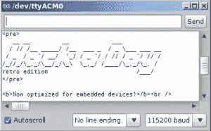
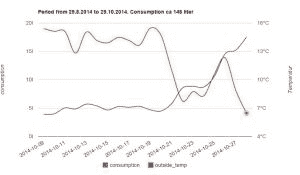
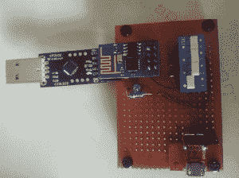
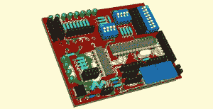

# hack let 25–ESP8266 WiFi 模块项目

> 原文：<https://hackaday.com/2014/12/05/hacklet-25-esp8266-wifi-module-projects/>

很少有设备像 ESP8266 一样给黑客/制造者带来如此巨大的影响。[Brian] [早在八月份就首次报道了](http://hackaday.com/2014/08/26/new-chip-alert-the-esp8266-wifi-module-its-5/)一款新的 5 美元 WiFi 模块。自那以后，利用低成本串行转 WiFi 模块(即 ESP8266)的出色项目不断涌现。本周的 Hacklet 是关于我们在 [Hackaday.io 上发现的一些伟大的 ESP8266 项目！](http://hackaday.io/)

 我们先从【TM】和 [ESP8266 复古浏览器说起。](http://hackaday.io/project/3072) [TM]有一个关于将 ESP8266 与 Arduino Mega2560 相结合的精彩教程。[TM]的目标很简单:创建一个 WiFi“浏览器”来访问 [Hackaday 的复古网站。](http://retro.hackaday.com/)这比人们想象的要复杂一些，因为 Arduino Mega2560 是 5V 板，而 ESP8266 是 3.3V 器件。变形人来救援了！[TM]能够在终端中调出复古站点，但发现即使是像 google 这样的“简单”网站也发送回足够的数据来交换可怜的 ESP8266！

 接下来是【托马斯】带着[简易原生 ESP8266 智能电表](http://hackaday.io/project/3249)。[托马斯]发明了一种装置来测量他的燃油加热系统的运行时间。他在 ESP8266 的板载 Diamond Standard L106 控制器上通过一些本地编程实现了这一点。当他完成后，8266 有两个新的 AT 命令，一个开始测量，一个停止。在 openweathermap.org[的帮助下，一点网络魔法让【托马斯】可以根据室外温度绘制燃油炉的运行时间。](http://openweathermap.org/)

【Matt Callow】也在他的项目 [ESP8266 Native](http://hackaday.io/project/3253) 中使用 EspressIf sdk 检验原生编程。早在 10 月份，当 ExpressIf 为 ESP8266 发布 SDK 时，他们做出了一个伟大的选择。[Matt]记录了他从 EspressIf 构建和扩展演示应用的工作。[Matt]有七个演示程序，可以做从闪烁 LED 到通过 WiFi 连接到 thingspeak 的所有事情。虽然演示还没有全部运行，但[Matt]正在取得巨大的进步。最棒的是，他从 Github repo 中链接了所有代码。干得漂亮[马特！]

 【迈克尔·奥图尔】正在从事 [ESP8266 开发 PCB](http://hackaday.io/project/3352)。devboards 具有用于 ESP8266 的接头、用于 Arduino Uno 兼容性的板载 ATmega328 和用于简化接口的 USB 转串行转换器。[Michael]还提供了让 ESp8266 保持良好状态所需的所有重要组件，如编程按钮和 3.3V 稳压器。我们真的很喜欢[Michael]为基于图形 LCD 的本地控制台添加了一个标题。

想看更多 ESP8266 善良？在 Hackaday.io 上查看我们策划的 [ESP8266 列表！](http://hackaday.io/list/3553-esp8266-projects)

## Hackaday.io 更新！

[Hackaday.io](http://hackaday.io/) 一天比一天好。我们刚刚推出了一个新的版本，其中包括一些伟大的更新。搜索现在有了很大的改进。尝试搜索，你会发现你现在可以按项目、项目日志、黑客或 11 个不同领域的任意组合进行搜索。我们的文本编辑器也进行了改进。更新项目日志，尝试新的外观！
我们知道每个人。io 很棒，但是为了防止垃圾邮件发送者溜进来，我们在项目和评论中添加了“报告不适当”按钮。一旦一些人点击这些报告按钮，项目或评论就会被发送给管理员进行审核。

这就是我们本周 Hacklet 的全部时间！一如既往，下周见。同样的黑时间，同样的黑渠道，带给你最好的 [Hackaday.io！](http://hackaday.io/)