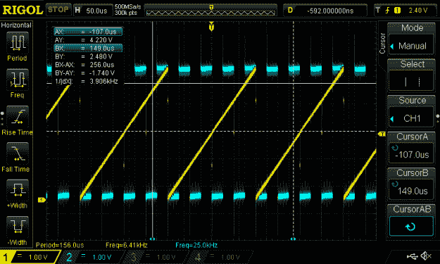
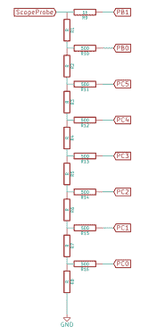
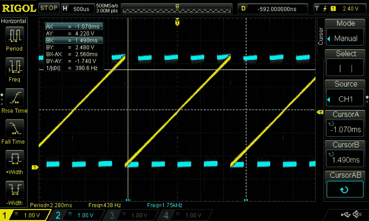
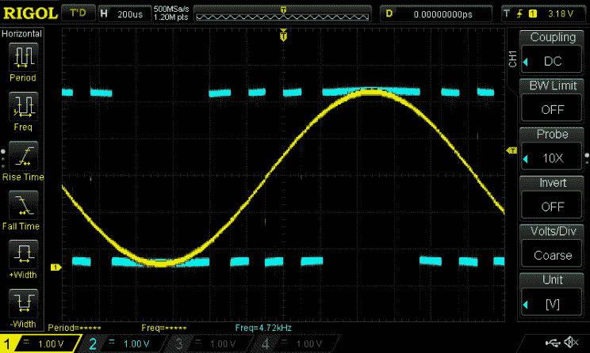
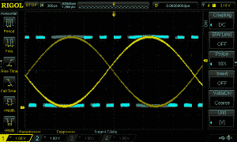
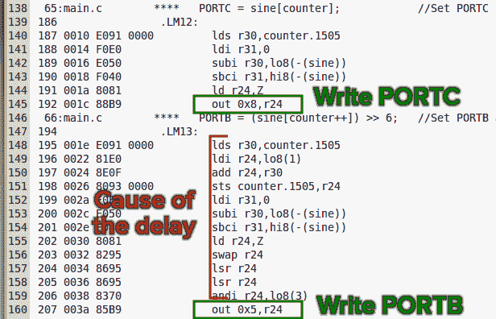
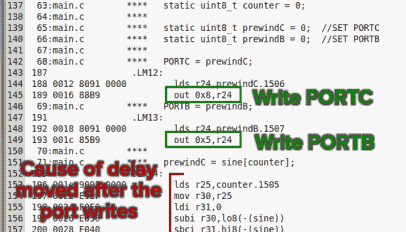
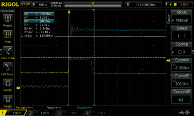
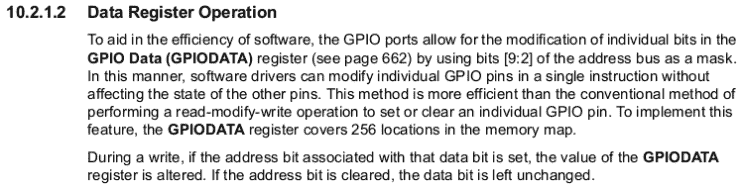

# scope Noob:DDS 的微控制器怪癖

> 原文：<https://hackaday.com/2014/12/09/scope-noob-microcontroller-quirks-with-dds/>

在本期 *Scope Noob* 中，我将使用微控制器进行直接数字合成。在这个过程中，我对自己发现的一些怪癖感到惊喜。最值得注意的是，我有机会观察通过使用释抑和使用微控制器引入的一些时序特性解决的错误触发。这里有一个视频概要，但我会在休息后深入报道一切。

[https://www.youtube.com/embed/Wv6_S3KuC1E?version=3&rel=1&showsearch=0&showinfo=1&iv_load_policy=1&fs=1&hl=en-US&autohide=2&wmode=transparent](https://www.youtube.com/embed/Wv6_S3KuC1E?version=3&rel=1&showsearch=0&showinfo=1&iv_load_policy=1&fs=1&hl=en-US&autohide=2&wmode=transparent)

## 直接数字合成

DDS 是一种从一组数字输入产生模拟信号的方法。在 DDS 上看了【Bil Herd 的】[帖子和视频后，我受到启发，想试一试。但是他用的是可编程逻辑，我想我可以试试用微控制器。](http://hackaday.com/2014/11/24/direct-digital-synthesis-dds-explained-by-bil-herd/)

#### R/2R 梯子

一个简单的 R/2R 梯形是这个实验的关键。这是一个电阻网络，电阻之间的比例为 1:2。我会推荐针对 10k 和 20k 的电阻；我手边的是 500 和 1k，它们很适合这种情况。微控制器的 8 位驱动梯形电阻的数字输入，单个输出为 0V 至 Vcc 之间的模拟电压。

我的每个实验的代码示例都可以在这个库中找到[。代码是为 ATmega328p(这是 Trinket Pro 正在开发的)编写的，但它足够简单，可以轻松移植到任何东西上。我的第一次运行是一个简单的](https://github.com/szczys/trinket-pro-dds)[斜坡信号，使用的代码通过一个 8 位变量循环](https://github.com/szczys/trinket-pro-dds/blob/master/trinket-pro-ramp-loop/main.c)，也用作输出值。当它溢出时，斜坡重新开始。

 [](https://hackaday.com/2014/12/09/scope-noob-microcontroller-quirks-with-dds/01-ramp-loop/)  [](https://hackaday.com/2014/12/09/scope-noob-microcontroller-quirks-with-dds/r2r-ladder/) 

```
uint8_t counter = 0;
while(1) {
  PORTC = counter;
  PORTB = counter &gt;&gt; 6; //Shift the counter so MSB is on PB0 and PB1

  ++counter;
}
```

请注意，斜坡信号上有几个黄色光点。我稍后会谈到这一点，但对于 DDS 的工作“hello world ”,我想通过使用硬件中断来改进我的方法。将定时器 2 设置为 16MHz 的系统时钟速率，计数器分辨率为 256 位，仍然可以产生 440 Hz 的频率:

[](https://hackaday.com/wp-content/uploads/2014/12/02-ramp-interrupt.png)

```
ISR(TIMER2_COMPA_vect)
{
  static uint8_t counter = 0;

  PORTC = counter;        //Set PORTC
  PORTB = counter &gt;&gt; 6;   //Set PORTB

  counter++;
}
```

值得注意的是，信号中的这些光点仍然存在，只是在上面的截图中更难看到。正如你所看到的，这个信号的时钟频率是 438 赫兹，非常接近我的目标 440 赫兹。那个频率在音高上是 A。我想我可能最终会把它变成一个音频项目，如果发生这种情况，我会想要一个听起来比斜波更好的信号。

## 我看到了正弦

这种设置为产生更有趣的信号做了充分的准备。所需要的是一组比递增计数器更好的数据推送到端口。最常见的方法是使用查找表。我发现了一个网站，它会根据你的参数需求生成正弦波值。我加载了一个 256 位的分辨率，这样我仍然可以使用计数器溢出作为数组的索引。

[](https://hackaday.com/wp-content/uploads/2014/12/03-sine-poor.png)

```
ISR(TIMER2_COMPA_vect)
{
  static uint8_t counter = 0;       //Declare static this will only be instatiated the first time

  PORTC = sine[counter];            //Set PORTC
  PORTB = (sine[counter++]) &gt;&gt; 6;   //Set PORTB and increment the counter
}
```

[](https://hackaday.com/wp-content/uploads/2014/12/04-false-trigger.png) 这是一条相当漂亮的曲线，但现在我们仍然可以看到那些信号异常，而且还有一个新问题。当我放大波形时，有时会得到双信号。这看起来像一个正弦波倒置，并覆盖在自己身上。

不知道是什么原因导致了这种情况，我联系了(亚当·法比奥)看看他是否有什么见解。他提到，这可能是一个范围触发的问题，当它不应该的时候。

我正在使用的 DS1054z 在触发菜单中有两个设置，可能有助于这一点。第一个是告诉示波器在触发时忽略噪声的开关。根据我的时基和触发电压，我可以让它工作一点点，但这不是一个确定的解决方案。另一个选择是拖延。

### 了解延迟

拖延是一种允许您拨入示波器不会触发的“中断”窗口的功能。我发现的关于该特性的最佳讨论是关于释抑的[达夫·琼斯'][视频](https://www.youtube.com/watch?v=ta096oBzSac)。他展示了几个用例，但我的是最简单的一个。我知道我的信号所使用的时序，并且我计算出一个稍长于 2.1ms 的延迟应该足以让示波器在每个周期开始时触发。

## 拆分微控制器端口

[](https://hackaday.com/wp-content/uploads/2014/12/06-long-blip.png)

终于到了弄清楚信号中的这些光点到底是怎么回事的时候了。这里你可以看到我正在测量其中一个大约 1.024 us 宽的光点。这实际上是相当多的，所以我开始在第二频道周围探测，看看发生了什么。我很快发现，尖峰总是出现在 R/2R 梯形的第 5 位和第 6 位之间。

在这种情况下，我真的很高兴我使用了小饰品专业版，因为否则我就不会有这些光点来玩了。通常情况下，我会在一个端口上使用所有 8 位，但该板不提供这种功能。因此，我使用 PC0-PC5 和 PB0-PB1。出现这种现象是因为写入 PORTC 和写入 PORTB 之间存在延迟。

我在中断服务例程中写的 C 代码是非常简洁漂亮的 C 代码。但是从它生成的集合显示了为什么我得到了大的信号:

[](https://hackaday.com/wp-content/uploads/2014/12/poor-assembly.png)

可以看到，在写入 PORTC 和随后写入 PORTB 之间有许多指令。这很容易追踪，因为我使用了示波器进行探测。最好的一点是，您不必求助于编写自己的程序集，相反，您可以在考虑计时的情况下编写 C 代码:

```
ISR(TIMER2_COMPA_vect) {
  static uint8_t counter = 0;

  static uint8_t prewindC = 0;
  static uint8_t prewindB = 0;

  PORTC = prewindC; //SET PORTC
  PORTB = prewindB; //SET PORTB

  prewindC = sine[counter];
  prewindB = (sine[counter++]) &gt;&gt; 6;
}
```

为了简洁起见，下面是最终的装配和新的 blip 测量结果(单击放大):

 [](https://hackaday.com/2014/12/09/scope-noob-microcontroller-quirks-with-dds/better-assembly/) Only one instruction between port writes. [](https://hackaday.com/2014/12/09/scope-noob-microcontroller-quirks-with-dds/07-short-blip/) This blip is about 5 times shorter than before!

牢记微控制器的编码结果将信号中的尖峰缩短了大约 5 倍！由于在端口写入之间仍然有一个指令调用，通过使用内联汇编，也许有可能进一步减少一半。但我认为这是一个示波器节省故障排除时间的极好例子。

## 关于微控制器选择的咆哮

[](https://hackaday.com/wp-content/uploads/2014/12/ti-arm-gpio-mask-register.png) 显然，使用裸芯片而不是分线板将允许我在一个端口上使用 8 位。但是让我们假设您被要求使用这个限制。对于大多数 8 位控制器，您会遇到我在这里遇到的另一个问题:要使用一条指令写入 PORTB，我必须清空整个 PORTB 寄存器，即使我只写入 2 位。

这是因为不能使用逐位指令将数字 1 和数字 0 同时写入端口。你能做的最好的事情是首先把你的目标位设置为一个已知的值，然后使用第二个指令来写你寻找的位值。显然，如果你在处理时间问题，这不是最佳的。

大多数 32 位微控制器(以及一些 8 位或 16 位微控制器)对此都有解决办法。以上是一款 TM4C123 芯片的 TI 数据表中的一段话。这表明该处理器允许单指令写入，而无需覆盖整个端口，因为它在寄存器的高位具有屏蔽功能。您可以使用赋值运算符，只有屏蔽寄存器中设置的位会受到影响。

## 家庭作业

下周我还没有一个确定的计划，所以我不能告诉你这个话题。请在下面留言，建议我探索一个领域，帮助我。