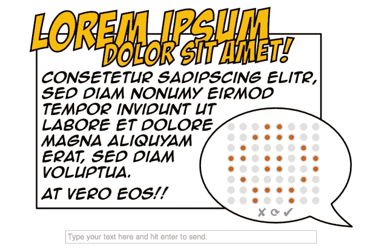

# 数字瓶中的 8 位信息

> 原文：<https://hackaday.com/2014/12/07/8-bit-message-in-a-digital-bottle/>

作为经验丰富的数据旅行者，我们习惯于不受任何限制地使用互联网发送信息和与他人交流。没有人必须被困在一个象征性的吹着烟雾信号的岛上…当然，除非他们想这样。他的项目“ [Lorem Ipsum](http://www.kitesurfer1404.de/tech/lorem_ipsum/en) ”所做的是创造一种情况，在这种情况下，其他人只能通过瓶子里的某种信息与他交流。在这种情况下，瓶子是一个电子部件。

在这个社会实验中，[Harm]在他的办公桌上放置了一个小小的宜家相框，上面显示着世界上其他人实时发送给他的图像和文本。Arduino 作为大脑，安装在框架右下方的小型 8×8 LED 矩阵显示通过以太网模块接收的数据。任何人都可以使用他的网络界面在虚拟版本的装置上修改矩阵的像素。一旦发送，该消息通过 IPv6 互联网连接传输，并被转换为 UDP，该单元由 UDP 控制。

[Harm]的项目调查了当人们有机会以完全匿名的方式向他们不认识的人发送信息时，他们的反应……尤其是以 64 像素的形式。项目名称“Lorem Ipsum”指的是图形设计中使用的填充文本，用于保存原本更有意义的信息，以便不会影响查看布局的体验。出于对我自己会想出什么样的“图形体验”的好奇，我试着敲打了一下[Harm 的] GUI。我一时迷失在打开和关闭小红点的过程中，最终翻出了这首小曲:

它应该是一个三角形的东西，却变成了一个麦田圈…或者尖头乳头。在它被发送后，我想知道[Harm]是否真的看到了它。在他这样做的情况下，我只能想象我用我的圆点风暴向我们的海外黑客伙伴传达了什么。所有这些想法都是这个项目的重点。太棒了。