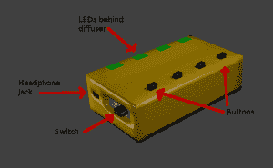
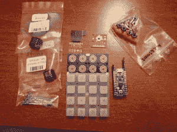

# EDC 竞赛综述:音乐家的助手和 BitMasher！

> 原文：<https://hackaday.com/2014/12/08/trinket-everyday-carry-contest-roundup-musicians-assistant-and-bitmasher/>

我们收到了各种各样的日常携带小饰品比赛的参赛作品！今天我们将展示几首致力于创作音乐的优秀作品！

【johnowhitaker】正在努力做[一个音乐家的助手](http://hackaday.io/project/3447)。[约翰]正在创造一种装置，它可以做一个正在练习的音乐家在旅途中可能需要的任何事情。音乐家的助手将包括节拍器、拍子/温度计数器和调音器。他希望还能让它使用 Pro Trinket 的板载 ATmega328 播放任意音符。[John]正在尝试仅使用 LED 和按钮作为用户界面来完成所有这些工作，尽管如果需要的话，他愿意使用 LCD 或有机发光二极管。

 【米歇尔·佩拉】正在研发 [BitMasher](http://hackaday.io/project/3453) ，便携式高保真音乐音序器。BitMasher 将允许外出的音乐家在任何地方创作音乐。[Michele]开始考虑使用基于 SID 的音序器，但他现在正尝试在 Pro Trinket 上全部完成。他已经在 Arduino Leonardo 上使用了[Roman 的][BTc 声音压缩算法](http://www.romanblack.com/BTc_alg.htm)。当然是高保真的，但这也是 BitMasher 有趣的地方！[Michele]设想歌曲条目类似于经典的 Roland TR-808。主要用户界面将是一个 Adafruit Trellis 4×4 按钮+LED 驱动板。

别忘了我们的第二次随机抽奖将在美国东部时间 12 月 9 日星期二晚上 9 点举行。要获得参赛资格，你需要将你的项目作为正式参赛作品提交，并在一周内发布至少一篇项目日志。本周的奖品是来自[杂货铺](http://store.hackaday.com/)的[积木拼图](http://store.hackaday.com/products/cordwood-puzzle-first-edition)。查看[比赛页面](http://hackaday.io/contest/3432)了解全部详情！