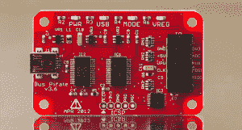

# 饰品日常携带竞赛抽奖#2 结果

> 原文：<https://hackaday.com/2014/12/09/trinket-everyday-carry-contest-drawing-2-results/>

我们已经为[饰品日常携带竞赛](http://hackaday.io/contest/3432)举行了第二次抽奖。本周我们[用一个专业饰品](http://hackaday.io/project/3594-trinket-randomizer)来随机挑选赢家。获胜者是[mikeneiderhauser]和他的项目[workout aid！](http://hackaday.io/project/3550)

 【迈克】喜欢去健身房，但讨厌在例行公事时掏出手机或摸索着用耳机换歌。WorkoutAid 旨在解决这一问题。它本质上是一个蓝牙媒体显示器和遥控器。曲目元数据将显示在 128×64 有机发光二极管上。6 个按钮将允许用户改变曲目、音量或执行其他功能。整个设备将通过 RN42X 蓝牙无线电与定制的 Android 应用程序进行通信。

我们希望[迈克]喜欢他来自[hack aday 商店](http://store.hackaday.com/)的新[积木拼图](http://store.hackaday.com/products/cordwood-puzzle-first-edition)。这里没有拼图，积木是一个涉及焊接的难题！它是用 20 世纪 50 年代和 60 年代流行的积木组装技术建造的。我们也没有开玩笑说这是一个难题——这个工具包没有说明！[Mike]当 3 个 led 全部亮起时，他就知道他做对了。

如果你本周没有中奖，不要担心，还有三次机会赢得随机抽奖！我们的下一次抽奖将在美国东部时间 2014 年 12 月 16 日晚上 9 点举行。奖品将是永远方便的[巴士海盗 V3.6](http://store.hackaday.com/products/buspirate-v3-6-thm180c4m) 。要获得参赛资格，你需要将你的项目作为正式参赛作品提交，并在一周内发布至少一篇项目日志。

[大赛](http://hackaday.io/contest/3432-trinket-everyday-carry-contest)截止日期 2014 年 1 月 2 日！[目前已有超过 60 个项目进入](http://hackaday.io/submissions/trinket/list)，但只有前 50 名将获得定制 t 恤。前三名项目将赢得一些非常棒的奖品，包括 Rigol DS1054Z 示波器、Fluke 179 米和 Hakko/Panavise 焊接包。

你还在等什么？从沙发上起来开始黑吧！