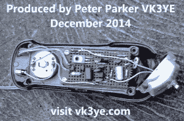

# Gibson Girl 应急信标由一个发条手电筒制成

> 原文：<https://hackaday.com/2014/12/19/gibson-girl-emergency-beacon-built-from-a-wind-up-flashlight/>

电池没电，没有手机覆盖，你需要与数百英里外的人交流？没问题。彼得·帕克·VK3YE 发明了一种内置于折扣店手摇手电筒(或称手电筒)中的发条火腿无线电发射器。没有电池——所有的能量来自你转动手摇曲柄。这个设计的灵感来自第二次世界大战期间使用的“吉布森女孩”紧急信标发射机。但是，曾经是一个非常大，全身曲柄箱现在很小，很容易启动。休息之后，让我们来看看他的视频和建造细节。

[https://www.youtube.com/embed/ARhiSUl8-5w?version=3&rel=1&showsearch=0&showinfo=1&iv_load_policy=1&fs=1&hl=en-US&autohide=2&wmode=transparent](https://www.youtube.com/embed/ARhiSUl8-5w?version=3&rel=1&showsearch=0&showinfo=1&iv_load_policy=1&fs=1&hl=en-US&autohide=2&wmode=transparent)

通过简单的有线天线，其连续波(CW)莫尔斯电码信号可以在数百公里外听到，这在视频中进行了演示。

## 它是如何建造的

 拆除火炬的发光二极管、电池和 PC 板，为三晶体管发射器腾出空间。发电机继续为发射器供电。

第一个晶体管是使用 7.023 MHz 晶体的 RF 振荡器。每当手柄转动时它就亮着。振荡器的输出由作为 RF 功率放大器连接的第二个晶体管放大。其输出通过抑制谐波的低通滤波器到达天线。曲柄越快，射频输出越大，但 500 毫瓦是典型的。

发送莫尔斯电码需要打开和关闭传输信号。这是通过键控晶体管实现的，只有当按键被按下时，键控晶体管才给射频功率放大器供电。这个简单可靠的发射机电路是基于多年前【乔治伯特 GM3OXX】著名的 OXO。

一个从旧录像机中抢救出来的瞬间按钮开关充当了钥匙。将它安装在一个你可以用拿着手电筒的手按住它的地方，同时用另一只手转动发电机。

建设成本低于 20 美元，该项目可以在一天内建成。上面链接的视频包括描述、演示和电路图。下面的一个展示了[彼得的]手摇收音机与 700 公里外的电台通信的演示。我们认为这个精巧装置的一些可能的附件包括一个配套的接收器，一个 PIC 控制的自动键盘或一个 GPS 附件，它可以用莫尔斯电码发送位置信息。

[https://www.youtube.com/embed/9Oicqr28xLk?version=3&rel=1&showsearch=0&showinfo=1&iv_load_policy=1&fs=1&hl=en-US&autohide=2&wmode=transparent](https://www.youtube.com/embed/9Oicqr28xLk?version=3&rel=1&showsearch=0&showinfo=1&iv_load_policy=1&fs=1&hl=en-US&autohide=2&wmode=transparent)