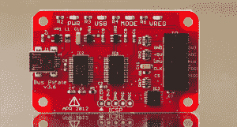
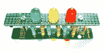

# 饰品 EDC 竞赛抽奖#3 结果

> 原文：<https://hackaday.com/2014/12/16/trinket-edc-drawing-3-results/>

我们已经为[饰品日常携带大赛](http://hackaday.io/contest/3432)举行了第三次抽奖。我们再次[使用一个专业饰品](http://hackaday.io/project/3594)来随机挑选赢家。本周的获胜者是[剪刀手]，他的项目是[设计安全夹克](http://hackaday.io/project/3584)

在真正的黑客风格中，[Scissorfeind]带着两个目标进入这个项目:一件能在晚上被看到的夹克，让他“看起来他妈的有病”。这件夹克本身是从旧货店买来的人造革。[Scissorfeind]为 bling 添加了一些饰钉，他正在为 light 添加大量的电子设备。

Pro Trinket 将驱动一系列 LED 矩阵，[Scissorfeind]正致力于将其转化为 POV 显示器。这些矩阵来自于[Scissorfeind]从垃圾填埋场保存下来的 LED 时钟。事实上，夹克中的大部分零件都是从电子垃圾中回收的。这件夹克刚刚开始拼起来。我们迫不及待地想看到最终的结果！

我们希望[剪刀手]喜欢他来自[黑客日商店的](http://store.hackaday.com/)[Bus Pirate v 3.6](http://store.hackaday.com/products/buspirate-v3-6-thm180c4m)。巴士海盗是由前黑客作家【Ian Lesnet】设计的，作为电子通信的瑞士军刀。如果你试图用 SPI、I C、JTAG 或 UART 连接到一个电路，总线海盗会帮你搞定。不过，它还能做更多的事情——从读取模拟数据到编程元件。在[巴士海盗 3.6 版产品页面查看【布莱恩·本乔夫】的完整评论！](http://store.hackaday.com/products/buspirate-v3-6-thm180c4m)

如果本周伪随机数神没有对你微笑，不要担心，还有两次机会赢取随机抽奖！我们的下一次抽奖将在美国东部时间 2014 年 12 月 23 日晚上 9 点举行。奖品将再次是一个[积木拼图！](http://store.hackaday.com/collections/products-toys-kits/products/cordwood-puzzle-first-edition)要获得参赛资格，你需要将你的项目作为正式参赛作品提交，并在一周内发布至少一篇项目日志。

主竞赛报名窗口将于 2015 年 1 月 2 日关闭，但不要等到最后一刻！点击竞赛页面，制作一些令人敬畏的可穿戴或可随身携带的电子产品！