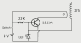

# 微型特斯拉线圈是一个完美的袜子填充物

> 原文：<https://hackaday.com/2014/12/22/micro-tesla-coil-makes-a-perfect-stocking-stuffer/>

特斯拉线圈在办公室里总是很受欢迎。戴着 DJ 的现代锁子甲播放音乐的巨型机器人，被自称疯狂的科学家扔在车库里的机器人……但是你见过能放在你手掌里的机器人吗？

【卢迪克科学】刚刚发布了这个如何制作的教程视频。这是一个微型  固态特斯拉线圈，它是基于曾经流行的[杀戮者激励电路](http://hackaday.com/2013/02/13/wireless-light-bulbs-with-a-slayer-exciter/)，它是由【GBluer】首先开发的。美妙之处在于这是一条非常简单的电路。它由一个功率晶体管、几个二极管、一些电阻和线圈组成。就是这样！

他甚至重新利用了一个小型继电器的电磁线，这实际上是一个你可以在商店里用废弃零件建造的项目。太棒了。

[https://www.youtube.com/embed/iMoDAspGPPc?version=3&rel=1&showsearch=0&showinfo=1&iv_load_policy=1&fs=1&hl=en-US&autohide=2&wmode=transparent](https://www.youtube.com/embed/iMoDAspGPPc?version=3&rel=1&showsearch=0&showinfo=1&iv_load_policy=1&fs=1&hl=en-US&autohide=2&wmode=transparent)

我们最喜欢的特斯拉线圈之一一定是[JJ·达舍]可笑的万圣节装置。他全力以赴。如果你真的想在宏观上建造一个，你可能[需要这个自动绕线机。](http://hackaday.com/2014/01/28/tesla-coil-auto-winder/)

【谢谢安德鲁！]