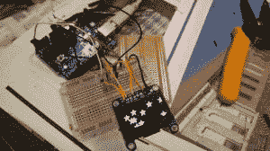

# 饰品 EDC 竞赛抽奖#4 结果

> 原文：<https://hackaday.com/2014/12/23/trinket-edc-drawing-4-results/>

Hackaday 日常小饰品携带大赛的五个随机抽奖中的第四个今晚举行。获胜者是[davish]和他的参赛作品,[小饰品手表。](http://hackaday.io/project/3627)

 【戴维斯】喜欢现在的智能手表，但他想要一款真正属于自己的智能手表。他用这个专业饰品和一把 1.3 英寸的 Adafruit 有机发光二极管来完成展示任务。尽管如此，这个小小的有机发光二极管能展示的不仅仅是数字。[davish]已经在设备上运行了 Adafruit 的徽标演示。饰品手表将开始作为一个简单的 Arduino 编码的“哑铃手表”。在时间和日期的基本问题解决后，[davish]希望增加蓝牙模块，将 Trinket Watch 变成一款成熟的智能手表。

我们希望[davish]能喜欢他在 Hackaday 商店[新买的](http://store.hackaday.com/)[积木拼图](http://store.hackaday.com/products/cordwood-puzzle-first-edition)。这里没有拼图游戏，积木是一个包含焊料的拼图游戏！如果你做错了一块，就该拿出焊芯来改正你错误了。这个拼图是用 20 世纪 50 年代和 60 年代流行的[积木组装技术制作的。我们也没有开玩笑说这是一个难题——这个工具包没有说明！[davish]将知道他得到了正确的，当所有 3 个发光二极管亮起。](http://en.wikipedia.org/wiki/Printed_circuit_board#Cordwood_construction)

如果您本周没有中奖，并没有失去一切，您还有一次机会赢得随机抽奖！我们的下一次抽奖将在美国东部时间 2014 年 12 月 30 日晚上 9 点举行。奖品将是一个 [Teensy 3.1 和音频适配器](http://store.hackaday.com/products/teensy-3-1)作为奖品。要获得参赛资格，你需要将你的项目作为正式参赛作品提交，并在一周内发布至少一篇项目日志。

主竞赛报名窗口将于 2015 年 1 月 2 日关闭，但不要等到最后一刻！[点击竞赛页面](http://hackaday.io/contest/3432)制作一些令人敬畏的可穿戴或可随身携带的电子产品！