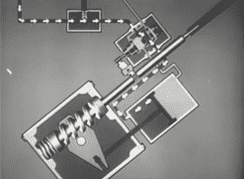

# 液压转向原理

> 原文：<https://hackaday.com/2014/12/30/retrotechtacular-principles-of-hydraulic-steering/>

你有没有试过驾驶一辆 20 世纪 40 年代的一吨重的皮卡，或者想知道如果没有助力转向系统，转弯会有多难？随着军用车辆在二战中变得越来越大和越来越重，需要某种辅助来驾驶它们。这部 1955 年的美国陆军训练电影巧妙地解释了液压辅助凸轮和杠杆转向系统中使用的[操作原理](http://www.youtube.com/watch?v=AlpvyWAA8a0)。

首先描述基本的转向组件。驾驶员转动连接在转向轴上的方向盘。该轴终止于转向凸轮，转向凸轮根据转向方向沿凸轮轴上下移动。凸轮轴通过一个[花键](http://gearsolutions.com/article/detail/5604/title/inside-splines)接头与转向轴相连，防止行程延伸至方向盘。转向凸轮连接至转向垂臂杆和转向垂臂轴。运动被传递到转向垂臂，该垂臂通过拉杆连接到转向连杆。

液压系统帮助转向臂驱动连杆转动车轮并改变车辆方向。组成液压系统的五个部件使用在动力缸内部产生的压差动力。液压系统始于并止于一个储存液体的容器。由发动机驱动的泵通过安全阀将加压流体输送到控制阀，控制阀是该系统的心脏。

该控制阀包含一个阀芯，该阀芯将流体从储罐引导至动力缸，并通过端口和通道返回。当驾驶员向一个方向转动方向盘时，凸轮使控制阀将加压流体释放到液压缸的一端。这压缩了活塞，活塞通过杠杆连接到转向垂臂杠杆。转向摇臂杆的另一端与转向凸轮啮合。它从中心移动一小段距离并压缩相应的末端弹簧。动力缸中的活塞将液压转换成机械力，使车轮转向所需的方向。

只要方向盘还在转动，流体就被泵送到动力缸中，而泄压阀会处理系统中积聚的任何过量压力。当你在一辆装有凸轮和杠杆转向装置的车上做油炸圈饼时，凸轮在这个不断转动的过程中是不转动的。与转弯方向相对应的末端弹簧保持压缩状态，液压在动力缸中保持平衡。一旦你感到厌倦，放开方向盘，系统返回到空档，所有进入控制阀的液体立即流回油箱。

液压转向也有助于减轻路面震动的影响。没有它，每一个小石子和弹坑都会让方向盘旋转，你不得不努力纠正它。装有液压转向装置的车辆通过逆转动力缸中发生的动作来抵抗这些冲击。震动通过连杆和转向垂臂传递到转向垂臂杆。这驱动凸轮，凸轮的运动使控制阀平衡压力，使车轮保持直线。

在过去的十年里，制造商一直在以油耗的名义转向电动助力转向。批评者认为，转向感觉僵硬，动力不足。我们的车今年 12 岁了，所以我们不知道 EPAS 是什么感觉。你喜欢哪一个？

[https://www.youtube.com/embed/AlpvyWAA8a0?version=3&rel=1&showsearch=0&showinfo=1&iv_load_policy=1&fs=1&hl=en-US&autohide=2&wmode=transparent](https://www.youtube.com/embed/AlpvyWAA8a0?version=3&rel=1&showsearch=0&showinfo=1&iv_load_policy=1&fs=1&hl=en-US&autohide=2&wmode=transparent)

Retrotechtacular 是一个每周专栏，以旧时的黑客、技术和媚俗为特色。通过[发送您对未来分期付款的想法](mailto:tips@hackaday.com?Subject=[Retrotechtacular])，帮助保持新鲜感。