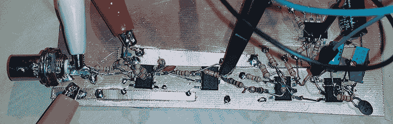

# 用运算放大器和 555s 解调 BPSK31

> 原文：<https://hackaday.com/2014/12/29/demodulating-bpsk31-with-opamps-and-555s/>

BPSK31 是业余无线电操作员非常喜欢的模式；它效率高，带宽窄，可以用计算机声卡或 Arduino 实现。就像罐头上说的那样，它是相移键控，正确的实现使用相位检测电路或类似的东西。[Craig]认为建造一个模拟 BPSK31 解调器[会很有趣，并想到用*振幅*解调](http://www.analogzoo.com/2014/12/amplitude-demodulating-bpsk31/)来做这件事。不，这不是你应该做的方式，但它很有效。

数据通过 BPSK31 传输，180 度相移为二进制 0，无相移为二进制 1。[Craig]的电路使用一个运算放大器和一对二极管对信号进行全波整流，基本上使二进制 1 逻辑高，二进制 0 逻辑低。

该整流信号随后馈入比较器，当信号高于 2V 时，输出变为高电平，当信号低于 1V 时，输出变为低电平。这就是你从信号中提取比特所需要做的，之后[克雷格]要做的就是想办法对其进行采样。

以 31.25 Hz 运行的非稳态模式设置的 555 提供时钟，通过将比较器的输出连接到 555 触发输入来与信号同步。计时器的时钟会稍微慢一点，但是由于 varicode 字符集，电路看到的二进制一的最大数量是 9；每当触发器看到一个零，定时器的触发器被重置，重新同步接收器的时钟。

是的，这是一个黑客，不，这不是你应该接受 PSK。然而，它确实起作用了，你应该为此感谢克雷格。

