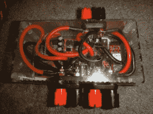

# “Superfan”游戏外设让您感受速度

> 原文：<https://hackaday.com/2015/01/07/superfan-gaming-peripheral-lets-you-feel-your-speed/>

虚拟现实已经走了很长的路，但一些感官仍然被忽视。在嗅觉视觉发生之前，下一步可能是[感受你头发上的风](http://jared.bienz.com/2014/12/19/create-your-own-superfan/)。也许是爸爸在开跑车，或者是孩子们在过山车上咯咯笑。没有你想象的那么难造，你可能已经有零件了。

现成的设备为你想象中的环境提供了[视觉和听觉部分，但它们仅此而已。[Jared]希望通过能够感受速度来进一步沉浸其中，这意味着建立自己的高功率风力发电机，并将其连接到虚拟现实系统中。“](http://hackaday.com/2014/10/03/interacting-with-virtual-reality-brings-us-even-closer-to-a-real-holodeck/)[花瓣](http://www.kickstarter.com/projects/236448256/petal-fan-for-virtual-reality)的失败众筹努力意味着一些新的东西将不得不被建造。显然，要移动空气而不使[真的像过山车一样](http://hackaday.com/2014/09/04/virtual-reality-expands-into-the-world-of-rollercoasters-with-the-augmented-thrill-ride-project/)需要一个电机控制器和一些风扇。强大的粉丝。

作为一个“做大”或“回家”的支持者，[Jared]拿起一对风扇，对它们进行了如此大的改造，以至于如果不固定住，它们会自己从桌子上掉下来。谁会过度驱动风扇，以至于需要为电机定制散热器？他有。他承认对大多数人来说，他走得太远了，明显超出了预算，但他是为自己建造的，并不在乎。

他是个好人，[Jared]对他构建的系统和你们大多数人想要构建的系统进行了定价和规格说明——Arduino、电脑风扇、电脑电源和你们零件中的其他垃圾。他的个人选择是一个 T-Rex 机器人控制器、BlueSMiRF 蓝牙和一对 O2Cool 风扇——163 美元，完成时将近 500 美元。如果你想完全模仿他的身材，[Jared]拍了照片，并详细描述了这个过程的每一步。

如果你像我们一样，你的第一个想法是“这很好，但没有用，除非游戏是为它而建的。”事实证明，有了插件套件，他们已经做到了。这个软件是这个版本的第二次破解，而且已经写好了。

[Jared]也很惊讶，但他发现的 3d 派对软件名为“ [SimTools](http://www.xsimulator.net/simtools-motion-simulator-software/) ”，它的速度和许多其他游戏内变量与广告宣传的一样。他们声称 95%的新赛车和飞行游戏都是由 SimTools 支持的，到目前为止已经有将近 100 个。一些你可能认识的标题:泥土，8 年的速度需要，微软飞行模拟 X，精英:危险，和无限制过山车。可悲的是，不可靠的支付系统鼓励论坛垃圾邮件“赚取”硬币或每场比赛的年费是必需的。不管奇怪与否，它确实提供了现金和捐款两种选择，所以，很难指责开发者太多。

项目日志就像是一个教程，对于新手来说并不缺少任何东西。初学者制作自己的风力发电机所需的一切都包含在他的详细讲解中。

看看下面的视频，看看一个非常开心的小女孩坐在她想象的过山车上，还有一个赛车游戏 Assetto Corsa 的顺风演示。

[https://www.youtube.com/embed/70RRKI3qXmc?version=3&rel=1&showsearch=0&showinfo=1&iv_load_policy=1&fs=1&hl=en-US&autohide=2&wmode=transparent](https://www.youtube.com/embed/70RRKI3qXmc?version=3&rel=1&showsearch=0&showinfo=1&iv_load_policy=1&fs=1&hl=en-US&autohide=2&wmode=transparent)

[https://www.youtube.com/embed/pexg-6KCV6k?version=3&rel=1&showsearch=0&showinfo=1&iv_load_policy=1&fs=1&hl=en-US&autohide=2&wmode=transparent](https://www.youtube.com/embed/pexg-6KCV6k?version=3&rel=1&showsearch=0&showinfo=1&iv_load_policy=1&fs=1&hl=en-US&autohide=2&wmode=transparent)