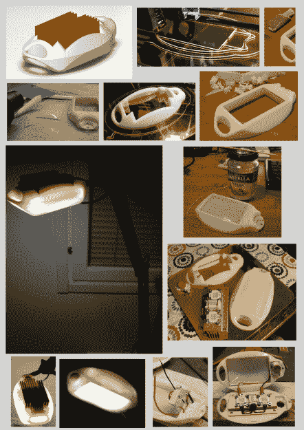

# 消除荧光嗡嗡声的一种方法

> 原文：<https://hackaday.com/2015/01/04/one-way-to-get-rid-of-that-fluorescent-buzzing-sound/>

厌倦了他的荧光台灯发出的持续的嗡嗡声，[安德烈斯·洛威]决定他必须修理它。所谓修复，我们的意思是彻底摆脱。不过他喜欢这盏灯，所以他决定把它换成 LED 灯——这样他也可以节省一些电费！

除了想摆脱嗡嗡声，[安德烈斯]还一直在研究夜间光线温度的影响——当你试图入睡时，蓝色的光通常对你的眼睛有害。所以他也借此机会改变了自己房间灯光的色温。不幸的是，这并不像用 led 取代荧光灯那么简单——不，那太简单了…

由于 led 需要巨大的散热器，[Andres]决定用他的 3D 打印机重建整个灯头会更容易，而不是试图修改他已经有的东西。为了让它看起来更漂亮一点，他用了[丙酮蒸汽浴法](http://hackaday.com/2013/02/26/giving-3d-printed-parts-a-shiny-smooth-finish/)将印刷的部分磨平。他还设计了一个小型扩散器，使用一张丙烯酸板来帮助更好地传播光线。