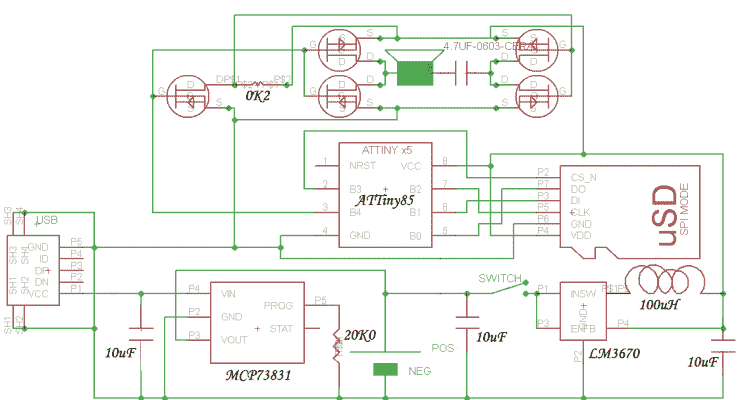

# 这款 CD 首饰盒无需光盘即可播放音乐

> 原文：<https://hackaday.com/2015/01/06/this-cd-jewel-case-plays-music-without-a-disc/>

我们都听说过那些糟糕的贺卡，里面有 2 比特的音乐片段，通常会让你想把电池拆了……但是霍尔马克终于赶上了技术，现在他们的贺卡里包含了真正的音乐——可能只有大约 10 秒钟，但是嘿，这是一个进步！

虽然它们仍然很老套，我们甚至不确定什么是给某人一张有声贺卡的理想情况——但无论如何，[德米特里·格林伯格]认为他可以比霍尔马克做得更好——我们不得不同意。他用 CD 首饰盒制作了一张新年贺卡，里面装的东西非常不可思议。

这个盒子打开后，将会播放一首完整的歌曲。下次你打开它，它会从自己的微型 SD 卡 300 首歌曲库中随机播放一些新的歌曲。

他使用 ATTiny85 实现了这一点，attin y85 使用两个时钟频率分别为 64MHz 和 32KHz 的定时器来输出模拟音乐品质。他还在盒子里装了一个微型 USB 充电器，带有一个薄锂电池，一个焊接在适当位置的 SD 卡适配器，允许交换 microSD 上的音乐文件，以及扬声器和放大器。结案时，你甚至看不出这个案子有什么不同。

很酷的项目。如果您有兴趣尝试自己的代码，他甚至还提供了代码(可以在他的网站上找到)!

[https://www.youtube.com/embed/uHMfQbcbqP8?version=3&rel=1&showsearch=0&showinfo=1&iv_load_policy=1&fs=1&hl=en-US&autohide=2&wmode=transparent](https://www.youtube.com/embed/uHMfQbcbqP8?version=3&rel=1&showsearch=0&showinfo=1&iv_load_policy=1&fs=1&hl=en-US&autohide=2&wmode=transparent)

对于一个更简约的电路，一个可能比霍尔马克公司的产品更便宜的单芯片贺卡怎么样？或者为什么不在[中加入一些漂亮的视觉效果，一张边缘发光的音乐贺卡呢？](http://hackaday.com/2012/10/10/edge-lit-musical-birthday-card/)