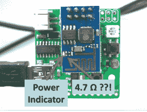

# 有故障的 ESP8266s 释放烟雾，然后继续工作？

> 原文：<https://hackaday.com/2015/01/08/faulty-esp8266s-release-smoke-then-keep-working/>

[雷]有点麻烦。当他开始销售基于 ESP8266 的产品时，一切看起来都很好，但此后不久[其中一些变得很热，让烟冒出来](http://rayshobby.net/?p=10241)。不要担心，他建议忽略这个问题，因为一旦有故障的组件蒸发了，设备就会好起来。

症状在于板载红色电源指示灯 LED 冒烟。(可能)LED 没有任何问题，因为在测试该批次时，他发现其限流电阻有时有点低于规格。差了一点点，哦，就算是 1000 倍吧。

 是的，4700 欧姆的电阻有时会被 4.7 欧姆的电阻代替。就在电力轨对面。那个可怜的小 LED 正试图在一个针头上消耗半瓦的能量。就像一只试图让大锤慢下来的麻雀，它不会有好下场。试着不要太挑剔，取放机器有时也会遇到困难，每个人都知道这些卷轴看起来几乎一样！

好消息是，LED 和电阻器开始了一场热竞赛，谁赢了谁就跑了。一旦连接断开，热量问题就会消失，功率消耗会恢复正常。一切都很好，除非你需要指示灯。看——没有多少修理工作可以用零工具、零努力、只需几秒钟的时间来完成。

[Ray]还建议，如果你是少数不幸的人之一，或者在最坏的情况下，他当然会主动提出更换产品，那么就测量并拆焊电阻或 LED。他尽了最大努力从真正的供应商那里购买，并向少数受到影响的客户道歉。据他所知，还没有其他人遇到过这个问题，所以他想尽快在 Hackaday 上与社区分享这个问题。保持警惕。

如果你以前从未看过 [~~冒烟~~](http://hackaday.com/2013/09/19/fail-of-the-week-smoking-pulse-sensor-and-ble-dissappointment/) *ISO9001 认证的电子维修*，有一个关于这个特殊的~~灾难~~ *升级*的短视频在休息后被现场录了下来。

[https://www.youtube.com/embed/LyqdtRD1ykI?version=3&rel=1&showsearch=0&showinfo=1&iv_load_policy=1&fs=1&hl=en-US&autohide=2&wmode=transparent](https://www.youtube.com/embed/LyqdtRD1ykI?version=3&rel=1&showsearch=0&showinfo=1&iv_load_policy=1&fs=1&hl=en-US&autohide=2&wmode=transparent)