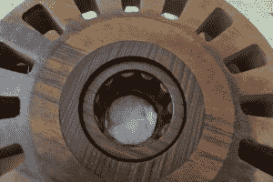

# 纯木质卡丁车赛激发了花式木质轴承的灵感

> 原文：<https://hackaday.com/2015/01/12/wood-only-kart-race-inspires-fancy-wooden-bearings/>

多山的意大利小镇 Artena 举办了一年一度的木制汽车肥皂箱比赛——这意味着 100%的木材，而不是任何其他东西。激烈的竞争促使[阿莱西奥]从事工程和数控加工，为车轮制造这些[华丽的木制滚柱轴承，这让他获得了优势。](http://www.alessiovaleri.it/a-wooden-roller-bearing-a-practical-approach/)

数以千计穿着戏服的人参加名为“Palio delle contrade di Artena”的文艺复兴集会，流行的纯木头比赛被称为“La Carettella”赛车由两人小组操作:一人在前面刹车，另一人在后面跳上跳下，在整个过程中按需推动。似乎没有从车轮**转向，所以转向也是两个人的努力。拖在路面上的木制杠杆为“司机”提供了一些转向，而推车人经常手动操纵整个车尾，在必要的地方漂移。该路线还包括全宽障碍物，如干草捆。团队按社区或“contrada”划分，是[Alessio]的队长带着滚柱轴承的特殊要求来找他的。找不到其他木制轴承的证据，[阿莱西奥]知道他必须自己发明它们——所以他做了。

 滚柱轴承内置于轮毂中，看起来就像是由淬硬钢制成的。[阿莱西奥]选择的纤维素是黄杨木，这是一种自润滑木材，也是最难种植和出售的木材(在那些贴有“铁木”标签的木材中)。在 Rhino 中绘制了车轮和轴承后，使用 3 轴数控铣床切割并组装。

可悲的是，在比赛中，[阿莱西奥]的司机设法撞毁了卡丁车——两次，也许是所有的额外速度——所以他们没有赢得今年的 Carettella。[阿莱西奥]着眼于明年的胜利，足以让他对设计的实际规格保密。

以下是[阿莱西奥]卡丁车比赛的 11 秒精彩镜头，以及 Artena 音乐节的一些片段。(比赛跳到 1:40)。

[https://www.youtube.com/embed/uexsOPMYy0Q?version=3&rel=1&showsearch=0&showinfo=1&iv_load_policy=1&fs=1&hl=en-US&autohide=2&wmode=transparent](https://www.youtube.com/embed/uexsOPMYy0Q?version=3&rel=1&showsearch=0&showinfo=1&iv_load_policy=1&fs=1&hl=en-US&autohide=2&wmode=transparent)

[https://www.youtube.com/embed/gAcdcx4u0Fc?version=3&rel=1&showsearch=0&showinfo=1&iv_load_policy=1&fs=1&hl=en-US&autohide=2&wmode=transparent](https://www.youtube.com/embed/gAcdcx4u0Fc?version=3&rel=1&showsearch=0&showinfo=1&iv_load_policy=1&fs=1&hl=en-US&autohide=2&wmode=transparent)

**更新——正如几位敏锐的读者所指出的，很明显存在转向。前轮安装在卡丁车中间的一个枢轴板上，由司机的脚控制。哎呀。

***更新–我们的一位意大利读者解释说，官方规则只允许使用金属转向销，这可能是为了防止木制转向销断裂时车队打滑。此外，虽然金属部件是不允许的，但像钉子和螺丝钉这样的紧固件是允许的，这要经过裁判的检查。