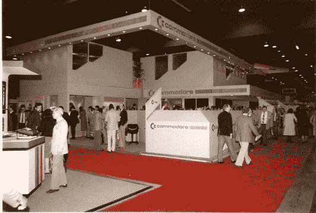
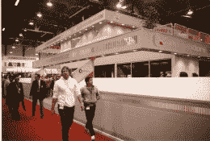
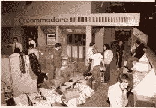
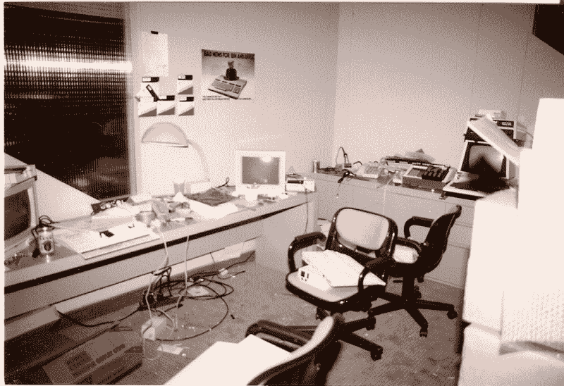
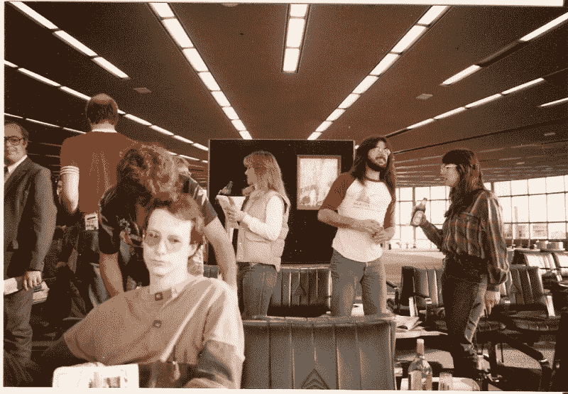

# 制作消费电子展…三十年前

> 原文：<https://hackaday.com/2015/01/10/making-the-ces-show-thirty-years-ago/>

今年的 CES 勾起了一些回忆。我曾假设，随着一个人变老，他们应该会习惯于年轻活力的人分享他们的身体和记忆，除了一些伤疤和一些旧袜子，加上 2 或 3 张照片证明这实际上不是一系列的幻觉。原来你不习惯，你就忍着。

30 年前是我们的消费电子展:Commodore 在每次消费电子展上都有展示新东西的名声，这是一个*家用电脑*意味着*消费电脑*的时代。我以前写过，我们如何努力确保别人的失败不会成为我们的失败，事实上，我们确实及时赶上了 1985 年的 CES，那是我们的旗舰电脑，至少在接下来的 4 天里。

## 直到最后一刻

  1985 Commodore CES Booth  Commodore 1985 CES Booth: an “elegant” grey and yellow battleship parting the CES seas. (Marketings’ idea)  Putting 85 CES together. Pics courtesy of [Terry Ryan]

当我说及时赶到时，我指的是人们在前一天晚上或当天早上手里拿着最后十个左右自制的和 MOS 煮的 80 个柱形薯片。在下面看到的房间里，等待的 C128 电脑排成一行并打开着；箱子张得大大的，就像一排小鸟，随着时间一秒一秒地倒数，等待着莫斯给我们带来的任何惊喜。

最后，我们站在展位的二楼(是的，他们在前一天晚上花了几个小时为我们建了一个两层楼的结构),检查现在工作的计算机；C128 和从未发布的 LCD 机，当最后一个“问题”在大门打开之前到来；一位营销人员(气喘吁吁地)告诉我们“又一次 C128 的失败”，尽管她实际上不能指出任何以前失败过的计算机。我们不会让她继续抱怨，直到她收回之前的失败的一般声明，更多的是原则而不是实际的卑鄙。

The “Prep” room now empty, every CES C128 computer came through here. Note the EPROM burner and disks taped to the wall along with a residual Coors beer can

与大多数高技术的现场修复一样，这一次是值得记住的。我在“85 年消费电子展”上的最后一幕变成了简单的动作，走到“出故障的”电脑前，按键将 C128 变回 40 列模式，这尤其重要，因为它只连接了一个 40 列显示器。

## 行结束

然后发生了一些事情:我们完成了。我感觉几个月来一直消耗 CPU 和 I/O 的子进程实际上结束了，我突然不受下一个“必须修复”的阻碍。我没有下一个任务要从堆栈中弹出…短语“行尾”出现在脑海中。

我当时 24 岁，在拉斯维加斯，刚刚为世界上最好的电脑公司的一个主要产品在唯一一个对我们很重要的展会上做了展示。我开始走向门口，异常明亮的拉斯维加斯阳光透过窗户。街区周围排着长队等待进入，但出口完全畅通无阻。

我把自己埋在拉斯维加斯，以一种只有青春、睾丸激素和肾上腺素才能实现的方式。

## 四处走动

Thats me with the long hair and the girl (Judy Braddick, a somewhat brilliant Game Programmer). Note the bottle of Tequila and empty beer bottle sitting on the table in the Las Vegas airport. Greg Berlin is on the left standing two feet taller than normal humans. (Hedley Davis of Xbox fame in the foreground). It was a good CES.

我不会在这里报告接下来几天所做的一切，因为我知道对于一些事情来说，诉讼时效永远不会真正结束，但受到[Mike]参观公司套房的报道的启发，我将在这里讲述一个小故事:我抓住我最好的朋友和硬件设计师同事，他是 1581 磁盘驱动器的父亲，也在这一天成功发布，然后走了出去。带着 6 英尺 8 英寸高的格雷格·柏林(柯蒂斯·赖特 P-40 战鹰战斗机设计师的孙子)，我们开始在当地酒店寻找那些从未亲自邀请过我们的“重要”公司的套房。我们有一个秘密武器，可以像贿赂一样打开门；不是在格雷格高耸的面前，而是在简单的短语:“我们来自准将”。

先前只开了 12-14 英寸的门完全打开了，只停在门卫的鞋子上，5.25 英寸的软盘被塞在我们的口袋里，就像一个试图给约会对象留下深刻印象的贵宾的 20 美元钞票一样。我想到的是电子艺术公司(Electronic Arts)的套件。我们口袋里塞着今年的(和去年的一些)C64 游戏软盘，像老朋友一样受到欢迎；预约和超过一对夫妇的突突比赛举行。他们失去了或者至少没有让我们变得更好，因为我们还年轻，充满了睾丸激素。

当我们准备离开艺电的好心人时，在确保我们第二天会去他们的摊位(我们去了)后，他们问是否有什么他们能为我们做的。这听起来可能是一个奇怪或不必要的问题，但我已经发现了 Michelob(1 微米硅早期的一种啤酒)的情况，并在问题完全说出之前就指向它。当我转身面对门口时，EA 毫不犹豫地抓起箱子，这样他就可以帮我把泪珠状的瓶子放在我的肩膀上。

回到拉斯维加斯，我们肩上扛着电子艺术公司的啤酒……这是一次很好的消费电子展。