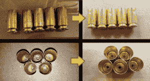

# DIY 零件不倒翁清洁你的零件好

> 原文：<https://hackaday.com/2015/01/11/diy-parts-tumbler-cleans-your-parts-good/>

零件滚磨是一种去毛刺和清洁相对较小物体的方法。这是通过捕获旋转容器内的部件和介质来实现的。搅动不断移动部件所有表面和角落周围的介质，使它们变得平滑，从而形成均匀的表面。介质可以是任何东西，从特种陶瓷形状到滚珠轴承甚至沙子。这一过程可以在潮湿或干燥的条件下进行。想想海滩，那里的岩石很光滑。这是由于波浪反复摩擦沙子和石头，导致光滑的圆形。

[imp22b]最近开始重装弹药，需要一种方法来[清理他用过的弹壳](http://ingunowners.com/forums/ammunition-reloading/284542-diy-wet-media-tumbler-pic-heavy.html)。外壳是黄铜的，在网上做了一点研究后，[imp22b]发现使用不锈钢针作为介质的湿法翻滚工艺是一种 DIY 的证明方法。然后，他继续寻找一个商业上可用的不倒翁来模拟他的构建，在这种情况下，Thumler 模型 b。当然没有必要在这里重新发明轮子。

正如你在照片中看到的，铝挤压被用作框架。安装在框架上的是 4 个轴台轴承，每对轴承之间有轴。一个马达驱动一个安装在轴承上的杆，该杆又转动放置在杆上的容器。[imp22b]从一个 1/15 马力的电机开始，他一直在踢来踢去，但这不够强大，所以他不得不加强到 1/3 马力的单位。容器由现成的 PVC 管件制成，容纳介质和外壳以及一些水。还添加了一点柠檬油和黎明清洁剂，有助于清洁零件。经过几个小时的翻滚，肠衣看起来相当不错。

如果你有兴趣自己制作更简单的不倒翁，看看这个[用手钻](http://hackaday.com/2014/09/01/a-peach-of-a-homemade-parts-tumbler/)的不倒翁或者这个[用咖啡罐](http://hackaday.com/2012/07/03/easy-to-build-parts-tumbler-you-can-add-to-your-shop/)的不倒翁。