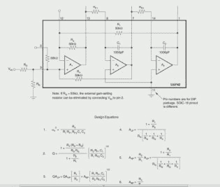
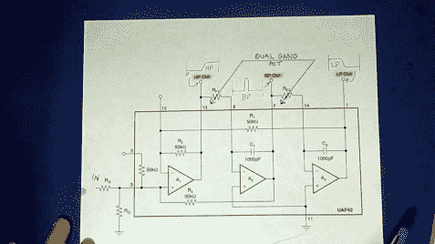
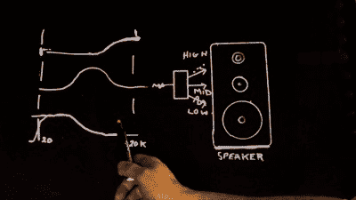
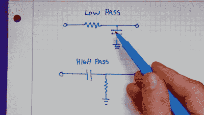
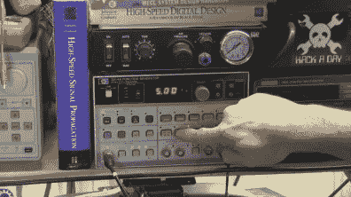
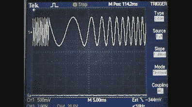
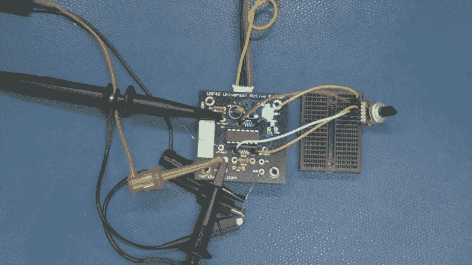
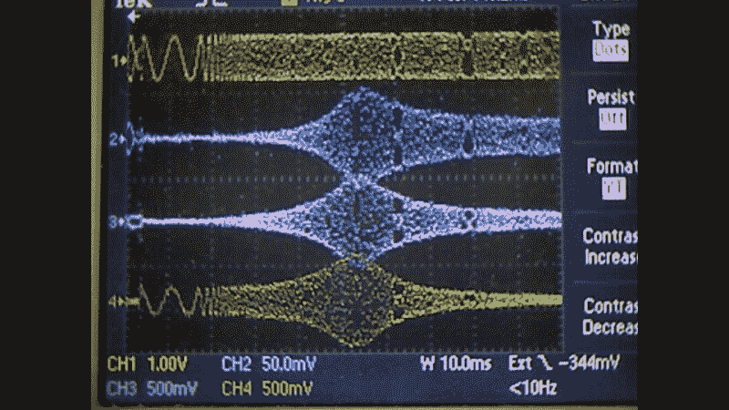

# 通用有源滤波器:第 1 部分

> 原文：<https://hackaday.com/2015/01/13/universal-active-filters-part-1/>

今天，我正在试验一个单芯片通用有源滤波器，在这种情况下，我为德州仪器的 UAF-42 做了一个小 PCB。我之所以特别选择这款器件，是因为它只需改变一对电阻就能方便地设置滤波器频率，并且芯片上的一些关键值已经过激光调整，以确保精度。这种类型的有源滤波器包括提供增益的运算放大器，它支持各种配置，包括带通、低通和高通等同时工作模式，使其具有“通用性”。

  UAF421 Universal Active Filter  UAF421 Universal Active Filter using a dual ganged potentiometer.

[https://www.youtube.com/embed/WjvQdddTWNk?version=3&rel=1&showsearch=0&showinfo=1&iv_load_policy=1&fs=1&hl=en-US&autohide=2&wmode=transparent](https://www.youtube.com/embed/WjvQdddTWNk?version=3&rel=1&showsearch=0&showinfo=1&iv_load_policy=1&fs=1&hl=en-US&autohide=2&wmode=transparent)

## 过滤器基础

Speaker Crossover Example

从框图中可以看出，我在何处插入了一个双组电位计，以同时改变两个电阻，这样就可以直接进行调整。

观察可以轻松实现简单低通或高通滤波器的简单 RC 滤波器的元件，我们会发现，数学计算相当简单，只需相互交换元件就可以改变滤波器类型。

Real Pole Filter Example

要区分高通和低通，请检查所示电路，其中电容与信号串联。简而言之，没有直流电流(DC)可以通过串联的电容器，因此 DC (0Hz)和其他低频被抑制或衰减。同样，当电容位于信号两端(从信号到地)时，它可以像电池一样工作；它储存能量并抵抗电压的变化，允许较慢、较低的变化或频率通过，同时抵抗电压的较快变化。

## 你的频率响应是多少

为了演示系统的频率响应，可以使用扫描频率发生器。这里，我古老的 HP 3314A 函数发生器被设置为从 80Hz 扫描到 5kz，并通过滤波器电路。观察输入，可以看到扫描从明显较低的频率开始，然后扫描到较高的频率。观察输出，可以看到不同输出的幅度，由于示波器的设置方式，输出与频率扫描的开始同步。这意味着我们可以根据信号在示波器上的位置来估计信号频率。

  Demonstrating the HP3314A Sweep Function Generator  HP3314A Function Generator in Sweep Mode  Herdware UAF-42 PCB

## 当一张照片值 1000 赫兹时

从图中我们可以看到，高通的蓝色轨迹有一个初始“尖峰”(一种非线性，可能是“纹波”变化)，右侧信号的幅度显示它正在通过更高的频率。同样，左边的绿色曲线通过较低频率，中间的粉色曲线通过区域。

由于双电阻提供的可调性，我可以使用电位计轻松地从低到高调整滤波器频率。如果您观看视频，可以看到这些调整的效果，当我想到扫描音频频段的交互滤波器时，我往往会想到模拟合成器，或许我可以在后续视频中自动调整这些滤波器。

请稍后回来看第 2 部分，在那里我测试了我们在前面几集里谈到的方波和谐波。我也谈了一点现实生活中的数学。