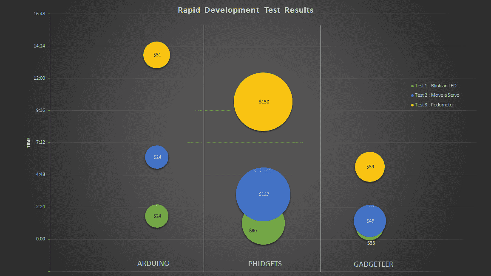

# Arduino Vs. Phidgets Vs. Gadgeteer

> 原文：<https://hackaday.com/2015/01/12/arduino-vs-phidgets-vs-gadgeteer/>

几天前，我们看到了 Arduino 和 Phidgets 之间的开发时间测试，这是一种有点专有的开发板，比 Arduino 贵很多倍。时间试验是一个简单的实验，看看哪个平台能更快地制作简单电路的原型。像往常一样，在黑客评论中，有大量的评论质疑测试的有效性和偏见。不想让一个好的争议浪费掉，[Ian Lee]把他的帽子扔进了与 gadgeter 的相同开发试验的环中。

gadgeter 拥有与 Phidgets 相同的设计理念:模块化组件和独特的软件系统——gadgeter 基于此。NET Micro Framework——允许您快速启动并运行。与 Phidgets 不同，Gadgeteer 的价格与 Arduino 具有竞争力，[主板](https://www.ghielectronics.com/catalog/product/349)的价格在单个 ATMega 芯片的数量级内。

[Ian]在三个开发平台上完成了三个项目:闪烁的 led、移动的伺服系统，以及构建一个带有加速度计的计步器。对于每一次试验，所花费的时间和所有部件的价格加在一起。这是相关的图表:

根据测试，小玩意以较大优势胜出。我们不会称之为决定性的测试，任何理智的人都不应该这样认为。然而，它突出了一个设计良好的“基于模块”的开发系统与一个好的 IDE 相结合的好处:Gadgeteer 始终比 Phidgets 快，只是比 Arduino 贵一点。

虽然由一名开发人员编写代码来闪烁 LED、移动伺服系统和读取计步器的计时试验不足以得出任何结论，但它确实证明了 Gadgeteer 并不比使用 Arduino 贵多少。我们将把剩下的讨论留给下面的评论者。