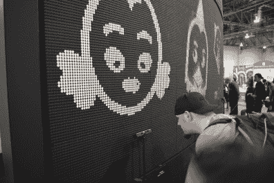

# CES 上的巨型翻转点显示器

> 原文：<https://hackaday.com/2015/01/14/the-giant-flip-dot-display-at-ces/>

翻转点显示器是宏伟的，尤其是这个拥有 74，088 像素！我曾经听说过把硬件比作电子墨水。这实际上是一个非常好的描述，因为两者都使用一边是白色另一边是黑色的像素，依靠线圈来改变状态，并且只在翻转这些位时使用电力。

这个装置的引人注目之处在于它的规模。它占据了 2015 年 CES 上 ooVoo 展台的一面巨大弧形墙。我们希望听到更多关于硬件的信息，所以我们联系了他们，他们没有让我们失望。ooVoo 的工作人员抽时间召开了一次电话会议，协调建造工作的 Pat Murray 也参加了会议。没错，他们建造了这个东西——我们以为它是租来的。[Matt Farrell]回忆说，在构思期间，团队问自己，当与尖端的 4k 和 8k 显示器并列时，移动公司的高清视频聊天如何展示显示技术？我们认为 flip-dot 是一个完美的策略——我知道我花在这上面的时间比看电视的时间还多。

休息后加入我们，了解它是如何建造的，包括装置背面的图片和视频剪辑，你必须听到才能相信。

## 惊人的短开发时间

 [![[Pat Murray] toils away... that's a lot of wiring!](img/4a82705c25597ab8265cda656dbfc371.png "IMG_2682")](https://hackaday.com/2015/01/14/the-giant-flip-dot-display-at-ces/img_2682/) [Pat Murray] toils away… that’s a lot of wiring!  Wide-angle view of the display being assembled.

听着，这堵墙从构思到完工只用了不到两个月的时间。第一次融资活动发生在 10 月的最后一周，钻机在圣诞节前一周完工。

在下面的视频中，你可以分辨出组成显示屏的面板。每个都有一个 28×14 的翻转点网格。面板排列成 21 列，每列 9 个。这提供了 588×126 的黑白显示分辨率。从认知上来说，这是个可怕的决定。但这项技术的巨大尺寸和新颖性使得 74，088 个机械像素在从一个状态到另一个状态的点击过程中，看起来和听起来都令人震惊。

[https://www.youtube.com/embed/SJU2-1X8kHQ?version=3&rel=1&showsearch=0&showinfo=1&iv_load_policy=1&fs=1&hl=en-US&autohide=2&wmode=transparent](https://www.youtube.com/embed/SJU2-1X8kHQ?version=3&rel=1&showsearch=0&showinfo=1&iv_load_policy=1&fs=1&hl=en-US&autohide=2&wmode=transparent)

每个模块都有一个内置控制器，通过串行方式控制。为了将其中的 189 个整合到一个显示器中，[Pat]从 [Grid Connect](http://gridconnect.com/) 获得了一些串行转以太网硬件。这些适配器通过 64 根以太网电缆向单台计算机报告。那个盒子回放一个视频文件，使用 [Adobe Air](http://www.adobe.com/products/air.html) 将数据包发送到以太网控制器的 IP 地址，对其进行动态改编。

所有这些都由三个 56A，24V 电源供电。在 30fps 的刷新率下，当一次翻转所有的点时，这是 189 个面板的最大电流消耗* 0.680 安培= 128.52A @ 24VDC(与 28 安培@ 110VAC 的功率相同= 3085W)。

## 让它互动

  Between video demos these cartoon faces will react to your expression.  PrimeSense used to gauge your facial expressions

显示器不仅仅是滚动视频。伴随着 ooVoo 的广告，这些卡通面孔将会出现。沿着显示器的长度均匀分布的是 [PrimeSense](http://en.wikipedia.org/wiki/PrimeSense) 深度相机。[Pat]告诉我们，之所以选择这些传感器而不是 Kinect 传感器，是因为它们更适合近距离面部识别。结合 [Affectiva](http://www.affectiva.com/) 和 [Faceshift](http://www.faceshift.com/) ，你的面部表情被测量并转化为卡通人物。每个传感器都有自己的 Mac mini，它解析数据并通过网络向控制显示器的盒子发送命令。

我们的欧洲读者可能有机会亲眼目睹这一幕。ooVoo 将于 3 月 2 日至 5 日在巴塞罗那举行的世界移动通信大会上展示这款手机。