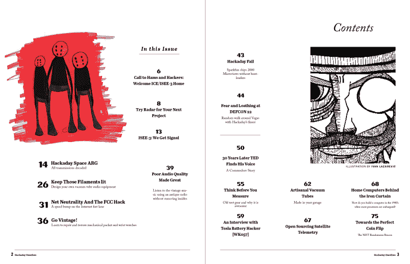
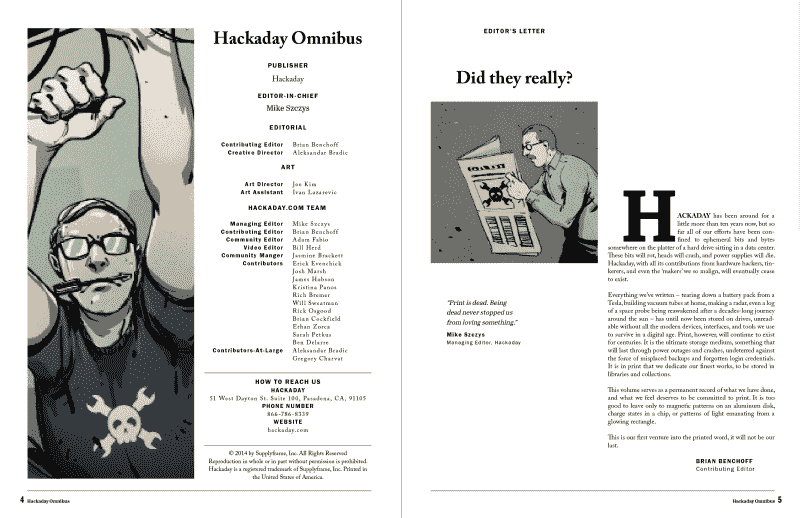
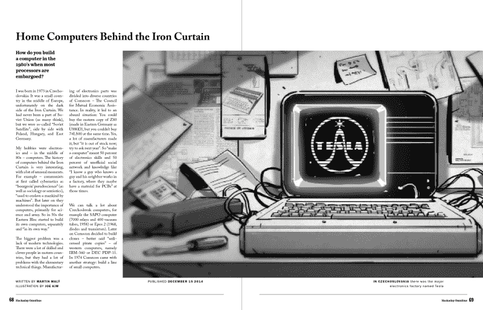

# hack aday Omnibus 2014——我们的首个印刷版

> 原文：<https://hackaday.com/2015/01/19/hackaday-omnibus-2014-our-first-ever-print-edition/>

这是你抓住一个实实在在的黑客日的机会。今天早上，我们开始[预订 2014 年](http://store.hackaday.com/products/hackaday-omnibus-2014)黑客日综合活动。这是我们的第一个印刷版本。它收集了 2014 年发表在 Hackaday 上的一些最好的原创内容。

我们为 Hackaday 团队去年取得的成就感到骄傲。从新旧故事到鼓励你扩展你的黑客世界的文章，我们对去年发表的原创内容文章感到兴奋。为了配合这一顶级内容，我们添加了来自[Joe Kim]的惊人的艺术和插图。这种产品需要用印刷品来纪念，因此《综合》诞生了。

这本全彩色、80 页、完美装订的书正是你的咖啡桌梦寐以求的。当然，它会看起来壮观的覆盖在焊接和剪辑电阻铅在工作台上。如果你的公司对硬件很认真，你需要在接待处(或者滑稽地在洗脸台)放一份综合信息。

我们将 Hackaday Omnibus 2014 的定价定为 15 美元，但如果你接受预订，我们会提高价格。使用此优惠券代码可获得 5 美元优惠: **OMNIBUS2014** 。该优惠券适用于预计发货日期为 2015 年 2 月 9 日的前 500 份预购。

