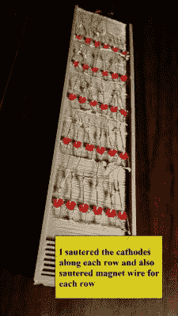

# 3D 打印 LED 吉他和弦图

> 原文：<https://hackaday.com/2015/01/18/3d-printed-led-guitar-chord-chart/>

学习弹吉他需要大量的记忆——和弦、音阶、琶音，应有尽有。[MushfiqM]用他的[数字和弦图](http://www.instructables.com/id/Digital-Chord-Chart/)让这个过程变得简单了一些。几乎每个初学吉他的人手边都有一个和弦应用程序、和弦手册，甚至和弦海报。通常这些和弦图是以[指法](http://en.wikipedia.org/wiki/Tablature)的形式出现，这是一种显示每个手指应该在乐器上的位置的速记方法。[MushfiqM]更进了一步，将图表放在吉他指板的 3D 打印模型上。

 [MushfiqM]首先使用 Autodesk Inventor 渲染一个简易吉他的 3D 模型。然后，他将他的创作分为三个部分:床头、琴颈和指板。吉他的琴颈被挖空，为显示手指位置的 led 矩阵留出了空间。[MushfiqM]然后小心翼翼地焊接在一个由 30 个 led 组成的 charlieplexed 矩阵中，所有的 led 都由磁线连接。led 由 Arduino UNO 控制，它将和弦和音阶图表存储在闪存中。

对于用户界面，[MushfiqM]使用了一个 2×16 字符的 LCD 和一个低成本的红外遥控器。用户只需选择一个和弦或音阶，它就会显示在指板上。

有几个商业产品也有类似的功能，最著名的是 [Fretlight](http://www.fretlight.com/) 吉他。这些可能会有点贵 LED 吉他的价格高达 400 美元。

[通过指令]