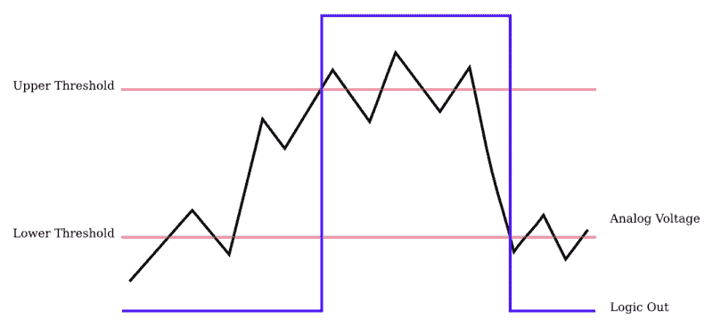
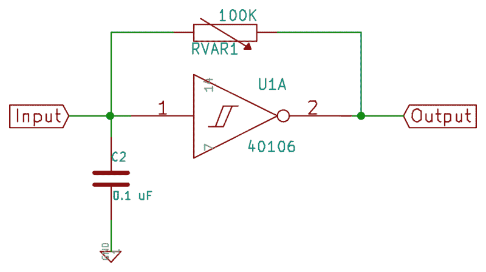
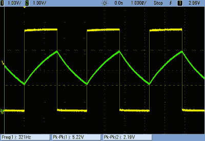
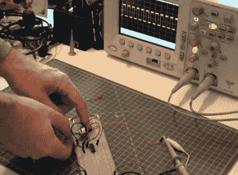
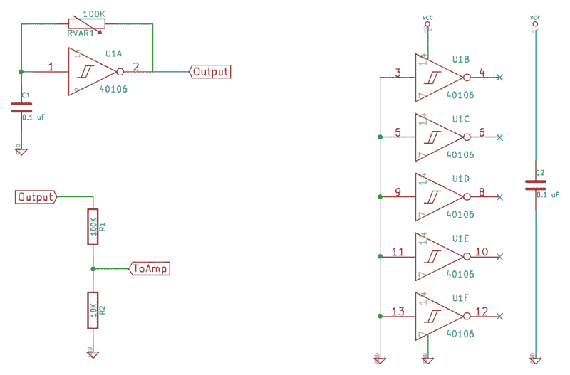
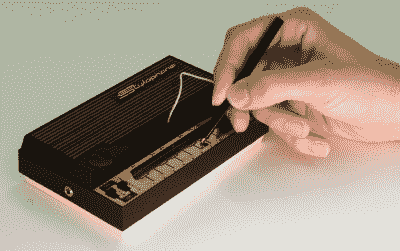
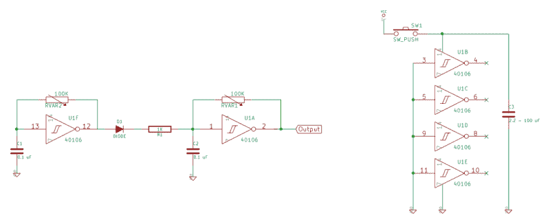
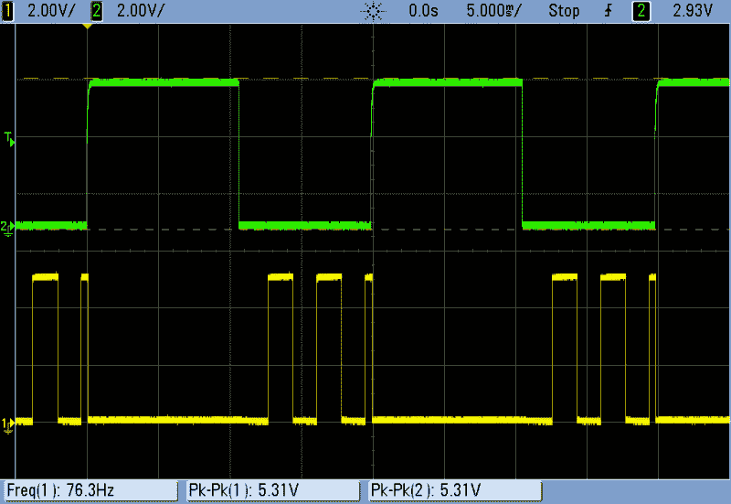

# 逻辑噪音:甜美的振荡器声音

> 原文：<https://hackaday.com/2015/02/04/logic-noise-sweet-sweet-oscillator-sounds/>

欢迎来到带你走进基于(大部分)CMOS 逻辑芯片的 DIY 电子合成器的兔子洞系列的第一部分。我们将使用最便宜的可用部件，使用或误用数字逻辑，而不是大型企业制造的商品设备。简而言之，不要期待预先包装的平滑色调，因为我们将制造创造性的噪音机器。

如果你是 chiptunes 类型的，你可能会在这里找到你喜欢的东西。如果你是电路弯曲者或电子噪音朋克类型，这将是你的拿手好戏。如果你只是喜欢看 CMOS 芯片以意想不到的方式蠕动，请随意越过我的肩膀看。如果你是那种坚持认为螺丝刀不能用来撬开油漆罐的人，那么也许你最好[跟着](https://www.youtube.com/watch?v=DIzAaY2Jm-s&index=2&list=RD2I33k8vV3Sk#t=3m23s)走。作为 bug 的小故障和作为有趣发现的小故障之间只有一线之隔，我们将会在它上面跳舞。

为了让您了解我们在本次会议中的内容，这里有一个快速演示。看一看，然后我们就开始讨论。

[https://www.youtube.com/embed/RfKNHV9t8so?version=3&rel=1&showsearch=0&showinfo=1&iv_load_policy=1&fs=1&hl=en-US&autohide=2&wmode=transparent](https://www.youtube.com/embed/RfKNHV9t8so?version=3&rel=1&showsearch=0&showinfo=1&iv_load_policy=1&fs=1&hl=en-US&autohide=2&wmode=transparent)

## 一切都从方块开始

我们将从一个振荡器开始(哈欠！)然后很快把它变成更有趣的东西。让这条赛道变得可玩需要更多的实验，但这就是重点。在此过程中，我们将为以后更复杂的电路打下基础。我们从头开始，但是曲线很陡。

我们简单的振荡器电路基于一个逻辑反相器 T1。反相器是一种芯片，它输出与输入相反的逻辑电压电平:如果输入看到高电压电平，它将输出设置为低(反之亦然)。

要想知道如何用一个反相器制作一个又快又脏的振荡器，想想如果你把一个反相器的输出端接回它的输入端会发生什么。如果输入从低电平开始，输出变为高电平。但由于它们相连，输入现在被拉高，进而将输出设为低，我们又回到了起点。这个高-低-高-低反馈电路为我们提供了一个基本的振荡器，只是我们还需要研究一些细微的差别。

我们将用于振荡器的芯片是 CD40106BE 也称为 HEF40106，取决于它的制造商([数据表](http://www.ti.com/general/docs/lit/getliterature.tsp?genericPartNumber=CD40106B)，PDF)，它是一个带迟滞的*十六进制反相器。对于我们的目的来说，这是一个很好的芯片，因为它可以在很宽的电压范围内工作，所以我们不必为它供电。5V 是一个很好的最小值，但 9V 电池没有问题，12V 只是桃子。 *Hex* 只是指同一个芯片里有六个反相器。你可以在下面看到它们的布局。引脚 1 是第一个反相器的输入。引脚 2 是其输出，依此类推。*

[迟滞](https://en.wikipedia.org/wiki/Hysteresis)只是希腊语的意思:状态依赖。在我们的特殊情况下，这意味着芯片用来确定输入是高还是低的阈值取决于它当前是高还是低。40106 芯片有两个阈值:较低的值在输入已经很高时有效，较高的值在输入很低时使用。对于传统用途，这提供了一定程度的抗噪性；如果输入当前为高电平，但略有波动，则必须降至低于下限阈值才能改变状态。

这里，我们依靠迟滞来使振荡器运行。如果你替换一个没有迟滞的反相器，它的输出将位于(单个)电压阈值。为什么？当输出电压稍微高于阈值时，它会拉高输入电压，并将输出切换到低电平。当输出稍微低于阈值时，它会切换回另一个方向。而不是一个振荡器，你最终与芯片内部来回颠簸，只是为了保持输出恒定的中间电压电平。

如果你在混音中加入迟滞，你会得到一个振荡器。我们有两个阈值，而不是在一个开关阈值附近不知不觉地波动。这意味着在输入至少上升到更高的输入电平之前，芯片不会将其输出切换到低电平。现在，这种情况发生得相当快:当我构建具有直接反馈的电路时，我得到一个以 4.3 MHz 振荡的方波，比人类听觉快了几个数量级。我们需要减缓反馈。

为了将音高降低到音频范围内，我们通过一个电阻运行反馈，以限制反馈路径中的电流，然后用该电流给一个电容充电。电容器从较低阈值电压充电到较高阈值电压所需的时间取决于所提供的电流。这意味着频率由电阻和电容的大小决定。较大的电阻限制了电流，减慢了周期。较大的电容器需要更多的电荷以达到给定的电压，这也导致较慢的周期和较低的间距。

现在我们来回顾一下振荡器电路。假设输入电压刚刚超过下限。因为输入电压较低，所以输出设为高电平。高输出和低输入导致电流流过电阻，慢慢对电容充电，直到输入电压高于高阈值，此时逻辑切换状态，输出变为低电平。然后，低电平输出使电容缓慢放电，直到降至低电平阈值以下，并重复该周期。Tadaa！输出端的方波在两个逻辑电压电平之间跳动。

但是输入呢？请记住，输入端看到电容在两个阈值电平之间充电和放电。因为输出电压是恒定的，电容上的电压随着时间的推移而增加，所以流过电阻的电流在周期中会下降一点，所以我们得到的是一个由指数曲线而不是直线组成的“三角形”波。(足以胜任政府工作。)我们将在几周后讨论线性模式逻辑芯片滥用时使用这个“三角形”波形，所以现在先把它放在脑后。同时，作用域跟踪胜过千言万语。

这里黄色的是逆变器的输出；一个漂亮的 321Hz 5V 方波。绿色轨迹是输入，表示电容的充电和放电速度减慢。您还可以看到逆变器的下限和上限阈值的确切位置，用虚线标出。一旦电容上的电压达到相关阈值电压，输出就会切换状态。这就是“张弛振荡器”的本质——它是一个简单的反馈振荡器，利用逆变器的迟滞特性，通过给电容充电来减慢振荡器的速度。

听起来是这样的。我使用了一个电位计作为电阻，在演示过程中我会转动旋钮。

[https://www.youtube.com/embed/dy3yq7Ut1UY?version=3&rel=1&showsearch=0&showinfo=1&iv_load_policy=1&fs=1&hl=en-US&autohide=2&wmode=transparent](https://www.youtube.com/embed/dy3yq7Ut1UY?version=3&rel=1&showsearch=0&showinfo=1&iv_load_policy=1&fs=1&hl=en-US&autohide=2&wmode=transparent)

## 建造它

够理论。该是你建立自己的时候了。

要真正听到这个东西，我们还需要把它连接到一个放大器和扬声器。我推荐你能找到的最便宜的电动“电脑”扬声器，因为它们有带音量控制的内置放大器，即使你弄坏了也不会在意。我甚至切断了我那一端的正常 1/4”插头，并焊接在鳄鱼夹上，使它们更容易连接到试验电路板上。

如果你要将 DIY 噪声发生器连接到有价值的东西上，你会想要将输出降低到线路电平:比如说一伏特峰峰值。如果你用的是 9V 电池，那就意味着要除以 9 倍左右。你可以用一个简单的分压器做到这一点(见下文)。最后，对于 CMOS 芯片，有两个细节你几乎总是要考虑的。首先，由于内部晶体管正在切换，它们对电源的要求很高。为了消除这种影响，我通常会在芯片的电源引脚上增加一个 0.1 uF 或 1 uF 的电容。第二，未使用的输入应该理想地连接到地(或 VCC，你的选择)。这意味着接地引脚 3、5、9、11 和 13。不要忘记将电源连接到引脚 7 和 14。

一个实际的电路应该是这样的:

打开你的扬声器/扩音器，听一听，直到你再也受不了为止。对我来说，这花了大约五秒钟。(对我老婆来说，大概三个。)让我们看看如何快速添加一点音高控制和力度，让事情变得更有音乐感。

## 投

首先让我们努力提高音调。频率由电容通过电阻充满的速度决定，所以我们必须改变其中一个。改变电容是困难的，所以我们将在电阻上工作。在这个电路中放入可变电阻的任何方法都是公平的。如上所述，电位计是非常明显的。

光敏电阻光电池是一个很好的选择。然后你可以用光来控制音高，通过挥动你的手，这有点酷。但是，当你邀请 LED 过来时，它会变得更酷——任何可以打开和关闭 LED 的东西都可以改变振荡器的音高。如果你一直在绞尽脑汁如何将你的 Arduino 连接到这个电路:PWM 来获得不同的亮度和“控制”音高。

还有 DIY 电阻。一些旧的 VHS 磁带有一个很好的电阻，沿其长度线性增加，但你可能必须尝试一些，才能找到正确的品牌。(用深色铅笔涂上一层很厚的石墨，效果也差不多。)在你把磁带从磁带盒中取出来之前，先用欧姆表测试一捆磁带的粗糙面。我的“12 只猴子”每英寸有 37 千欧，使用稍微小一点的电容就非常理想了。我把 VHS 录像带绑在一块纸板上，用鳄鱼夹把它连接到电路上。我用另一个片段在磁带上敲击来播放它。[好震动](http://en.wikipedia.org/wiki/Good_vibrations)！

[https://www.youtube.com/embed/r1PD7NY1z-8?version=3&rel=1&showsearch=0&showinfo=1&iv_load_policy=1&fs=1&hl=en-US&autohide=2&wmode=transparent](https://www.youtube.com/embed/r1PD7NY1z-8?version=3&rel=1&showsearch=0&showinfo=1&iv_load_policy=1&fs=1&hl=en-US&autohide=2&wmode=transparent)

“[Originalstylophone](https://commons.wikimedia.org/wiki/File:Originalstylophone.JPG#mediaviewer/File:Originalstylophone.JPG)” by Dhscommtech CC BY-SA 3.0

如果您想要多个离散音符，如钢琴，您可以连接各种电阻，电阻的一端共同连接到电容。在另一端，连接回输出，连接一根电线，用于选择电路中的电阻。参见[唱针](https://en.wikipedia.org/wiki/Stylophone)获取灵感。

如果你的 DIY 电阻没有我的范围，或者你只是想玩不同的音高，你可以使用任何大小的电容来获得你想要的范围。芯片不喜欢输出超过几毫安的电流，所以如果你想让芯片正常工作，尽量保持最小电阻在 2 千欧以上。

对于我选择的 0.1 uF 电容，10K 欧姆是一个很好的电阻下限，否则音高会高得令人讨厌。正因为如此，你可能想把一个 10K 电阻与你正在使用的可变电阻方案串联起来。否则，你会惹恼狗或者扰乱蝙蝠的飞行路线。

## 力学

如果你只是想打开和关闭这个东西，我们有几个选项。最简单的方法是通过按钮连接 VCC 电源。按下按钮，芯片得到果汁并发出声音。释放，没有力量和寂静。改进该电路的一个快速方法是在开关后增加一个相当大(10uF 至 100uF)的电容。当你释放按钮时，电容器将提供足够的电荷来运行电路一会儿，平滑地释放音符。

否则，你可以再次依靠 LDRs，通过在我上面建议的分压器上添加 LDR 来将信号降低到线路电平，从而使自己成为一个光控音量控制器。用 LED 按动这个 LDR，你又可以通过电子方式控制音量了。我们将在几周内更认真地进行音量控制，但现在如果你真的需要，你可以用 LDR 拼凑一些东西。

如果你正在建设，现在是一个很好的时间在试验板上测试一下，也许可以试着演奏一段简单的旋律或其他什么。至少试试电源戏法中的按钮，尝试不同的电源淡出电容大小。一旦你熟悉了一个振荡器，我们会再加一个。

## 鼓膜调制

现在开始变得有趣了。(哦，这只是开始！)我们还有五个反相器门没有使用，其中任何一个都可以用来增加丰富度/修改我们目前正在制作的简单方波。所以让我们做一个振荡器同步效果。如果我们建立另一个振荡器，并使用它来打开和关闭我们的第一个振荡器，并将事情设置得恰到好处，我们将获得数字[硬同步](https://en.wikipedia.org/wiki/Oscillator_sync)的有时鼻音，有时刺耳的音色。

[https://www.youtube.com/embed/bg0vvU5BOFg?version=3&rel=1&showsearch=0&showinfo=1&iv_load_policy=1&fs=1&hl=en-US&autohide=2&wmode=transparent](https://www.youtube.com/embed/bg0vvU5BOFg?version=3&rel=1&showsearch=0&showinfo=1&iv_load_policy=1&fs=1&hl=en-US&autohide=2&wmode=transparent)

建立第二个振荡器，就像第一个一样，通过一个二极管和大约 1 千欧的电阻将第二个振荡器的输出连接到第一个振荡器的输入。(电阻限制输出电流，使芯片保持在规格范围内。)当第二个振荡器为高电平时，它将通过二极管导通，并使振荡器 1 的输入始终保持高电平，从而有效地将其关闭。但是当第二个振荡器变低时，它将释放振荡器 1 来做正常的事情。

第一个(快速)振荡器的频率充当音色调制器，第二个振荡器控制整体感知音高。让我们把它带到示波器上。

顶部的绿色轨迹是第二个振荡器，设定为决定音高的频率。是无聊的方波。但底部的黄色轨迹是我们用作输出的同步高频轨迹。可以看到，当绿色振荡器变为高电平时，它通过二极管导通，迫使黄色振荡器的输入变为高电平，相应地输出变为低电平。当绿色振荡器输出变低时，黄色振荡器可以再次自由工作；二极管只单向导通。因此，我们看到黄色振荡器以较高的频率重新启动，直到绿色振荡器再次变高，在周期中期将其切断。

这个电路听起来比最初无聊的旧方波有趣得多，当你可以改变同步振荡器的频率时，它甚至更具表现力。电位计是可以的，但这里有一个很好的地方可以使用 LDR，通过在光电池上挥动你的手来控制音色。一个警告是，当同步振荡器的频率接近同步振荡器的频率时，你再也听不到任何声音。所以，为了玩玩，将 LDR 与电位计串联是很有意义的，这样你就可以玩玩效果的范围。

为了额外加分，通过将 LED 指向 LDR 来驱动同步振荡器的频率。现在，无论你如何控制 LED，它都会控制音色的高频成分。LED 与 LDR 的距离会改变效果的深度，从细微到真实。音高仍然由运行振荡器 2 的电位计控制，但音色由 led 控制。当然，没有什么能阻止你对音高振荡器使用同样的技巧。

## 结论，下周:测序仪

所以到现在为止，你已经在你的桌子上建立了一些东西，要么用闪烁的 led 发出完全自主的噪音，要么你已经建立了一个富有表现力的手动电子仪器。如果你得到了什么好的东西，记录下来并在评论区链接到它。(并告诉我们你是如何做到的。)

下周，我们将在基本的张弛振荡器框架中添加一个序列器，敬请关注。如果你想自己预订一些零件，我们需要一个 4040 计数器芯片和(我最喜欢的 CMOS 逻辑芯片？)一个 4051 8 路模拟开关。你还需要各种电阻，可能是一个或两个 LDR，还有一堆二极管。如果你还没有找到便宜的电动电脑扬声器，那就开始吧。

到时候见。