# 设计与构建第 2 部分:多频段、相位单边带和 SDR

> 原文：<https://hackaday.com/2015/03/04/get-serious-with-amateur-radio-design-build-a-single-sideband-transceiver-from-scratch-part-2/>

业余无线电是终极黑客的爱好。您可以设计、制造并广播您自己的高功率收发器。有了这个自制的设备，你就可以直接接触到世界各地的人们，而不需要依赖任何基础设施。使用你创造的设备与那个远距离电台通信是一种令人兴奋的体验，在那里你按下麦克风的时候，你立刻就知道每个晶体管在做什么。

在之前的一篇文章中，我描述了单边带无线电设备的工作原理，并提供了一个单波段 20 米单边带收发器的例子。在这篇文章中，我将讨论一个多波段单边带收发器，一个完整的自制业余电台，包括放大器，并以一个周末可以制作的软件定义无线电(SDR)结束。

## 10m 和 6m 双频单边带

我的第二个单边带收发器是一款双频收发器，涵盖 6m 和 10m 两种波长。我做了这个收音机，作为 ARRL“家酿挑战赛 3”的一部分。这遵循了与上一篇文章中的[所示相同的框图，除了两个感兴趣的频带在 28 MHz 和 54 MHz 跨越一个完整的倍频程，导致额外的开关和更宽的带宽 VFO。](http://hackaday.com/2015/02/02/get-serious-with-amateur-radio-design-build-a-single-sideband-transceiver-from-scratch-part-1/)

使用了类似的制造技术，导致了一个老派的外观。

 [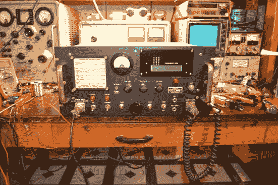](https://hackaday.com/2015/03/04/get-serious-with-amateur-radio-design-build-a-single-sideband-transceiver-from-scratch-part-2/best-image/)  [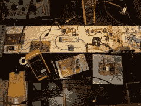](https://hackaday.com/2015/03/04/get-serious-with-amateur-radio-design-build-a-single-sideband-transceiver-from-scratch-part-2/hpim2863/) Photos of the dual-band 6m and 10m SSB/CW transceiver. [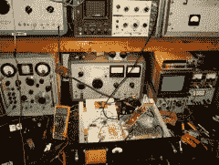](https://hackaday.com/2015/03/04/get-serious-with-amateur-radio-design-build-a-single-sideband-transceiver-from-scratch-part-2/hpim3019/)  [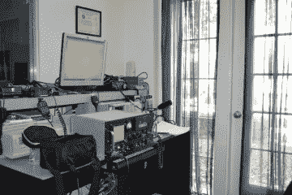](https://hackaday.com/2015/03/04/get-serious-with-amateur-radio-design-build-a-single-sideband-transceiver-from-scratch-part-2/dsc_0201-3/)  [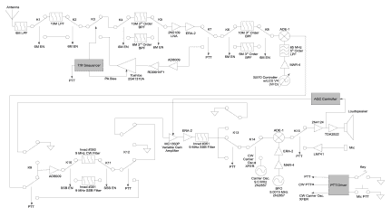](https://hackaday.com/2015/03/04/get-serious-with-amateur-radio-design-build-a-single-sideband-transceiver-from-scratch-part-2/fig2_block_diagram/) Block diagram of the 10m and 6m dual-band SSB/CW transceiver.

原理图和细节见 2013 年 3 月 QST 的[全文，设计笔记](http://www.arrl.org/news/digital-edition-of-march-em-qst-em-now-available)[见此](http://glcharvat.com/Dr._Gregory_L._Charvat_Projects/6_%26_10m_SSB_CW_Transceiver.html)。有趣的是，这款收音机的 VFO、功率放大器和前端覆盖了所有高频波段，最高可达 2 米的 VHF 波段。如果滤波器是内置的，这种收音机很容易做成全波段收音机。

## 整个车站！

我见过的最令人印象深刻的自制电台是 K5AM 的马克·曼德肯制作的。马克在 20 世纪 90 年代末和 21 世纪初的 QEX 杂志上发表了所有这些设备的细节，包括原理图、框图和更多信息[请点击这里](http://www.zianet.com/k5am/)。

 [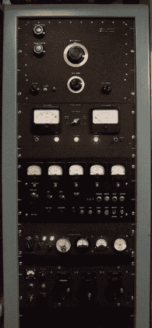](https://hackaday.com/2015/03/04/get-serious-with-amateur-radio-design-build-a-single-sideband-transceiver-from-scratch-part-2/rack/)  [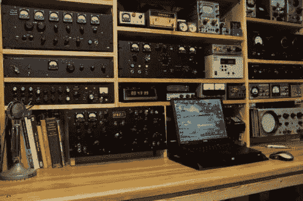](https://hackaday.com/2015/03/04/get-serious-with-amateur-radio-design-build-a-single-sideband-transceiver-from-scratch-part-2/stn/) Mark Mandelkern, K5AM, built his entire amateur radio station from scratch. [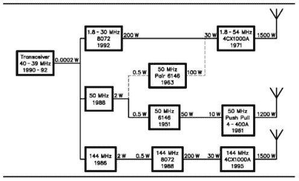](https://hackaday.com/2015/03/04/get-serious-with-amateur-radio-design-build-a-single-sideband-transceiver-from-scratch-part-2/block-3/) More photos of Mark Mandelkern’s station.

用马克自己的话说

“所有的装备都是全新设计、从头开始制造的。但我不打算重新发明超外差。每个项目都从彻底研究手册和相关杂志文章开始。我从所有以前的建造者那里收集想法，应该感谢他们。设计意味着选择有助于产生预期结果的最佳创意。手册中描述了各个电路；真正的设计工作是将它们组合成一个完整的功能单元。在有限的时间间隔内建造一个完整的车站意味着使用最可靠的方法，并开始工作，而不是试图为每个阶段发明一个新的电路。”

## 还有更多

其他人已经制作了自己的多波段和单波段单边带收发器:

*   [N6QW](http://www.jessystems.com)
*   [ARRL 家酿挑战赛 I，40m 单边带/连续波收发器](http://www.arrl.org/files/file/QST/Homebrew%20Challenge/HBC%201%20Winner-KD1JV.pdf)
*   [网关 40，家酿 5w SSB/CW 收发器，使用相位调整方法](http://www.g0kla.com/gateway40/gateway40.php)
*   [自制 40m 单边带/连续波收发器](http://www.delboyonline.co.uk/m0dad/construcion/homebrew_40m_ssbcw_transceiver.htm)
*   [80/20m 连续波/单边带收发器，25W](http://www.dxzone.com/cgi-bin/dir/jump2.cgi?ID=29525)

其他人建议在 YouTube 上搜索这些收音机的播放演示，或者在评论区发布。

## 定相单边带和软件定义无线电

还有其他方法来实现 SSB 设备，包括使用[定相](http://www.arrl.org/files/file/Technology/tis/info/pdf/9304027.pdf)的直接转换(数字或模拟)。在这种架构中，I/Q 镜像抑制混频器用于上混频(发射)或下混频(接收),以直接调制或解调 SSB 信号。IQ 混频器之后的后端可以用运算放大器或数字化实现。这是早期[单边带发射机](http://www.arrl.org/files/file/Technology/pdf/McElroy.pdf)的通用架构之一，如今这是[入门级软件定义无线电](http://www.wb5rvz.com/sdr/RXTX62/) (SDR)接收机和发射机的首选架构。

 [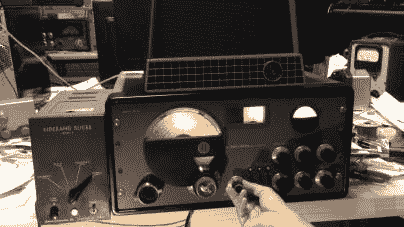](https://hackaday.com/2015/03/04/get-serious-with-amateur-radio-design-build-a-single-sideband-transceiver-from-scratch-part-2/maxresdefault-3/) Photos of a vintage phasing SSB amateur radio equipment. [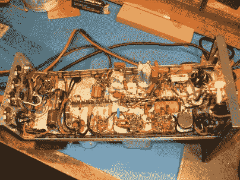](https://hackaday.com/2015/03/04/get-serious-with-amateur-radio-design-build-a-single-sideband-transceiver-from-scratch-part-2/slicer-recap_zps532b3fdb/)  [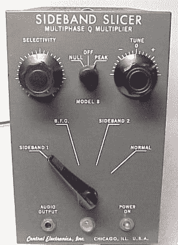](https://hackaday.com/2015/03/04/get-serious-with-amateur-radio-design-build-a-single-sideband-transceiver-from-scratch-part-2/slb/) 

## 软件无线电(SDR)

对于那些对构建工具包或编写代码更感兴趣，而不是从头开始构建设计的人来说，SDR 可能是一个很好的选择。在许多情况下，[软件已经被编写好了。让我们面对现实吧，](http://www.rtl-sdr.com/big-list-rtl-sdr-supported-software/) [SDR 是无线电](http://hackaday.com/2015/02/12/why-you-should-care-about-software-defined-radio/)的未来，它将以前的模拟电路推向数字领域，以 CPU 周期换取模拟电路复杂性的降低。

[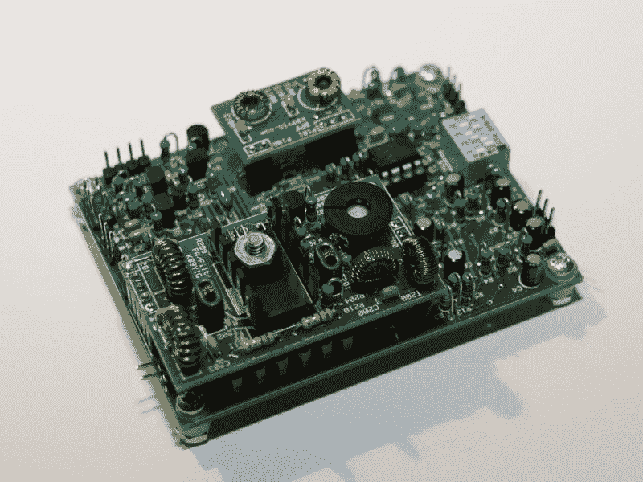](https://hackaday.com/wp-content/uploads/2015/01/softrock-rxtx-v6-3-board.jpg)

The Soft Rock SDR transceiver kit.

如今有许多 SDR 套件可用，包括那些由 [AE9RB](http://ae9rb.com/) 、 [Picastar](http://www.carnut.info/singleboard/Ver_Porta_P1/Porta_Combo_P1.htm) 或 [Heremes](http://openhpsdr.org/hermes.php) 提供的 SDR 套件。也可以买[商用版](https://apache-labs.com/1001/Ham-Radio-Products.html)或者[可以混搭激励器](http://www.tapr.org/kits_alex.html)，PA，滤波板。最近，一个 [SDR 使用一个 teensy](http://hackaday.com/2015/01/30/casing-up-the-teensy-sdr/) 开发出来。检查一下 [hackrf](https://greatscottgadgets.com/hackrf/) 或 [hackrfblue](http://hackrfblue.com) 让专业人士转换成业余人士使用，再加上一个好的功率放大器和一些滤波器。

性能最佳的软件定义(或 DSP)接收机采用混合架构，将模拟设计的最佳实践与 SDR 后端(有时称为“[屋顶滤波器](http://www.elecraft.com/K3/Roofing_Filters.htm)”)相结合。这为模拟无线电的高动态范围架构提供了软件定义无线电的灵活性。这就是为什么 [Elecraft K3](http://www.elecraft.com/K3/K3.htm) 是一款性能卓越的收音机(它也可以作为套件提供)。

## 建造它

开始的唯一方法是建造一些东西。从小处着手，查看 QRP 社区，尝试制作[单次转换接收器](http://qrp-popcorn.blogspot.com/2014/10/simpler-single-signal-direct-conversion.html)，尝试入门级 SDR，最后升级到晶体中频滤波器。从以下书籍中借用并缩放电路:

*   [ARRL 手册](http://www.arrl.org/arrl-handbook-2015)
*   [面向无线电爱好者的固态设计](http://www.amazon.com/Solid-State-Design-Radio-Amateur/dp/0872590402)
*   [射频电路设计的秘密](http://www.amazon.com/Secrets-Circuit-Design-Joseph-Carr/dp/0071370676/ref=sr_1_1?s=books&ie=UTF8&qid=1422153457&sr=1-1&keywords=secrets+of+rf+circuit+design)
*   [射频电路设计](http://www.amazon.com/RF-Circuit-Design-Christopher-Bowick/dp/0750699469/ref=sr_1_2?s=books&ie=UTF8&qid=1422153483&sr=1-2&keywords=Chris+Bowick+RF+circuit+design)
*   [通信接收器](http://www.amazon.com/Communications-Receivers-Software-Radios-Design/dp/0071361219/ref=asap_bc?ie=UTF8)
*   [QST 杂志](http://www.arrl.org/qst)
*   [QEX 杂志](http://www.arrl.org/qex)

或者利用完整的集成电路和模块，比如来自[微型电路](http://www.minicircuits.com/homepage/homepage.html)的集成电路和模块。没有什么比在你白手起家的无线电设备上进行第一次长途联系更好的了。

* * *

**确认**

我的表妹，[朱丽叶·赫尔利](http://www.everchangellc.com/owner-bio)，MBA，MSF，MAC，负责编辑这篇文章。

**作者简介**
[格雷戈里·l·查瓦特](http://glcharvat.com/Dr._Gregory_L._Charvat_Projects/About.html)只操作他白手起家建造的无线电设备，是[小型和短程雷达系统](http://www.crcpress.com/product/isbn/9781439865996)的作者，[超精细研究公司](http://www.hyperfine-research.com)，[蝴蝶网络公司](http://www.technologyreview.com/news/532166/with-100-million-entrepreneur-sees-path-to-disrupt-medical-imaging/)的联合创始人。(两者都是[4 catalyster](http://www.4catalyzer.com)公司)，Camera Culture Group 麻省理工学院媒体实验室的客座研究科学家， [Gregory L. Charvat 电气工程实用方法系列的编辑，](http://glcharvat.com/Dr._Gregory_L._Charvat_Projects/Book_Series_on_Electrical_Engineering.html)以及 CNN、CBS、Sky News 等的客座评论员。他是麻省理工学院林肯实验室的技术人员，他在穿墙雷达方面的工作赢得了 2010 年 MSS 三军雷达研讨会的最佳论文，并且是 2011 年 Provost 研究亮点的麻省理工学院办公室。他曾在麻省理工学院教授短期雷达课程，他的“构建小型雷达”课程是 2011 年排名第一的麻省理工学院专业教育课程，并被其他大学、实验室和私人组织广泛采用。从早年开始，Greg 开发了许多雷达系统、铁路 SAR 成像传感器、相控阵雷达系统；拥有多项专利；并开发了许多其他传感器、无线电和音频设备。他撰写了许多出版物，并因其作品受到媒体的关注。Greg 于 2007 年获得密歇根州立大学电气工程博士学位，2003 年获得 MSEE，2002 年获得 BSEE，他是 IEEE 的资深会员，在 2010 年、2013 年和 2016 年 IEEE 国际相控阵系统和技术研讨会指导委员会任职，并于 2010 年至 2011 年担任 IEEE AP-S Boston 分会主席。