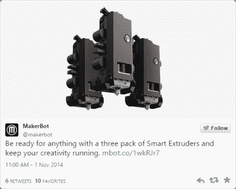

# 3D 打印:霍布斯仪表和 3D 打印机的可靠性

> 原文：<https://hackaday.com/2015/02/10/3d-printering-hobbs-meters-and-3d-printer-reliability/>

A direct link to Makerbot’s 3-pack of Smart Extruders is very hard to find

Makerbot 推出他们的新系列打印机已经有一年多了，从那以后，人们就开始抱怨每一台打印机所配的智能挤出机的质量。虽然没有 3D 打印机挤出机不会最终堵塞、磨损或断裂，但有报道称 Makerbot 智能挤出机仅使用数百甚至数十小时就出现故障。考虑到一个大型打印可能需要十几个小时才能完成，你可以很容易地理解为什么智能挤出机如此受鄙视，为什么甚至三包智能挤出机的*可用性*在 3D 打印社区都是一个笑话。

当然，对 Makerbot 进行一次廉价的攻击，正好迎合你的先入为主的想法和偏见是太容易了。我们是来解决问题的，而不仅仅是陈述问题，所以我们正在做的是:为了量化 3D 打印机的长期可靠性，我们需要一种方法来测量挤出机故障前的平均时间。这已经是一个解决了的问题；只是没有实现而已。

在飞机和一些为建筑和船只提供动力的非常昂贵的发动机上，有一个仪表藏在控制面板中，它记录发动机已经运行了多长时间。它被称为霍布斯计(Hobbs meter),背后的想法非常简单——当霍布斯计通电时，它会在一个小型时钟显示器上计算时间。显示器的分辨率通常只有十分之一小时，但这对于安排维护和在 NTSB 事故报告中提及已经足够了。

在 3D 打印机上花足够多的时间，你会很快意识到“估计打印时间”只是一个大概，对于失败的打印，“这个物体的总打印时间”并不能完全衡量你使用挤压机的时间。只有通过直接测量热端记录了多少小时或多少公里的长丝已经通过挤出机，您才能准确了解挤出机已经运行了多长时间，以及打印机的可靠性如何。

霍布斯米[可以从 Mouser](http://www.mouser.com/Search/Refine.aspx?Keyword=Hobbs+meter) 买到，但是你在那里会支付过高。更好的选择是来自[一个不同领域的供应商](http://www.aircraftspruce.com/catalog/inpages/hobbs.php?clickkey=4565)；一个可以直接连接到挤出机加热器的仪表 30 美元。如果有足够多的人添加这一功能并保持适当的日志记录，就有一点点机会用真实的*数据*改善 3D 打印机的状态，而不是人们试图证明自己的设计和购买的偏见。

但也许这太难了；仅仅为了数据而将一个 30 美元的项目添加到打印机的 BOM 中有点多。幸运的是，有一个更简单的解决方案，不需要花一分钱。只需在固件中测量加热器开启的时间，或者在微控制器的 EEPROM 中保存挤出灯丝的总长度。从[马林](https://github.com/MarlinFirmware/Marlin)到[重复者](https://github.com/repetier/Repetier-Firmware)到[冲刺者](https://github.com/kliment/Sprinter)的每一个打印机固件都有一种方法来计算加热器已经开启的时间长度或者有多少灯丝已经通过喷嘴。

然而，这是我们正在处理的 3D 打印。一个有组织的社区并不是我们目前所享受的奢侈品，要做到这一点需要几样东西。首先是上传失败统计数据的地方。这将是一个网站，自然，有能力输入打印机品牌，挤出机和热端模型，以及自上次堵塞喷嘴的时间。网站本身只是一个数据库，一些 JavaScript，一点 CSS，还有一些托管成本；不难，除非你考虑到成千上万的运营商不得不*知道*这个网站*和*的贡献。

第二，如果我们不使用机械霍布斯计量仪，就需要在不同的固件中有一个“加热器总开启时间”或“挤出长丝总长度”变量。希望有标准化的 Gcodes 或 Mcodes 来读取和重置这个变量。

会出现这种情况吗？当然不是。组织不是 RepRap 项目的强项，任何实现 Hobbs meter 功能的公司都可能会将其锁定在专有的混淆中。然而，Makerbot 并不傻，鉴于他们销售三包挤出机，我敢打赌他们有一些关于挤出机 MTBF 的数据。对打印机损坏的最常见原因进行基于社区的测量当然是可能的，但像所有问题一样，这是一个组织问题，而不是技术问题。

* * *

**3D 打印**是一个半月刊专栏，深入挖掘所有与 3D 打印相关的事物。如果您对未来的分期付款有问题或想法，请[将您的想法发送给我们](http://hackaday.com/submit-a-tip/)。