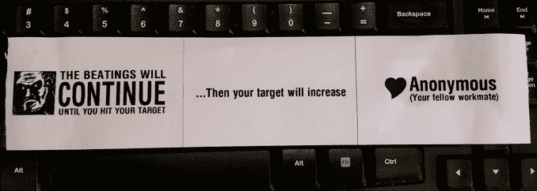
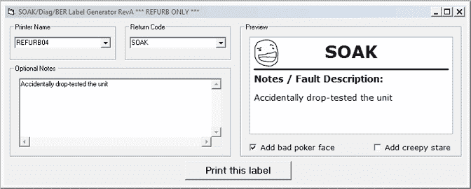

# 黑掉你同事的标签制造商

> 原文：<https://hackaday.com/2015/01/25/hacking-your-coworkers-label-makers/>

最后一个**真正的**黑！[PodeCoet]写信给我们，告诉我们他最近在工作场所的一个小趣事……他发现每个人使用的标签制作机都是有知识产权的……嗯，[他利用了这一点。](http://ultrakeet.com.au/casual/003-hijack-your-coworkers-label-printers)

他写的冗长但非常有趣的博文实际上是一个如何侵入斑马品牌打印机的教程。从实现这种可能性，到第一次测试打印，再到伪造他的 MAC 地址，[PodeCoet]在这件事上玩得很开心——这在他对事件的可爱描述中显而易见——就像在他第一次通过 IP 访问打印机之后。

> 我现在兴奋得不得了，当我冲向汽车准备开车回家时，时间似乎在膨胀。
> 
> 在 20 分钟的车程中，我无法抑制自己的兴奋，将车停在一条小巷中，在智能手机上浏览斑马的网站，并下载了一份[“斑马 ZPL 编程指南”](http://www.zebra.com/content/dam/zebra/manuals/en-us/software/zpl-zbi2-pm-en.pdf)。

谈刺激！哦，我们有没有提到他原本打算这样做而被解雇？

不过，他可能已经重新考虑过了，决定采用一种更中性、更友好的标签，以便在工作中大量印刷(顺便说一下，这是一条装配线)。这是他想到的:

最后，他的“打印机攻击”持续了大约 15 秒钟，所有的打印机几乎同时吐出了同一个标签。他希望他能得到一个同事反应的视频剪辑，但显然这可能会泄露他的身份。

这是他可爱的黑客应用程序的屏幕截图。

总之，[PodeCoet]建议您保护您的网络:

> 永远假设有人试图闯入你的 s#%t，即使你认为你的员工是努力收支平衡的穴居人。