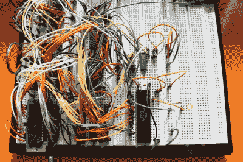
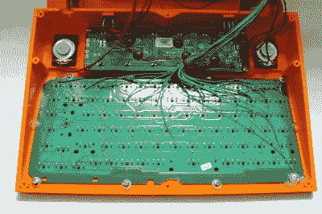

# DIY 6502 笔记本电脑外观和工作都很棒

> 原文：<https://hackaday.com/2015/01/27/diy-6502-laptop-computer-looks-and-works-great/>

多年来，我们已经看到了许多 DIY 复古计算机，但[Dirk Grappendorf]创造了迄今为止最精美的 6502 系统之一。他的电池供电便携式机器使用 4 行 40 字符的液晶显示器，和一个改进的 USB 键盘。将所有这些装在一个光滑的 3D 打印外壳中，你就有了一台让我们想起古老的 [TRS-80 Model 100 的机器。](http://en.wikipedia.org/wiki/TRS-80_Model_100)

[Dirk]有一些很棒的文档可以和他的电脑一起使用。他从一个经典的 MOS 6502 处理器开始。他在处理器周围安装了许多 80 年代早期的支持芯片。RAM 是易于使用的静态 RAM，而 ROM 由 UV 可擦除 EPROM 处理。一对 MOS 6522 多功能接口适配器(VIA)芯片将键盘、LCD 和任何其他外围设备连接到 CPU。声音当然是由 6581 SID 芯片提供的。当在试验板上构建时，所有这些都需要大量的导线。这个版本唯一缺少的是存储写在机器上的软件的方法。[Dirk]已经在寻找给机器添加 SD 卡接口的方法。

然而，家园建筑并没有就此止步。[Dirk]为他的电脑设计并蚀刻了自己的印刷电路板(PCB)。如今，用表面贴装元件 DIY PCBs 很容易，但用旧的通孔元件就难多了。每个通孔引脚和过孔都必须钻孔，并焊接到电路板的顶层和底层。更不用说两层都必须完美排列以避免漏洞了！说这是大量的工作是一种保守的说法。

 [Dirk]为他的电脑设计了一个定制的 3D 打印外壳，并在他的 Ultimaker 上打印出来。为了使东西合适，他把他的设计分成两半，印刷完成后就把盒子粘起来。

如果令人敬畏的硬件和外壳还不够的话，[德克]还花时间为机器设计软件。他编写了自己的缩写 BASIC 解释程序和几个 BASIC 程序。你可以在他的 GitHub 知识库中找到一切。

我们总是喜欢写一些有据可查的、一般来说很棒的项目，比如[德克的]。如果你知道任何像这样的复古电脑，给我们一个建议吧！

【感谢 [MicroHex！](http://hackaday.io/MicroHex) ]