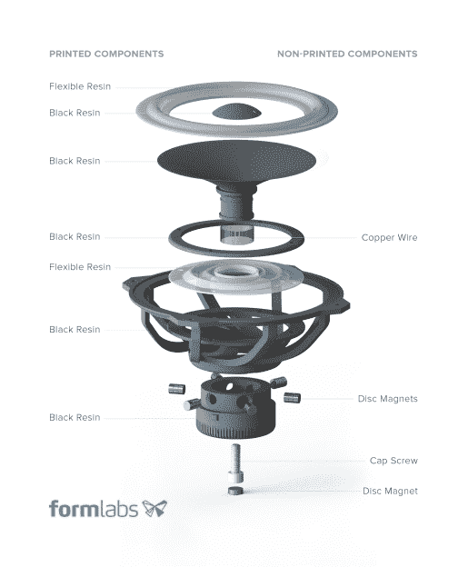

# 3D 打印扬声器推动了快速原型的发展

> 原文：<https://hackaday.com/2015/01/27/3d-printed-speaker-pushes-rapid-prototyping-boundaries/>

我们认为 Formlabs 已经真正找到了宣传他们的 3D 打印机系列的关键——只需设计非常酷的东西，你可以用树脂 3D 打印，并公开发布它们！为了庆祝 Form 1+的固件升级，他们设计并发布了这款非常酷的 [3D 打印扬声器](http://formlabs.com/en/company/blog/2015/01/06/new-year-new-resolution/)，你可以自己制作。

由[Adam Lebovitz]设计的扬声器只需几个工作就可以打印出来，使用他们的柔性树脂作为动态组件。它甚至听起来相当不错。

正如你在下面的扬声器分解图中看到的，几乎整个东西都是由两种材料 3D 打印出来的——减去一些铜线、37 个圆盘磁铁和一个帽螺钉。

当然，这不是第一次有人用 3D 打印出一个扬声器，但是亚当做得非常漂亮。他们已经免费发布了所有的设计文件(你必须请求它们)，但可以预见的是，它可以在标准的 FDM 机器上用支持材料打印出来——只是用树脂打印机要容易得多。

[https://player.vimeo.com/video/115417731](https://player.vimeo.com/video/115417731)

类似于他们的 [3D 打印单片眼镜(其中包括镜片！)](http://hackaday.com/2014/12/13/3d-printed-lenses-open-up-possibilities/)，这是一个很好的例子，说明基于 SLA 的打印机已经走了多远。

詹妮弗，谢谢你的提示！]