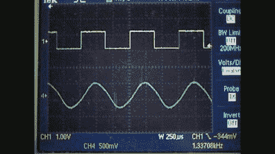
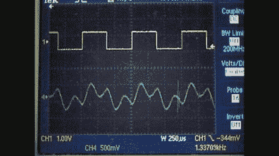
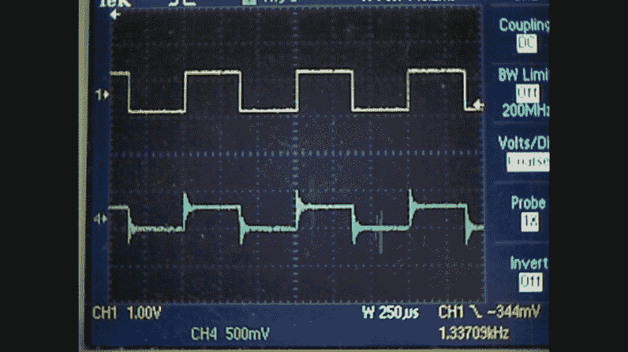
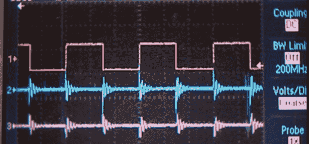
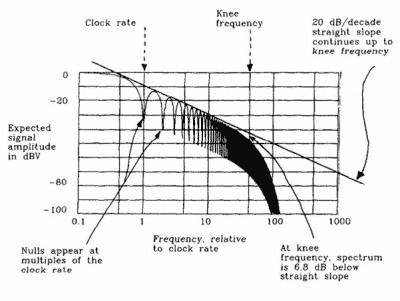
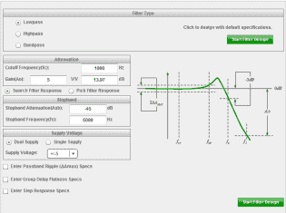
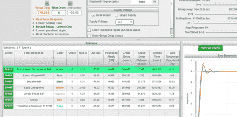
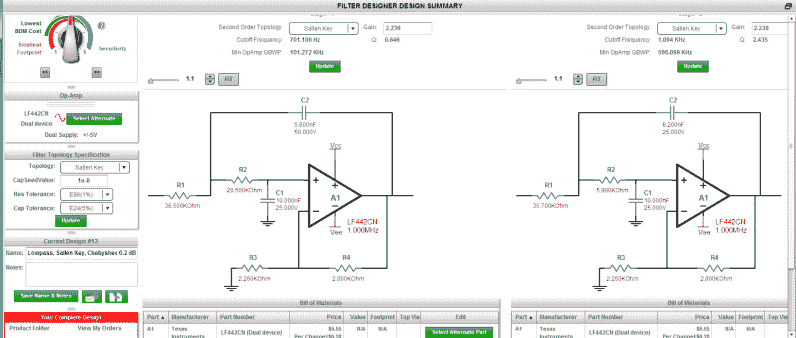
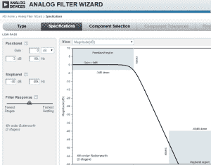
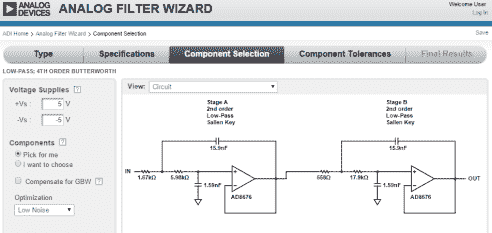

# 通用有源滤波器:第二部分

> 原文：<https://hackaday.com/2015/01/28/universal-active-filters-part-2/>

将有源滤波器概念化的一个简单方法是考虑音频扬声器。扬声器分频具有低通、高通和带通效果，根据频率将信号分成三个分量。在本系列的前一部分中，我将这一想法应用于一个通用有源滤波器，该滤波器由基于单芯片运算放大器的芯片 UAF-42 构成。顺便说一下，这是一个相当老的昂贵的芯片，只是我挑选出来演示的一个。

使用双组电位计，我能够调整频率允许通过或拒绝的点。我们可以用我的扫描频率函数发生器扫描电路来显示这种行为，它可以快速地将频率从低变到高，同时观察有什么可以通过滤波器。

[https://www.youtube.com/embed/DBYVnGk_qrg?version=3&rel=1&showsearch=0&showinfo=1&iv_load_policy=1&fs=1&hl=en-US&autohide=2&wmode=transparent](https://www.youtube.com/embed/DBYVnGk_qrg?version=3&rel=1&showsearch=0&showinfo=1&iv_load_policy=1&fs=1&hl=en-US&autohide=2&wmode=transparent)

在这一部分中，我将测试这样一种理论，即滤除构成方波的谐波会导致波形发生可预测的退化，直到最终成为正弦波。该正弦波出现在原始方波的基频处。这是视频，但休息后请继续关注我，让我介绍其中涉及的每个概念。

## 这都是关于边缘

  Lowpass on Square Wave  Harmonics building a Square Wave  Some ringing left, call it an artifact.

当使用高通滤波器(和带通滤波器)从相反方向观察时，我们看到能量正好在方波的上升沿。这就是臭名昭著的“边缘”，我称之为“咬痕”，意思是上升或下降边缘的能量泄漏出来，进入 FCC 辐射或被模拟电路拾取。

Looking at a square wave through a hi-pass filter.

该上升沿可以描述为角频率的一部分，即δv/δt(读作“Dee Vee Dee Tee”)，即电压变化与时间变化的关系。在设定的时间段内，电压变化越快，等效频率和能量越高。

Knee Frequency due to Rise Time of Signal. From High Speed Digital Design

面对非常快速的转换时，有许多半导体器件会有些反常:SCR、三端双向可控硅开关、晶体管、MOSFETs 甚至二极管都以高δv/δt 开启，好消息是，您可以在相应的数据手册中找到这种敏感度。

信号的上升时间也与高频的多少有关。简而言之，上升时间越快，RF 频谱中的能量就越高。如果你对数学感兴趣，我见过这表示为 F [膝盖] = .5/T [上升]。F [拐点]是频域中能量频谱滚降的点(本例中为 6.8db)，T [上升]是从全信号的 10%升至 90%所需的标准时间。

      

您可能会发现，网上直接提供的优秀滤波器设计程序的数量和可访问性令人惊讶。德州仪器的 [Webench](http://www.ti.com/lsds/ti/analog/webench/overview.page) 从问什么样的滤波器开始；低通、带通或高通，然后允许您选择一般设计的属性。下一步，您可以直接观察不同类型的过滤器的效果，结果将立即可用。在过去，(在 VisiCalc 出现之前)我们可能不得不反复研究方程式，寻找最佳的折衷方案。最后，程序显示了标准零件的原理图和材料清单。这也消除了尝试并不断求解可以使用实际电阻值(通常为 1%电阻)的正确器件集的需要。

    

[ADI 公司的滤波器向导](http://www.analog.com/designtools/en/filterwizard/#/componentSelection)基本上做同样的事情，让业余爱好者或小型实验室能够定义一个精确、有效的滤波器，而无需使用虚变量(如负 1 的平方根)做一个数学方程。一个很好的文本是【唐·兰卡斯特的】 *有源滤波器食谱* ，虽然我第一次接触是在翻阅国家半导体模拟数据手册的每一页。

最后，如果你想继续探索这个概念，这里有一个面包屑来指导你:你知道你可以使用滤波器的相移来创建一个正弦波发生器，或者你可以反向偏置许多常见晶体管的发射极基极结，以创建一个白噪声源，用于测试滤波器(或音响系统)的响应？