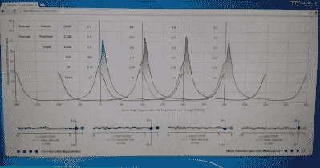

# Raspberry Pi 学习如何控制内燃机

> 原文：<https://hackaday.com/2015/01/28/raspberry-pi-learns-how-to-control-a-combustion-engine/>

在密歇根大学攻读博士学位时，[Adam]设计了一个基于 Raspberry Pi 的系统来控制 HCCI 发动机，这种发动机结合了柴油发动机和汽油发动机的优点。这些引擎表现出近乎混沌的行为，建模非常具有挑战性，因此他[在 Raspberry Pi 上开发了一种机器学习算法](http://arxiv.org/abs/1310.3567)，它可以自适应地学习如何控制引擎。

[Adam]的算法需要气缸压力和曲轴角度的实时读数才能运行。为了在 Raspberry Pi 上测量这些数据，[Adam]设计了一个子板，它从每个气缸中的压力传感器读取数据，并用编码器测量曲轴角度。Pi 还配备了一个 CAN 收发器，可与低级发动机控制单元通信。

【Adam】的算法根据压力读数和曲轴位置在 Pi 上实时计算发动机控制参数。控制值通过 CAN 发送到低级发动机控制器。Pi 用新值监测发动机性能的变化，并在发动机运行时改变其控制值以优化燃烧循环。Pi 还提供了一个网页，上面有曲轴位置和气缸压力的图表，这些图表会实时更新，以向用户提供一些反馈。

对于所有有趣的细节，看看我们上面链接的[亚当]的论文。为了更直观的分析，请在休息后观看视频，在视频中[Adam]向您介绍了他的设置和他工作的超棒的实验室。

[https://www.youtube.com/embed/qQG7ocnE3EA?version=3&rel=1&showsearch=0&showinfo=1&iv_load_policy=1&fs=1&hl=en-US&autohide=2&wmode=transparent](https://www.youtube.com/embed/qQG7ocnE3EA?version=3&rel=1&showsearch=0&showinfo=1&iv_load_policy=1&fs=1&hl=en-US&autohide=2&wmode=transparent)