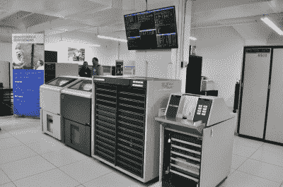
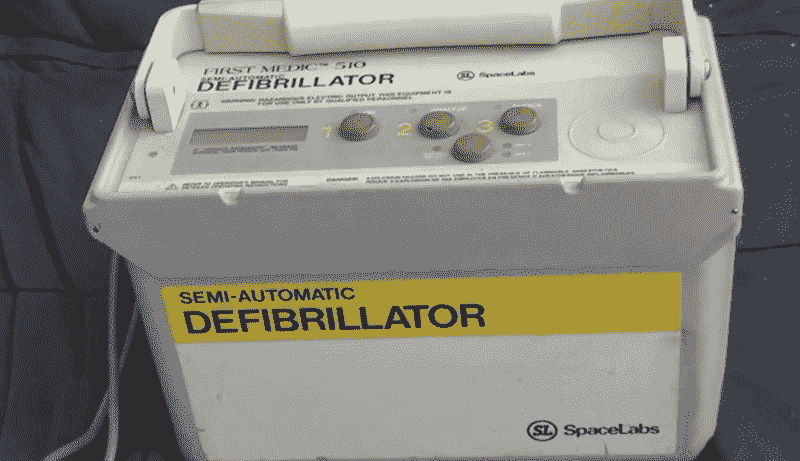
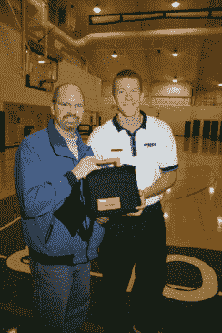
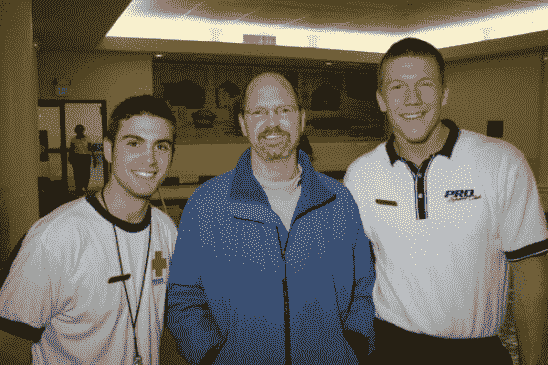

# 几年后，开发者通过自己的硬件拯救了自己

> 原文：<https://hackaday.com/2015/02/06/developer-saved-years-later-by-his-own-hardware/>

Bryan 是一个计算机新手(他需要帮助来打开他的计算机)，但是他有一个篮球故事。他的球队正在俱乐部参加一场至关重要的篮球季后赛。他们在比赛后期落后两分，而他就是找不到一个队员防守。这位球员是一个伟大的射手，仅此而已——埋葬了一个三分，让球队第一次领先。下沉后，他只是站在那里欣赏他的杰作，而布莱恩尖叫着让他回来防守(他很少打 D，他也没有那场比赛)。相反，他直挺挺地趴在地上——心脏病发作！

当然，那个球员就是我，那真是糟糕的一天。但我仍然在讲述这个故事…作为一名硬件设计师，几年前我不知道我会把一切都押在一个特定的项目上。

## 简单的开始

“LCM – CDC 501 printer and other equipment – 01” [by Joe Mabel. CC BY-SA 3.0](http://commons.wikimedia.org/wiki/File:LCM_-_CDC_501_printer_and_other_equipment_-_01.jpg#mediaviewer/File:LCM_-_CDC_501_printer_and_other_equipment_-_01.jpg)

我叫克里斯。在七十年代，我获得了 MSU 的电子工程学位(好的密执安大学！).我还上了一些生物工程和计算机编程课。在我内心深处，我认为我可以用某种技术治愈我的糖尿病。我可以用最好的打字机打穿孔卡片。我非常确定我喝的啤酒是使用 CDC 6500 的推荐药物(嗯，除了在我把卡片交给操作员之前卡片掉在地上的时候。我选择责怪他们)。

毕业后，我去了一家大型飞机公司工作。其中一份工作是自动化测试工程师。我制作了电路板和软件，在飞机起飞前测试飞机上的所有电子设备。(mighty) [HP1000/RTE](http://en.wikipedia.org/wiki/HP-1000/RTE) ，用 Fortan77、Macro/1000、SymbolicDebug/1000 和机器语言编程与芯片对话。当我告诉我的喝啤酒的朋友，飞机要在我的测试通过后才能起飞时，他们总是很紧张。

我很快就抛弃了大公司的官僚作风。我去了当地一家医院工作。在心电图分析计算机上工作。该系统使用人工智能和模式识别软件和知识库来自动执行从患者获得的 ECG 轨迹的解释、测试报告和计算机辅助诊断。我再次使用了(强大的)HP1000/RTE，它带有 4 个可移动磁盘驱动器，可以存储大约 300MB 的数据和磁带备份。

我工作的心脏病专家投资了一家小型创业公司，该公司将生产半自动除颤器，可以由第一反应人员(警察和消防人员)带到现场。心脏病发作时，心脏恢复得越快，存活的机会就越大。当时，只有急救人员和训练有素的专家才能拿出可靠的电极板进行电击。但这可能需要花费宝贵的时间让他们到达现场。

为了开发他们的除颤器算法，该公司 First Medic 希望使用我的系统收集的多年心电图数据。我是他们的第一个顾问。这既有趣又令人兴奋(另外，他们还雇佣了我的一个在飞机公司工作的朋友)，所以我只收了他们一箱山姆亚当啤酒作为我工作的报酬(嘿，这是好酒！).

不久后，我去了这家公司工作。除颤器必须小巧便携，携带一个冲头(每次电击的能量高达 360 焦耳)，有可充电电池(当时很难)，不能用高能电击烧芯片，与操作者交谈，告诉他们下一步该做什么，读取患者的心电图并决定何时电击。然后，事件发生后，该系统必须与医院沟通结果，并有一个数据管理系统。我们制造了小型墨盒来插入机器。我造了一个设备，可以读取数据，并通过串行端口或调制解调器传输到计算机。我设计了数据管理系统和所有的通讯软件。不得不在最大容量为 640K 的 DOS 机器上完成所有工作，因为消防和警察对另一个只运行该系统的计算机系统的预算有限。我为点阵打印机和后来的激光打印机开发了打印机驱动程序。我不得不创建图形来查看电脑上的心电图…而图形在 DOS 机器上是一个婊子！我用 C，汇编和各种机器语言编程。

第一军医 510 AED【图片来源:[YouTube 上的 Markhk](https://www.youtube.com/watch?v=tnfpGyPR8Pg)

我们的第一款产品是第一军医 510 AED(自动体外除颤器)。我们的第一批客户是纽约市、圣地亚哥县、阿拉米达县和温哥华市的消防部门。我去了奥克兰附近的一个聚会，在那里我们为 9 名被消防部门救下的人(第一年他们有了我们的 aed)支付了费用，以会见救了他们命的消防人员(通常事件发生后病人被送到医院，再也见不到第一次治疗他们的人)。知道我参与了这一切，我非常激动，感觉非常好。

像许多创业公司一样，我们发明了新技术，工作有趣/有挑战性/有趣，我们“改变了世界”。然而，我们遇到了法规，因为我们必须从一个州到另一个州，让他们改变法律，允许非医生的第一反应者提供电击。您可能会惊讶地听到，这可能比实际构建产品花费了更多的时间和资源。更糟糕的是，我们有外国投资者退出。在最终发布最初的产品之前，我们花光了所有的钱，被另一家公司收购了。第一个从盒子里拿出来的东西没有赚大钱的几率有多大？我们会要求加薪并获得更多的股票期权。我希望我留着它们，因为我需要墙纸。

## 回到篮圈的故事

  At club where I died, with the AED and one of the teenagers who saved my life  The two employees who responded when I collapsed

两个青少年冲到球场上，给我做心肺复苏。但是，更重要的是，抓起易于使用的 AED(俱乐部刚刚购买并培训其员工使用)，重新启动了我的心脏。两周后，我出院了。两个勇敢的少年和一辆崭新的 AED 救了我的命。

布莱恩很高兴我得救了，这样我就可以去他家打开他的电脑了！

从[本演示视频](https://www.youtube.com/watch?v=tnfpGyPR8Pg)或[原始规格表](http://somatechnology.com/pdfFiles/PhysioControl510.pdf)了解更多关于首款 Medic 510 自动体外除颤器的信息(PDF)。

* * *

## 关于作者

克里斯，在他的死亡挑战法案八年多后，在华盛顿大学工作。他正在为多中心生物医学研究建立数据系统，努力改善人们的健康和生活。