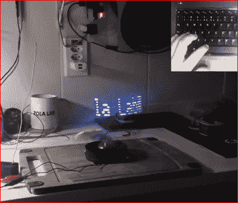
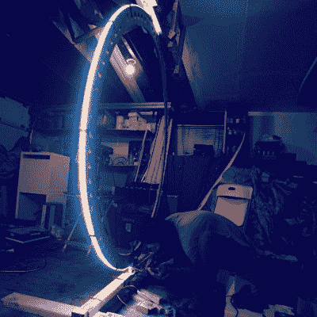
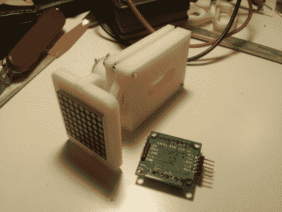
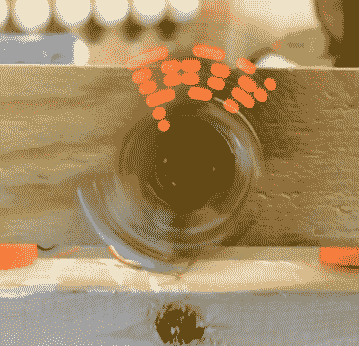

# hack let 32-LED 视觉暂留显示器

> 原文：<https://hackaday.com/2015/01/30/hacklet-32-led-persistence-of-vision-displays/>

闪烁的指示灯是好的。移动、旋转的东西也不错。把它们放在一起，你就得到一个视觉暂留(POV)显示。黑客多年来一直在建造这些显示器。本周的 Hacklet 聚焦于 [Hackaday.io 上的一些最佳 LED POV 显示！](http://hackaday.io/?utm_source=hackaday&utm_medium=32&utm_campaign=hacklet)

 我们从【EduardoZola】和 [POV 开始随着你打字，在空中写](http://hackaday.io/project/1065?utm_source=hackaday&utm_medium=32&utm_campaign=hacklet)。[Eduardo]使用 Arduino Nano、一对 433 MHz 无线电、一些蓝色 led 和一个马达来创建一个简单的旋转显示器。霍尔效应传感器使一切保持同步。整个显示器由 500 毫安的 LiPo 电池供电。这款显示器最棒的地方在于它的交互性。发射器模块通过板载 USB 转串行转换器连接到笔记本电脑。在任何串行终端中键入内容都会将文本直接发送到 POV 显示器，在那里字母看起来就像悬在空中一样。

 接下来是【布尔】与[无声乐团 POV 又名【死亡之环】](http://hackaday.io/project/2692?utm_source=hackaday&utm_medium=32&utm_campaign=hacklet)。[boolean]他不想只是创建一个 POV 环，他想要一个巨大的 5 英尺直径的显示器，用于他的本地燃烧人解压。死亡之环是一个由 3HP 马达旋转的铝环。霍尔效应传感器保持一切同步，并保持死亡戒指的 3 马力电机在检查中。光线由一个[像素推动器](http://www.heroicrobotics.com/products/pixelpusher)和 WS2812 RGB 条提供。该系统设计为交互式，由 Leap Motion 控制器或微软 Kinect 控制。MPU-6050 在处理将视频映射到 LED 条的过程中保持加速度。Arduino Yun 允许通过 WiFi 控制整个系统。[布尔]和他的团队已经对死亡戒指进行了多次修改。从他们的铝焊接质量来看，他们正朝着令人敬畏的最终结果前进！

 Hackaday.io 超级用户【Davedarko】一直在开发一种不同类型的 POV 显示。他的 [Locomatrix](http://hackaday.io/project/1148?utm_source=hackaday&utm_medium=32&utm_campaign=hacklet) 是一个 8×8 的 LED 矩阵，可以在 Z 轴上进出移动。[Dave]最初创建 Locomatrix 作为他在 2014 年 Hackaday 奖的参赛作品。我们必须承认这是我们第一次看到这种展示，但这个想法是合理的。事实上，[Bruce Land]在评论中让[Dave]知道他早在 1964 年就在 CRT 显示器上看到过类似的技术。我们打赌戴夫的 3D 打印齿轮和 LED 矩阵显示器将比每分钟几百个脉冲的 CRT 显像管来回撞击更坚固！

 最后，我们有 Hackaday 自己的【Mike Szczys】和[CPOV——一个蹩脚的视觉暂留显示器](http://hackaday.io/project/1136?utm_source=hackaday&utm_medium=32&utm_campaign=hacklet)。CPOV 是一个概念验证，由[迈克]在几个小时内组装起来的升级部件制成。他从一个旧卡带盒中取出马达，一些胶合板，纸板，当然还有发光二极管来建造他的显示器。处理器是运行 [Adafruit 的 MiniPOV 3 固件的 ATtiny2313。](https://learn.adafruit.com/minipov3)系统显示器没有同步输入，因此【Mike】使用一种新型的[人在回路](http://en.wikipedia.org/wiki/Human-in-the-loop) PWM 控制来控制电机速度。CPOV 证明了 Hackaday.io 不仅仅是为了完美的项目，也是为了证明概念、失败和简单的研究。即使你的项目并不完美，记录下来也会帮助你从中学习。它甚至会激励其他人继续前进，从你停下的地方继续前进！

想要更多的 POV 善良？查看我们新的[视点显示列表！](http://hackaday.io/list/4158?utm_source=hackaday&utm_medium=32&utm_campaign=hacklet)

我们的 led 变暗了，所以这就是我们的全部时间。一如既往，下周见。同样的黑时间，同样的黑渠道，带给你最好的 [Hackaday.io！](http://hackaday.io/?utm_source=hackaday&utm_medium=32&utm_campaign=hacklet)